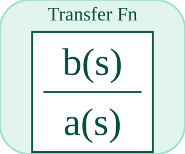

# tf

Implements a continuous transfer function approximation.

## 📝 Syntax

- Block type: tf

## 📥 Input argument

- input ports - 1 input port(s) declared.

## 📤 Output argument

- output ports - 1 output port(s) declared.

## 📄 Description

Implements a continuous transfer function approximation. 

| Field | Value |
| --- | --- |
| Module | <code>nflow_blocks</code> | 
| Library | Continuous blocks | 
| Type | <code>tf</code> | 
| Label | Transfer Fn | 

  

<b>Description</b> 

A continuous-time transfer function block defined by numerator and denominator polynomials. Useful for representing linear dynamics in the Laplace domain. 

<b>Ports</b> 

<b>Input(s)</b> 

| Port | Role | Side | Position | 
| --- | --- | --- | --- | 
| Port\_1 | Numeric signal read by the block. | left | x=0, y=40 | 

 

<b>Output(s)</b> 

| Port | Role | Side | Position | 
| --- | --- | --- | --- | 
| Port\_1 | Numeric signal produced by the block. | right | x=85, y=40 | 

 

<b>Parameters</b> 

| Parameter | Default value | 
| --- | --- | 
| <code>num</code> | [3] | 
| <code>den</code> | [1, 3] | 

 

<b>Inspector Keys</b> 

These serialized keys are exposed by the block inspector. 

- <code>num</code> 
- <code>den</code> 

<b>Block Characteristics</b> 

| Field | Value |
| --- | --- |
| Block type | tf | 
| Family | Continuous blocks | 
| Rendered size | 85 x 80 | 
| Phases | INIT, OUTPUT, ALGEBRAIC, UPDATE | 
| Direct feedthrough | yes | 
| Internal state or history | yes | 
| Signal data type | double numeric values | 

 

<b>Algorithms</b> 

- INIT normalizes coefficients and clears histories. 
- OUTPUT emits direct-feedthrough/stored output; ALGEBRAIC is present for direct-feedthrough solving. 
- UPDATE advances internal histories with input and dt. 

<b>Equation or Rule</b> 
$$y \approx \frac{num(s)}{den(s)}\,u$$
 

<b>Extended Capabilities</b> 

This page describes the native runtime behavior observed in the module C++ sources. Declared phases indicate when the simulation engine calls the block. 

Code generation: supported for C and Rust. 

<b>Implementation Sources</b> 

**Manifest:** `modules/nflow_blocks/libraries/continuous/library.json`
 

**Runtime:** `modules/nflow_blocks/src/cpp/continuous/tf.cpp`

## 🔗 See also

[stateSpace](../../nflow_blocks/continuous/stateSpace.md), [integrator](../../nflow_blocks/continuous/integrator.md), [dtf](../../nflow_blocks/discrete/dtf.md), [lpf](../../nflow_blocks/continuous/lpf.md), [hpf](../../nflow_blocks/continuous/hpf.md).

## 🕔 History

| Version | 📄 Description     |
| ------- | --------------- |
| 1.0.0   | initial version |

<!--
## 👤 Author

Allan CORNET
-->
