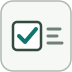

# dashboardCheckBox

Toggles a bound parameter between two values with a check box.

## 📝 Syntax

- Block type: dashboardCheckBox

## 📄 Description

Toggles a bound parameter between two values with a check box. 

| Field | Value |
| --- | --- |
| Module | <code>nflow_blocks</code> | 
| Library | Dashboard blocks | 
| Type | <code>dashboardCheckBox</code> | 
| Label | Check Box | 

  

<b>Description</b> 

The Check Box block toggles the bound parameter between two configured values depending on whether it is checked. 

<b>Ports</b> 

<b>Input(s)</b> 

This block declares no input ports. 

<b>Output(s)</b> 

This block declares no output ports. 

<b>Parameters</b> 

| Parameter | Default value | 
| --- | --- | 
| <code>LabelPosition</code> | Hide | 
| <code>Binding</code> |  | 
| <code>ShowInitialText</code> | on | 
| <code>Label</code> | Label | 
| <code>Values</code> | [0, 1] | 
| <code>Opacity</code> | 1 | 

 

<b>Inspector Keys</b> 

These serialized keys are exposed by the block inspector. 

- <code>LabelPosition</code> 
- <code>Binding</code> 
- <code>ShowInitialText</code> 
- <code>Label</code> 
- <code>Values</code> 
- <code>Opacity</code> 

<b>Block Characteristics</b> 

| Field | Value |
| --- | --- |
| Block type | dashboardCheckBox | 
| Family | Dashboard blocks | 
| Rendered size | 135 x 30 | 
| Phases | none | 
| Direct feedthrough | see Algorithms | 
| Internal state or history | no | 
| Signal data type | double numeric values | 

 

<b>Algorithms</b> 

- The block declares no simulation phases; it is driven by the dashboard, not by the solver. 
- User interaction writes the selected value to the bound parameter before or during the run. 
- The block declares no input or output signal ports. 

<b>Extended Capabilities</b> 

This page describes the native runtime behavior observed in the module C++ sources. Declared phases indicate when the simulation engine calls the block. 

Code generation: supported for C and Rust. 

<b>Implementation Sources</b> 

**Manifest:** `modules/nflow_blocks/libraries/dashboard/library.json`
 

**Runtime:** `modules/nflow_blocks/src/cpp/DashboardHandlers.cpp`

## 🔗 See also

[dashboardComboBox](../../nflow_blocks/dashboard/dashboardComboBox.md), [dashboardScope](../../nflow_blocks/dashboard/dashboardScope.md), [dashboardDisplay](../../nflow_blocks/dashboard/dashboardDisplay.md), [dashboardEdit](../../nflow_blocks/dashboard/dashboardEdit.md).

## 🕔 History

| Version | 📄 Description     |
| ------- | --------------- |
| 1.0.0   | initial version |

<!--
## 👤 Author

Allan CORNET
-->
