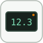

# dashboardDisplay

Shows the current value of a bound signal as formatted text.

## 📝 Syntax

- Block type: dashboardDisplay

## 📄 Description

Shows the current value of a bound signal as formatted text. 

| Field | Value |
| --- | --- |
| Module | <code>nflow_blocks</code> | 
| Library | Dashboard blocks | 
| Type | <code>dashboardDisplay</code> | 
| Label | Display | 

  

<b>Description</b> 

The Display block shows the instantaneous value of the bound signal as text, using the selected numeric format. It updates after every simulation step. 

<b>Ports</b> 

<b>Input(s)</b> 

This block declares no input ports. 

<b>Output(s)</b> 

This block declares no output ports. 

<b>Parameters</b> 

| Parameter | Default value | 
| --- | --- | 
| <code>LabelPosition</code> | Hide | 
| <code>Binding</code> |  | 
| <code>ShowInitialText</code> | on | 
| <code>Format</code> | short | 
| <code>Alignment</code> | Center | 
| <code>Opacity</code> | 1 | 
| <code>Layout</code> | Preserve dimensions | 
| <code>FormatString</code> | %d | 
| <code>GridColor</code> | [0.502, 0.502, 0.502] | 
| <code>ShowGrid</code> | on | 

 

<b>Inspector Keys</b> 

These serialized keys are exposed by the block inspector. 

- <code>LabelPosition</code> 
- <code>Binding</code> 
- <code>ShowInitialText</code> 
- <code>Format</code> 
- <code>Alignment</code> 
- <code>Opacity</code> 
- <code>Layout</code> 
- <code>FormatString</code> 
- <code>GridColor</code> 
- <code>ShowGrid</code> 

<b>Block Characteristics</b> 

| Field | Value |
| --- | --- |
| Block type | dashboardDisplay | 
| Family | Dashboard blocks | 
| Rendered size | 180 x 40 | 
| Phases | INIT, AFTER\_STEP | 
| Direct feedthrough | see Algorithms | 
| Internal state or history | yes | 
| Signal data type | double numeric values | 

 

<b>Algorithms</b> 

- INIT resets the widget to its initial reading. 
- AFTER\_STEP samples the bound signal and refreshes the display. 
- The block visualizes the signal only; it declares no input or output signal ports. 

<b>Extended Capabilities</b> 

This page describes the native runtime behavior observed in the module C++ sources. Declared phases indicate when the simulation engine calls the block. 

Code generation: supported for C and Rust. 

<b>Implementation Sources</b> 

**Manifest:** `modules/nflow_blocks/libraries/dashboard/library.json`
 

**Runtime:** `modules/nflow_blocks/src/cpp/DashboardHandlers.cpp`

## 🔗 See also

[dashboardEdit](../../nflow_blocks/dashboard/dashboardEdit.md), [dashboardGauge](../../nflow_blocks/dashboard/dashboardGauge.md), [dashboardHalfGauge](../../nflow_blocks/dashboard/dashboardHalfGauge.md), [dashboardKnob](../../nflow_blocks/dashboard/dashboardKnob.md).

## 🕔 History

| Version | 📄 Description     |
| ------- | --------------- |
| 1.0.0   | initial version |

<!--
## 👤 Author

Allan CORNET
-->
