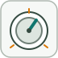

# dashboardKnob

Sets a bound parameter by turning a rotary knob.

## 📝 Syntax

- Block type: dashboardKnob

## 📄 Description

Sets a bound parameter by turning a rotary knob. 

| Field | Value |
| --- | --- |
| Module | <code>nflow_blocks</code> | 
| Library | Dashboard blocks | 
| Type | <code>dashboardKnob</code> | 
| Label | Knob | 

  

<b>Description</b> 

The Knob block lets you set the bound parameter by turning a rotary control between the configured limits, on a linear or logarithmic scale. 

<b>Ports</b> 

<b>Input(s)</b> 

This block declares no input ports. 

<b>Output(s)</b> 

This block declares no output ports. 

<b>Parameters</b> 

| Parameter | Default value | 
| --- | --- | 
| <code>LabelPosition</code> | Top | 
| <code>Binding</code> |  | 
| <code>ShowInitialText</code> | on | 
| <code>ScaleType</code> | Linear | 
| <code>Limits</code> | [0, -1, 100] | 

 

<b>Inspector Keys</b> 

These serialized keys are exposed by the block inspector. 

- <code>LabelPosition</code> 
- <code>Binding</code> 
- <code>ShowInitialText</code> 
- <code>ScaleType</code> 
- <code>Limits</code> 

<b>Block Characteristics</b> 

| Field | Value |
| --- | --- |
| Block type | dashboardKnob | 
| Family | Dashboard blocks | 
| Rendered size | 110 x 115 | 
| Phases | none | 
| Direct feedthrough | see Algorithms | 
| Internal state or history | no | 
| Signal data type | double numeric values | 

 

<b>Algorithms</b> 

- The block declares no simulation phases; it is driven by the dashboard, not by the solver. 
- User interaction writes the selected value to the bound parameter before or during the run. 
- The block declares no input or output signal ports. 

<b>Extended Capabilities</b> 

This page describes the native runtime behavior observed in the module C++ sources. Declared phases indicate when the simulation engine calls the block. 

Code generation: supported for C and Rust. 

<b>Implementation Sources</b> 

**Manifest:** `modules/nflow_blocks/libraries/dashboard/library.json`
 

**Runtime:** `modules/nflow_blocks/src/cpp/DashboardHandlers.cpp`

## 🔗 See also

[dashboardLamp](../../nflow_blocks/dashboard/dashboardLamp.md), [dashboardLinearGauge](../../nflow_blocks/dashboard/dashboardLinearGauge.md), [dashboardMultiStateImage](../../nflow_blocks/dashboard/dashboardMultiStateImage.md), [dashboardPushButton](../../nflow_blocks/dashboard/dashboardPushButton.md).

## 🕔 History

| Version | 📄 Description     |
| ------- | --------------- |
| 1.0.0   | initial version |

<!--
## 👤 Author

Allan CORNET
-->
