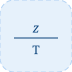

# ddelay

Delays a sampled signal by an integer number of steps.

## 📝 Syntax

- Block type: ddelay

## 📥 Input argument

- input ports - 1 input port(s) declared.

## 📤 Output argument

- output ports - 1 output port(s) declared.

## 📄 Description

Delays a sampled signal by an integer number of steps. 

| Field | Value |
| --- | --- |
| Module | <code>nflow_blocks</code> | 
| Library | Discrete blocks | 
| Type | <code>ddelay</code> | 
| Label | Discrete Delay | 

  

<b>Description</b> 

Delays the input by a number of discrete steps. 

<b>Ports</b> 

<b>Input(s)</b> 

| Port | Role | Side | Position | 
| --- | --- | --- | --- | 
| Port\_1 | Numeric signal read by the block. | left | x=0, y=40 | 

 

<b>Output(s)</b> 

| Port | Role | Side | Position | 
| --- | --- | --- | --- | 
| Port\_1 | Numeric signal produced by the block. | right | x=80, y=40 | 

 

<b>Parameters</b> 

| Parameter | Default value | 
| --- | --- | 
| <code>steps</code> | 1 | 
| <code>ts</code> | 0.1 | 

 

<b>Inspector Keys</b> 

These serialized keys are exposed by the block inspector. 

- <code>steps</code> 
- <code>ts</code> 

<b>Block Characteristics</b> 

| Field | Value |
| --- | --- |
| Block type | ddelay | 
| Family | Discrete blocks | 
| Rendered size | 80 x 80 | 
| Phases | INIT, OUTPUT, UPDATE | 
| Direct feedthrough | see Algorithms | 
| Internal state or history | not observed in the documented runtime | 
| Signal data type | double numeric values | 

 

<b>Algorithms</b> 

- INIT allocates a queue sized from steps. 
- OUTPUT emits the oldest queued value. UPDATE samples at ts and advances the queue. 
- steps is at least 1 and ts is at least 0.001. 

<b>Equation or Rule</b> 
$$y_k = u_{k-steps}$$
 

<b>Extended Capabilities</b> 

This page describes the native runtime behavior observed in the module C++ sources. Declared phases indicate when the simulation engine calls the block. 

Code generation: supported for C and Rust. 

<b>Implementation Sources</b> 

**Manifest:** `modules/nflow_blocks/libraries/discrete/library.json`
 

**Runtime:** `modules/nflow_blocks/src/cpp/discrete/ddelay.cpp`

## 🔗 See also

[delay](../../nflow_blocks/continuous/delay.md), [unitDelay](../../nflow_blocks/discrete/unitDelay.md), [zoh](../../nflow_blocks/discrete/zoh.md).

## 🕔 History

| Version | 📄 Description     |
| ------- | --------------- |
| 1.0.0   | initial version |

<!--
## 👤 Author

Allan CORNET
-->
