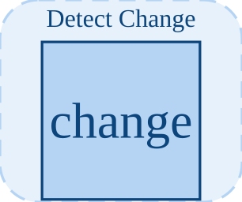

# detectChange


<p align="center">

</p>
Outputs 1 on any step where the input differs from the previous step.

## 📝 Syntax

- Block type: detectChange

## 📥 Input argument

- input ports - 1 input port(s) declared.

## 📤 Output argument

- output ports - 1 output port(s) declared.

## 📄 Description


Outputs 1 on any step where the input differs from the previous step. 

| Field | Value |
| --- | --- |
| Module | <code>nflow_blocks</code> | 
| Library | Discrete | 
| Type | <code>detectChange</code> | 
| Label | Detect Change | 

  

<b>Description</b> 

Outputs 1 on any step whose input differs from its value at the previous step, else 0. <code>InitialCondition</code> seeds the value "before" the first step. Stateful (the previous input is held); element-wise over a vector input. 

<b>Ports</b> 

<b>Input(s)</b> 

| Port | Role | Side | Position | 
| --- | --- | --- | --- | 
| Port\_1 | Numeric signal read by the block. | left | x=0, y=40 | 

 

<b>Output(s)</b> 

| Port | Role | Side | Position | 
| --- | --- | --- | --- | 
| Port\_1 | Numeric signal produced by the block. | right | x=80, y=40 | 

 

<b>Parameters</b> 

| Parameter | Default value | 
| --- | --- | 
| <code>InitialCondition</code> | 0 | 

 

<b>Block Characteristics</b> 

| Field | Value |
| --- | --- |
| Block type | detectChange | 
| Family | Discrete | 
| Rendered size | 80 x 80 | 
| Phases | INIT, OUTPUT, UPDATE | 
| Internal state or history | yes | 
| Signal data type | double numeric values | 

 

<b>Algorithms</b> 

- OUTPUT: out = (u != prev) ? 1 : 0. UPDATE: prev = u. 

<b>Equation or Rule</b> 
$$y_k = [\,u_k \neq u_{k-1}\,]$$
 

<b>Extended Capabilities</b> 

Code generation: supported for C and Rust. 

<b>Implementation Sources</b> 

**Manifest:** `modules/nflow_blocks/libraries/discrete/library.json`
 

**Runtime:** `modules/nflow_blocks/src/cpp/discrete/detectChange.cpp`


## 💡 Example

Detect that a ramp changes every step (1 after the first sample).

```matlab
d.blocks={ struct('id','r','type','ramp','inputs',0,'outputs',1,'params',struct('slope',1)), struct('id','dc','type','detectChange','inputs',1,'outputs',1,'params',struct('InitialCondition',0)), struct('id','w','type','toWorkspace','inputs',1,'outputs',0,'params',struct('VariableName','y','SaveFormat','Array')) };
d.connections={ struct('from','r','to','dc','fromIndex',0,'toIndex',0), struct('from','dc','to','w','fromIndex',0,'toIndex',0) };
d.sampleTime=0.1; d.duration=1.0; d.solver='discrete'; d.variables=struct();
r=jsondecode(__nflow_simulate__(jsonencode(d)));
```


## 🔗 See also

[detectIncrease](../../nflow_blocks/discrete/detectIncrease.md), [detectDecrease](../../nflow_blocks/discrete/detectDecrease.md), [risingEdge](../../nflow_blocks/discrete/risingEdge.md).

## 🕔 History

| Version | 📄 Description     |
| ------- | --------------- |
| 1.0.0   | initial version |

<!--
## 👤 Author

Allan CORNET
-->
