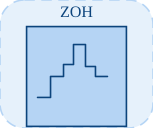

# zoh

<p align="center">

</p>
Samples an input and holds the last sampled value.

## 📝 Syntax

- Block type: zoh

## 📥 Input argument

- input ports - 1 input port(s) declared.

## 📤 Output argument

- output ports - 1 output port(s) declared.

## 📄 Description

Samples an input and holds the last sampled value.

| Field   | Value                     |
| ------- | ------------------------- |
| Module  | <code>nflow_blocks</code> |
| Library | Discrete blocks           |
| Type    | <code>zoh</code>          |
| Label   | ZOH                       |

<b>Description</b>

Zero-Order Hold: holds the input constant for a sampling period (used in discrete-time systems).

<b>Ports</b>

<b>Input(s)</b>

| Port   | Role                              | Side | Position  |
| ------ | --------------------------------- | ---- | --------- |
| Port_1 | Numeric signal read by the block. | left | x=0, y=40 |

<b>Output(s)</b>

| Port   | Role                                  | Side  | Position   |
| ------ | ------------------------------------- | ----- | ---------- |
| Port_1 | Numeric signal produced by the block. | right | x=80, y=40 |

<b>Parameters</b>

| Parameter       | Default value |
| --------------- | ------------- |
| <code>ts</code> | 0.1           |

<b>Inspector Keys</b>

These serialized keys are exposed by the block inspector.

- <code>ts</code>

<b>Block Characteristics</b>

| Field                     | Value                 |
| ------------------------- | --------------------- |
| Block type                | zoh                   |
| Family                    | Discrete blocks       |
| Rendered size             | 80 x 80               |
| Phases                    | INIT, OUTPUT, UPDATE  |
| Direct feedthrough        | see Algorithms        |
| Internal state or history | yes                   |
| Signal data type          | double numeric values |

<b>Algorithms</b>

- INIT clears the stored output and schedules sampling.
- OUTPUT emits the stored output. UPDATE samples when t reaches the next sample time.
- ts is clamped to at least 0.001.

<b>Equation or Rule</b>
$$y(t) = u(t_k),\quad t_k \le t$$

<b>Extended Capabilities</b>

This page describes the native runtime behavior observed in the module C++ sources. Declared phases indicate when the simulation engine calls the block.

Code generation: supported for C and Rust.

<b>Implementation Sources</b>

<details>
<summary>Manifest: <code>modules/nflow_blocks/libraries/discrete/library.json</code></summary>

```json
{
  "id": "builtin.discrete",
  "title": "Discrete",
  "version": "1.0.0",
  "format": "nflow-2",
  "metadata": {
    "author": "Allan CORNET",
    "created": "2026-03-21",
    "tool": "Nelson nflow"
  },
  "comment": "Blocks for discrete-time systems",
  "license": "LGPL-3.0",
  "builtin": true,
  "blocks": [
    {
      "type": "zoh",
      "label": "ZOH",
      "icon": "zoh.svg",
      "phases": ["INIT", "OUTPUT", "UPDATE"],
      "width": 80,
      "height": 80,
      "inputs": [
        {
          "x": 0,
          "y": 40,
          "side": "left"
        }
      ],
      "outputs": [
        {
          "x": 80,
          "y": 40,
          "side": "right"
        }
      ],
      "defaultParams": {
        "SampleTime": 0.1
      },
      "render": {
        "type": "image",
        "src": "zoh.svg"
      }
    },
    {
      "type": "foh",
      "label": "FOH",
      "icon": "foh.svg",
      "phases": ["INIT", "OUTPUT", "UPDATE"],
      "width": 80,
      "height": 80,
      "inputs": [
        {
          "x": 0,
          "y": 40,
          "side": "left"
        }
      ],
      "outputs": [
        {
          "x": 80,
          "y": 40,
          "side": "right"
        }
      ],
      "defaultParams": {
        "SampleTime": 0.1
      },
      "render": {
        "type": "image",
        "src": "foh.svg"
      }
    },
    {
      "type": "dtf",
      "icon": "dtf.svg",
      "label": "Discrete TF",
      "phases": ["INIT", "OUTPUT", "UPDATE"],
      "width": 80,
      "height": 80,
      "inputs": [
        {
          "x": 0,
          "y": 40,
          "side": "left"
        }
      ],
      "outputs": [
        {
          "x": 80,
          "y": 40,
          "side": "right"
        }
      ],
      "defaultParams": {
        "Numerator": [1],
        "Denominator": [1, -0.5],
        "SampleTime": 0.1
      },
      "render": {
        "type": "image",
        "src": "dtf.svg"
      }
    },
    {
      "type": "ddelay",
      "icon": "ddelay.svg",
      "label": "Discrete Delay",
      "phases": ["INIT", "OUTPUT", "UPDATE"],
      "width": 80,
      "height": 80,
      "inputs": [
        {
          "x": 0,
          "y": 40,
          "side": "left"
        }
      ],
      "outputs": [
        {
          "x": 80,
          "y": 40,
          "side": "right"
        }
      ],
      "defaultParams": {
        "DelayLength": 1,
        "SampleTime": 0.1
      },
      "render": {
        "type": "image",
        "src": "ddelay.svg"
      }
    },
    {
      "type": "dstateSpace",
      "icon": "dstateSpace.svg",
      "label": "Discrete State-Space",
      "phases": ["INIT", "OUTPUT", "UPDATE"],
      "width": 80,
      "height": 80,
      "inputs": [
        {
          "x": 0,
          "y": 40,
          "side": "left"
        }
      ],
      "outputs": [
        {
          "x": 80,
          "y": 40,
          "side": "right"
        }
      ],
      "defaultParams": {
        "A": 1,
        "B": 1,
        "C": 1,
        "D": 0,
        "SampleTime": 0.1
      },
      "render": {
        "type": "image",
        "src": "dstateSpace.svg"
      }
    },
    {
      "type": "unitDelay",
      "label": "Unit Delay",
      "icon": "unitDelay.svg",
      "phases": ["INIT", "OUTPUT", "UPDATE"],
      "width": 80,
      "height": 80,
      "inputs": [
        {
          "x": 0,
          "y": 40,
          "side": "left"
        }
      ],
      "outputs": [
        {
          "x": 80,
          "y": 40,
          "side": "right"
        }
      ],
      "defaultParams": {
        "InitialCondition": 0
      },
      "render": {
        "type": "image",
        "src": "exports/unitDelay.svg",
        "svgMode": "element",
        "preserveAspectRatio": "none",
        "x": 0,
        "y": 0,
        "width": 80,
        "height": 80
      }
    },
    {
      "type": "rateTransition",
      "label": "Rate Transition",
      "icon": "rateTransition.svg",
      "phases": ["INIT", "OUTPUT", "UPDATE"],
      "width": 80,
      "height": 80,
      "inputs": [
        {
          "x": 0,
          "y": 40,
          "side": "left"
        }
      ],
      "outputs": [
        {
          "x": 80,
          "y": 40,
          "side": "right"
        }
      ],
      "defaultParams": {
        "OutPortSampleTime": -1,
        "InitialCondition": 0
      },
      "render": {
        "type": "image",
        "src": "exports/rateTransition.svg",
        "svgMode": "element",
        "preserveAspectRatio": "none",
        "x": 0,
        "y": 0,
        "width": 80,
        "height": 80
      }
    },
    {
      "type": "difference",
      "label": "Difference",
      "icon": "difference.svg",
      "phases": ["INIT", "OUTPUT", "UPDATE"],
      "width": 80,
      "height": 80,
      "inputs": [
        {
          "x": 0,
          "y": 40,
          "side": "left"
        }
      ],
      "outputs": [
        {
          "x": 80,
          "y": 40,
          "side": "right"
        }
      ],
      "defaultParams": {
        "ICPrevInput": 0
      },
      "render": {
        "type": "image",
        "src": "exports/difference.svg",
        "svgMode": "element",
        "preserveAspectRatio": "none",
        "x": 0,
        "y": 0,
        "width": 80,
        "height": 80
      }
    },
    {
      "type": "detectChange",
      "label": "Detect Change",
      "icon": "detectChange.svg",
      "phases": ["INIT", "OUTPUT", "UPDATE"],
      "width": 80,
      "height": 80,
      "inputs": [
        {
          "x": 0,
          "y": 40,
          "side": "left"
        }
      ],
      "outputs": [
        {
          "x": 80,
          "y": 40,
          "side": "right"
        }
      ],
      "defaultParams": {
        "InitialCondition": 0
      },
      "render": {
        "type": "image",
        "src": "exports/detectChange.svg",
        "svgMode": "element",
        "preserveAspectRatio": "none",
        "x": 0,
        "y": 0,
        "width": 80,
        "height": 80
      }
    },
    {
      "type": "detectIncrease",
      "label": "Detect Increase",
      "icon": "detectIncrease.svg",
      "phases": ["INIT", "OUTPUT", "UPDATE"],
      "width": 80,
      "height": 80,
      "inputs": [
        {
          "x": 0,
          "y": 40,
          "side": "left"
        }
      ],
      "outputs": [
        {
          "x": 80,
          "y": 40,
          "side": "right"
        }
      ],
      "defaultParams": {
        "InitialCondition": 0
      },
      "render": {
        "type": "image",
        "src": "exports/detectIncrease.svg",
        "svgMode": "element",
        "preserveAspectRatio": "none",
        "x": 0,
        "y": 0,
        "width": 80,
        "height": 80
      }
    },
    {
      "type": "detectDecrease",
      "label": "Detect Decrease",
      "icon": "detectDecrease.svg",
      "phases": ["INIT", "OUTPUT", "UPDATE"],
      "width": 80,
      "height": 80,
      "inputs": [
        {
          "x": 0,
          "y": 40,
          "side": "left"
        }
      ],
      "outputs": [
        {
          "x": 80,
          "y": 40,
          "side": "right"
        }
      ],
      "defaultParams": {
        "InitialCondition": 0
      },
      "render": {
        "type": "image",
        "src": "exports/detectDecrease.svg",
        "svgMode": "element",
        "preserveAspectRatio": "none",
        "x": 0,
        "y": 0,
        "width": 80,
        "height": 80
      }
    },
    {
      "type": "risingEdge",
      "label": "Rising Edge",
      "icon": "risingEdge.svg",
      "phases": ["INIT", "OUTPUT", "UPDATE"],
      "width": 80,
      "height": 80,
      "inputs": [
        {
          "x": 0,
          "y": 40,
          "side": "left"
        }
      ],
      "outputs": [
        {
          "x": 80,
          "y": 40,
          "side": "right"
        }
      ],
      "defaultParams": {
        "InitialCondition": 0
      }
    },
    {
      "type": "fallingEdge",
      "label": "Falling Edge",
      "icon": "fallingEdge.svg",
      "phases": ["INIT", "OUTPUT", "UPDATE"],
      "width": 80,
      "height": 80,
      "inputs": [
        {
          "x": 0,
          "y": 40,
          "side": "left"
        }
      ],
      "outputs": [
        {
          "x": 80,
          "y": 40,
          "side": "right"
        }
      ],
      "defaultParams": {
        "InitialCondition": 0
      }
    }
  ]
}
```

</details>


<details>
<summary>Runtime: <code>modules/nflow_blocks/src/cpp/discrete/zoh.cpp</code></summary>

```cpp
//=============================================================================
// Copyright (c) 2016-present Allan CORNET (Nelson)
//=============================================================================
// This file is part of Nelson.
//=============================================================================
// LICENCE_BLOCK_BEGIN
// SPDX-License-Identifier: LGPL-3.0-or-later
// LICENCE_BLOCK_END
//=============================================================================
#include "SimEngineTypes.hpp"
#include "BlockRegistry.hpp"
#include "FieldNames.hpp"
#include "NFlowBlockDescriptor.hpp"
#include <cmath>
#include <algorithm>
#include "discrete_blocks.hpp"
//=============================================================================
bool
Nelson::NFlow::handleZoh(SimCtx& ctx, const Block& b, Phase phase)
{
    auto& st = getState(ctx, b.nid);
    const int w = outputWidth(ctx, b.nid, 0);
    if (phase == Phase::INIT) {
        st.scalar = 0.0;
        st.output = 0.0;
        st.dNextTime = 0.0;
        if (w > 1) {
            st.vec.assign(w, 0.0);
        }
        return false;
    }
    if (phase == Phase::ALGEBRAIC) {
        // A hold samples at t = kT and holds until the next hit, so at a hit
        // instant the output is the value taken THERE; emitting only the value
        // committed by the previous UPDATE turned the block into a full
        // sample-period delay. Direct feedthrough at a hit, hence ALGEBRAIC:
        // the input may itself come from the algebraic schedule. Pure - UPDATE
        // owns the latch - so an RK stage may re-enter this freely.
        const bool hit = (ctx.t + 1e-6 >= st.dNextTime);
        SigView u = getInputSig(ctx, b.nid, 0);
        return emitElementwise(ctx, b.nid, [&](int i) {
            if (hit) {
                return sigAt(u, i);
            }
            return (w <= 1) ? st.output : ((i < (int)st.vec.size()) ? st.vec[i] : 0.0);
        });
    }
    if (phase == Phase::UPDATE) {
        nflow::BlockDescriptor bd(b, ctx.variables);
        double ts = std::max(0.001, bd.paramDouble(nflow::kTs, ctx.dt));
        if (ctx.t + 1e-6 >= st.dNextTime) {
            if (w <= 1) {
                st.scalar = getInput(ctx, b.nid, 0, 0.0);
            } else {
                SigView u = getInputSig(ctx, b.nid, 0);
                if ((int)st.vec.size() != w) {
                    st.vec.assign(w, 0.0);
                }
                for (int i = 0; i < w; ++i) {
                    st.vec[i] = sigAt(u, i);
                }
            }
            st.dNextTime = ctx.t + ts;
        }
        st.output = st.scalar;
        return false;
    }
    return false;
}
//=============================================================================
Nelson::NFlow::BlockCodegenTemplate
Nelson::NFlow::getCodeGenCZoh()
{
    BlockCodegenTemplate t;
    t.emitState = [](const BlockCodegenStateArgs& a) {
        a.addState("zoh_last_" + a.id, "", "");
        a.addState("zoh_next_" + a.id, "", "");
    };
    // No emitOutput: the hold is direct feedthrough at a hit instant, so the
    // sample has to be taken BEFORE the output is read. Emitting the latch
    // first delayed the block by a whole sample period.
    t.emitStep = [](const BlockCodegenArgs& a) {
        nflow::BlockDescriptor bd(*a.block, *a.variables);
        double ts = std::fmax(0.001, bd.paramDouble(nflow::kTs, 0.0));
        if (ts == 0) {
            ts = a.dt;
        }
        a.line("if (t + 1e-6 >= s->zoh_next_" + a.id + ") {");
        a.line("  s->zoh_last_" + a.id + " = " + a.in[0] + ";");
        a.line("  s->zoh_next_" + a.id + " = t + " + a.fmt(ts) + ";");
        a.line("}");
        a.line("out_" + a.id + " = s->zoh_last_" + a.id + ";");
    };
    return t;
}
//=============================================================================
Nelson::NFlow::BlockCodegenTemplate
Nelson::NFlow::getCodeGenRustZoh()
{
    BlockCodegenTemplate t;
    t.emitState = [](const BlockCodegenStateArgs& a) {
        a.addState("zoh_last_" + a.id, "", "");
        a.addState("zoh_next_" + a.id, "", "");
    };
    // Same reordering as the C template: sample first, then read the hold.
    t.emitStep = [](const BlockCodegenArgs& a) {
        nflow::BlockDescriptor bd(*a.block, *a.variables);
        double ts = std::fmax(0.001, bd.paramDouble(nflow::kTs, 0.0));
        if (ts == 0) {
            ts = a.dt;
        }
        a.line("if t + 1e-6 >= s.zoh_next_" + a.id + " {");
        a.line("    s.zoh_last_" + a.id + " = " + a.in[0] + ";");
        a.line("    s.zoh_next_" + a.id + " = t + " + a.fmt(ts) + ";");
        a.line("}");
        a.line("out_" + a.id + " = s.zoh_last_" + a.id + ";");
    };
    return t;
}
//=============================================================================

```

</details>

## 🔗 See also

[foh](../../nflow_blocks/discrete/foh.md), [unitDelay](../../nflow_blocks/discrete/unitDelay.md), [ddelay](../../nflow_blocks/discrete/ddelay.md).

## 🕔 History

| Version | 📄 Description  |
| ------- | --------------- |
| 1.0.0   | initial version |

<!--
## 👤 Author

Allan CORNET
-->
