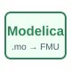

# modelica

Compiles a Modelica model and uses it as an NFlow block.

## 📝 Syntax

- Block type: modelica

## 📄 Description

The <b>Modelica</b> block references inline <b>source</b> or a Modelica <b>file</b>, and selects <b>modelName</b>. Before simulation, NFlow compiles the model to an FMU. 

A working OpenModelica installation is required. Compilation and model errors are reported in Diagnostics. 

## 🔗 See also

[modelicaToFmu](../../nflow_fmi/modelicaToFmu.md).