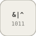

# bitwiseOperator


<p align="center">

</p>
Bit-wise AND/OR/XOR/NAND/NOR/NOT of the input against a constant BitMask.

## 📝 Syntax

- Block type: bitwiseOperator

## 📥 Input argument

- input ports - 1 input port(s) declared.

## 📤 Output argument

- output ports - 1 output port(s) declared.

## 📄 Description


Bit-wise AND/OR/XOR/NAND/NOR/NOT of the input against a constant BitMask. 

| Field | Value |
| --- | --- |
| Module | <code>nflow_blocks</code> | 
| Library | Logic / Bit Operations | 
| Type | <code>bitwiseOperator</code> | 
| Label | Bitwise Operator | 

  

<b>Description</b> 

Reinterprets the (integer-valued) input as an <code>NumBits</code>-wide unsigned integer and applies the selected bit-wise <code>Operation</code> against the constant <code>BitMask</code>. NOT ignores the mask. The result is masked back to <code>NumBits</code> bits and returned as a double. Element-wise over the input width. 

<b>Ports</b> 

<b>Input(s)</b> 

| Port | Role | Side | Position | 
| --- | --- | --- | --- | 
| Port\_1 | Numeric signal read by the block. | left | x=0, y=40 | 

 

<b>Output(s)</b> 

| Port | Role | Side | Position | 
| --- | --- | --- | --- | 
| Port\_1 | Numeric signal produced by the block. | right | x=90, y=40 | 

 

<b>Parameters</b> 

| Parameter | Default value | 
| --- | --- | 
| <code>Operation</code> | AND | 
| <code>BitMask</code> | 0 | 
| <code>NumBits</code> | 32 | 

 

<b>Block Characteristics</b> 

| Field | Value |
| --- | --- |
| Block type | bitwiseOperator | 
| Family | Logic / Bit Operations | 
| Rendered size | 90 x 80 | 
| Phases | ALGEBRAIC | 
| Internal state or history | no | 
| Signal data type | double numeric values | 

 

<b>Algorithms</b> 

- ALGEBRAIC: x = (uint)round(u) & fullmask; out = op(x, BitMask) & fullmask, where fullmask = 2^NumBits - 1. 

<b>Equation or Rule</b> 
$$y = (u \star \text{BitMask}) \,\&\, (2^{\text{NumBits}}-1)$$
 

<b>Extended Capabilities</b> 

Code generation: supported for C and Rust. 

<b>Implementation Sources</b> 

**Manifest:** `modules/nflow_blocks/libraries/logic/library.json`
 

**Runtime:** `modules/nflow_blocks/src/cpp/logic/bitwiseOperator.cpp`


## 💡 Example

AND of 12 (1100) with mask 10 (1010) over 8 bits gives 8 (1000).

```matlab
d.blocks={ struct('id','c','type','constant','inputs',0,'outputs',1,'params',struct('Value',12)), struct('id','b','type','bitwiseOperator','inputs',1,'outputs',1,'params',struct('Operation','AND','BitMask',10,'NumBits',8)), struct('id','w','type','toWorkspace','inputs',1,'outputs',0,'params',struct('VariableName','y','SaveFormat','Array')) };
d.connections={ struct('from','c','to','b','fromIndex',0,'toIndex',0), struct('from','b','to','w','fromIndex',0,'toIndex',0) };
d.sampleTime=0.1; d.duration=0.2; d.solver='discrete'; d.variables=struct();
r=jsondecode(__nflow_simulate__(jsonencode(d)));
```


## 🔗 See also

[bitSet](../../nflow_blocks/logic/bitSet.md), [bitClear](../../nflow_blocks/logic/bitClear.md), [extractBits](../../nflow_blocks/logic/extractBits.md), [shiftArithmetic](../../nflow_blocks/logic/shiftArithmetic.md).

## 🕔 History

| Version | 📄 Description     |
| ------- | --------------- |
| 1.0.0   | initial version |

<!--
## 👤 Author

Allan CORNET
-->
