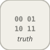

# combinatorialLogic

<p align="center">

</p>
Truth-table lookup: an N-bit input vector indexes a 2^N-entry TruthTable.

## 📝 Syntax

- Block type: combinatorialLogic

## 📥 Input argument

- input ports - 1 input port(s) declared.

## 📤 Output argument

- output ports - 1 output port(s) declared.

## 📄 Description

Truth-table lookup: an N-bit input vector indexes a 2^N-entry TruthTable.

| Field   | Value                           |
| ------- | ------------------------------- |
| Module  | <code>nflow_blocks</code>       |
| Library | Logic / Bit Operations          |
| Type    | <code>combinatorialLogic</code> |
| Label   | Combinatorial Logic             |

<b>Description</b>

The single input is a vector of N boolean elements that forms a binary index (element 0 is the most-significant bit); the output is <code>TruthTable[index]</code>, where <code>TruthTable</code> is a 2^N-entry column. Non-zero inputs count as 1. The block is registered vector-aware (it accepts a vector input and produces a scalar output).

Native runtime only: the vector-input row lookup is not yet code-generated. An out-of-range index or an empty table yields 0.

<b>Ports</b>

<b>Input(s)</b>

| Port   | Role                              | Side | Position  |
| ------ | --------------------------------- | ---- | --------- |
| Port_1 | Numeric signal read by the block. | left | x=0, y=40 |

<b>Output(s)</b>

| Port   | Role                                  | Side  | Position   |
| ------ | ------------------------------------- | ----- | ---------- |
| Port_1 | Numeric signal produced by the block. | right | x=90, y=40 |

<b>Parameters</b>

| Parameter               | Default value |
| ----------------------- | ------------- |
| <code>TruthTable</code> | [0 1 1 0]     |

<b>Block Characteristics</b>

| Field                     | Value                  |
| ------------------------- | ---------------------- |
| Block type                | combinatorialLogic     |
| Family                    | Logic / Bit Operations |
| Rendered size             | 90 x 80                |
| Phases                    | ALGEBRAIC              |
| Internal state or history | no                     |
| Signal data type          | double numeric values  |

<b>Algorithms</b>

- ALGEBRAIC: index = sum over bits (u[i] != 0) \* 2^(N-1-i); out = TruthTable[index].

<b>Equation or Rule</b>
$$y = \text{TruthTable}\big[\textstyle\sum_i u_i\,2^{N-1-i}\big]$$

<b>Extended Capabilities</b>

Native runtime only (this block is not code-generated).

Code generation: supported for C and Rust.

<b>Implementation Sources</b>

<details>
<summary>Manifest: <code>modules/nflow_blocks/libraries/logic/library.json</code></summary>

```json
{
  "id": "builtin.logic",
  "title": "Logic / Bit Operations",
  "version": "0.1.0",
  "format": "nflow-2",
  "builtin": true,
  "blocks": [
    {
      "type": "and",
      "label": "AND",
      "icon": "and.svg",
      "phases": ["ALGEBRAIC"],
      "width": 80,
      "height": 80,
      "inputs": [
        {
          "x": 0,
          "y": 20,
          "side": "left"
        },
        {
          "x": 0,
          "y": 60,
          "side": "left"
        }
      ],
      "outputs": [
        {
          "x": 80,
          "y": 40,
          "side": "right"
        }
      ],
      "render": {
        "type": "math",
        "bodyClass": "block-body",
        "mathGroupClass": "and-math",
        "formula": "\\text{AND}",
        "textSize": "16px"
      }
    },
    {
      "type": "or",
      "label": "OR",
      "icon": "or.svg",
      "phases": ["ALGEBRAIC"],
      "width": 80,
      "height": 80,
      "inputs": [
        {
          "x": 0,
          "y": 20,
          "side": "left"
        },
        {
          "x": 0,
          "y": 60,
          "side": "left"
        }
      ],
      "outputs": [
        {
          "x": 80,
          "y": 40,
          "side": "right"
        }
      ],
      "render": {
        "type": "math",
        "bodyClass": "block-body",
        "mathGroupClass": "or-math",
        "formula": "\\text{OR}",
        "textSize": "16px"
      }
    },
    {
      "type": "xor",
      "label": "XOR",
      "icon": "xor.svg",
      "phases": ["ALGEBRAIC"],
      "width": 80,
      "height": 80,
      "inputs": [
        {
          "x": 0,
          "y": 20,
          "side": "left"
        },
        {
          "x": 0,
          "y": 60,
          "side": "left"
        }
      ],
      "outputs": [
        {
          "x": 80,
          "y": 40,
          "side": "right"
        }
      ],
      "render": {
        "type": "math",
        "bodyClass": "block-body",
        "mathGroupClass": "xor-math",
        "formula": "\\text{XOR}",
        "textSize": "16px"
      }
    },
    {
      "type": "not",
      "label": "NOT",
      "icon": "not.svg",
      "phases": ["ALGEBRAIC"],
      "width": 80,
      "height": 80,
      "inputs": [
        {
          "x": 0,
          "y": 40,
          "side": "left"
        }
      ],
      "outputs": [
        {
          "x": 80,
          "y": 40,
          "side": "right"
        }
      ],
      "render": {
        "type": "math",
        "bodyClass": "block-body",
        "mathGroupClass": "not-math",
        "formula": "\\text{NOT}",
        "textSize": "16px"
      }
    },
    {
      "type": "compareToConstant",
      "label": "Compare Const",
      "icon": "compareToConstant.svg",
      "phases": ["ALGEBRAIC"],
      "width": 100,
      "height": 80,
      "inputs": [
        {
          "x": 0,
          "y": 40,
          "side": "left"
        }
      ],
      "outputs": [
        {
          "x": 100,
          "y": 40,
          "side": "right"
        }
      ],
      "defaultParams": {
        "relop": "ge",
        "const": 0
      },
      "render": {
        "type": "image",
        "src": "exports/compareToConstant.svg",
        "svgMode": "element",
        "preserveAspectRatio": "none",
        "x": 0,
        "y": 0,
        "width": 100,
        "height": 80
      }
    },
    {
      "type": "intervalTest",
      "label": "Interval Test",
      "icon": "intervalTest.svg",
      "phases": ["ALGEBRAIC"],
      "width": 100,
      "height": 80,
      "inputs": [
        {
          "x": 0,
          "y": 40,
          "side": "left"
        }
      ],
      "outputs": [
        {
          "x": 100,
          "y": 40,
          "side": "right"
        }
      ],
      "defaultParams": {
        "LowerLimit": 0,
        "UpperLimit": 1,
        "IntervalClosedLeft": 1,
        "IntervalClosedRight": 1
      },
      "render": {
        "type": "image",
        "src": "exports/intervalTest.svg",
        "svgMode": "element",
        "preserveAspectRatio": "none",
        "x": 0,
        "y": 0,
        "width": 100,
        "height": 80
      }
    },
    {
      "type": "intervalTestDynamic",
      "label": "Interval Test Dynamic",
      "icon": "intervalTestDynamic.svg",
      "phases": ["ALGEBRAIC"],
      "width": 100,
      "height": 80,
      "inputs": [
        {
          "x": 0,
          "y": 20,
          "side": "left"
        },
        {
          "x": 0,
          "y": 40,
          "side": "left"
        },
        {
          "x": 0,
          "y": 60,
          "side": "left"
        }
      ],
      "outputs": [
        {
          "x": 100,
          "y": 40,
          "side": "right"
        }
      ],
      "defaultParams": {
        "IntervalClosedLeft": 1,
        "IntervalClosedRight": 1
      },
      "render": {
        "type": "image",
        "src": "exports/intervalTestDynamic.svg",
        "svgMode": "element",
        "preserveAspectRatio": "none",
        "x": 0,
        "y": 0,
        "width": 100,
        "height": 80
      }
    },
    {
      "type": "bitwiseOperator",
      "label": "Bitwise Operator",
      "icon": "bitwiseOperator.svg",
      "phases": ["ALGEBRAIC"],
      "width": 90,
      "height": 80,
      "inputs": [
        {
          "x": 0,
          "y": 40,
          "side": "left"
        }
      ],
      "outputs": [
        {
          "x": 90,
          "y": 40,
          "side": "right"
        }
      ],
      "defaultParams": {
        "Operation": "AND",
        "BitMask": 0,
        "NumBits": 32
      },
      "render": {
        "type": "image",
        "src": "exports/bitwiseOperator.svg",
        "svgMode": "element",
        "preserveAspectRatio": "none",
        "x": 0,
        "y": 0,
        "width": 90,
        "height": 80
      }
    },
    {
      "type": "bitSet",
      "label": "Bit Set",
      "icon": "bitSet.svg",
      "phases": ["ALGEBRAIC"],
      "width": 80,
      "height": 80,
      "inputs": [
        {
          "x": 0,
          "y": 40,
          "side": "left"
        }
      ],
      "outputs": [
        {
          "x": 80,
          "y": 40,
          "side": "right"
        }
      ],
      "defaultParams": {
        "BitIndex": 0,
        "NumBits": 32
      },
      "render": {
        "type": "image",
        "src": "exports/bitSet.svg",
        "svgMode": "element",
        "preserveAspectRatio": "none",
        "x": 0,
        "y": 0,
        "width": 80,
        "height": 80
      }
    },
    {
      "type": "bitClear",
      "label": "Bit Clear",
      "icon": "bitClear.svg",
      "phases": ["ALGEBRAIC"],
      "width": 80,
      "height": 80,
      "inputs": [
        {
          "x": 0,
          "y": 40,
          "side": "left"
        }
      ],
      "outputs": [
        {
          "x": 80,
          "y": 40,
          "side": "right"
        }
      ],
      "defaultParams": {
        "BitIndex": 0,
        "NumBits": 32
      },
      "render": {
        "type": "image",
        "src": "exports/bitClear.svg",
        "svgMode": "element",
        "preserveAspectRatio": "none",
        "x": 0,
        "y": 0,
        "width": 80,
        "height": 80
      }
    },
    {
      "type": "extractBits",
      "label": "Extract Bits",
      "icon": "extractBits.svg",
      "phases": ["ALGEBRAIC"],
      "width": 90,
      "height": 80,
      "inputs": [
        {
          "x": 0,
          "y": 40,
          "side": "left"
        }
      ],
      "outputs": [
        {
          "x": 90,
          "y": 40,
          "side": "right"
        }
      ],
      "defaultParams": {
        "StartBit": 0,
        "NumBitsToExtract": 8,
        "NumBits": 32,
        "OutputScaling": "keepWeight"
      },
      "render": {
        "type": "image",
        "src": "exports/extractBits.svg",
        "svgMode": "element",
        "preserveAspectRatio": "none",
        "x": 0,
        "y": 0,
        "width": 90,
        "height": 80
      }
    },
    {
      "type": "shiftArithmetic",
      "label": "Shift Arithmetic",
      "icon": "shiftArithmetic.svg",
      "phases": ["ALGEBRAIC"],
      "width": 90,
      "height": 80,
      "inputs": [
        {
          "x": 0,
          "y": 40,
          "side": "left"
        }
      ],
      "outputs": [
        {
          "x": 90,
          "y": 40,
          "side": "right"
        }
      ],
      "defaultParams": {
        "ShiftDirection": "Left",
        "ShiftNumber": 1
      },
      "render": {
        "type": "image",
        "src": "exports/shiftArithmetic.svg",
        "svgMode": "element",
        "preserveAspectRatio": "none",
        "x": 0,
        "y": 0,
        "width": 90,
        "height": 80
      }
    },
    {
      "type": "combinatorialLogic",
      "label": "Combinatorial Logic",
      "icon": "combinatorialLogic.svg",
      "phases": ["ALGEBRAIC"],
      "width": 90,
      "height": 80,
      "inputs": [
        {
          "x": 0,
          "y": 40,
          "side": "left"
        }
      ],
      "outputs": [
        {
          "x": 90,
          "y": 40,
          "side": "right"
        }
      ],
      "defaultParams": {
        "TruthTable": [0, 1, 1, 0]
      },
      "render": {
        "type": "image",
        "src": "exports/combinatorialLogic.svg",
        "svgMode": "element",
        "preserveAspectRatio": "none",
        "x": 0,
        "y": 0,
        "width": 90,
        "height": 80
      }
    },
    {
      "type": "compareToZero",
      "label": "Compare Zero",
      "icon": "compareToZero.svg",
      "phases": ["ALGEBRAIC"],
      "width": 100,
      "height": 80,
      "inputs": [
        {
          "x": 0,
          "y": 40,
          "side": "left"
        }
      ],
      "outputs": [
        {
          "x": 100,
          "y": 40,
          "side": "right"
        }
      ],
      "defaultParams": {
        "relop": "ne"
      },
      "render": {
        "type": "image",
        "src": "exports/compareToZero.svg",
        "svgMode": "element",
        "preserveAspectRatio": "none",
        "x": 0,
        "y": 0,
        "width": 100,
        "height": 80
      }
    },
    {
      "type": "relationalOperator",
      "label": "Relational",
      "icon": "relationalOperator.svg",
      "phases": ["ALGEBRAIC"],
      "width": 100,
      "height": 80,
      "inputs": [
        {
          "x": 0,
          "y": 30,
          "side": "left"
        },
        {
          "x": 0,
          "y": 50,
          "side": "left"
        }
      ],
      "outputs": [
        {
          "x": 100,
          "y": 40,
          "side": "right"
        }
      ],
      "defaultParams": {
        "Operator": "ge"
      },
      "render": {
        "type": "image",
        "src": "exports/relationalOperator.svg",
        "svgMode": "element",
        "preserveAspectRatio": "none",
        "x": 0,
        "y": 0,
        "width": 100,
        "height": 80
      }
    },
    {
      "type": "switchCase",
      "label": "Switch Case",
      "icon": "switchCase.svg",
      "phases": ["ALGEBRAIC"],
      "width": 100,
      "height": 80,
      "inputs": [
        {
          "x": 0,
          "y": 40,
          "side": "left"
        }
      ],
      "outputs": [
        {
          "x": 100,
          "y": 30,
          "side": "right"
        },
        {
          "x": 100,
          "y": 50,
          "side": "right"
        }
      ],
      "defaultParams": {
        "CaseConditions": "{1}",
        "ShowDefaultCase": "on"
      },
      "render": {
        "type": "image",
        "src": "exports/switchCase.svg",
        "svgMode": "element",
        "preserveAspectRatio": "none",
        "x": 0,
        "y": 0,
        "width": 100,
        "height": 80
      }
    },
    {
      "type": "if",
      "label": "If",
      "icon": "if.svg",
      "phases": ["ALGEBRAIC"],
      "width": 100,
      "height": 80,
      "inputs": [
        {
          "x": 0,
          "y": 30,
          "side": "left"
        },
        {
          "x": 0,
          "y": 50,
          "side": "left"
        }
      ],
      "outputs": [
        {
          "x": 100,
          "y": 30,
          "side": "right"
        },
        {
          "x": 100,
          "y": 50,
          "side": "right"
        }
      ],
      "defaultParams": {
        "IfExpression": "u1 > 0",
        "ElseIfExpressions": "",
        "ShowElse": "on"
      },
      "render": {
        "type": "image",
        "src": "exports/if.svg",
        "svgMode": "element",
        "preserveAspectRatio": "none",
        "x": 0,
        "y": 0,
        "width": 100,
        "height": 80
      }
    },
    {
      "type": "logicalOperator",
      "label": "Logical Operator",
      "icon": "logicalOperator.svg",
      "phases": ["ALGEBRAIC"],
      "width": 80,
      "height": 80,
      "inputs": [
        {
          "x": 0,
          "y": 30,
          "side": "left"
        },
        {
          "x": 0,
          "y": 50,
          "side": "left"
        }
      ],
      "outputs": [
        {
          "x": 80,
          "y": 40,
          "side": "right"
        }
      ],
      "defaultParams": {
        "Operator": "AND"
      },
      "render": {
        "type": "image",
        "src": "exports/logicalOperator.svg",
        "svgMode": "element",
        "preserveAspectRatio": "none",
        "x": 0,
        "y": 0,
        "width": 80,
        "height": 80
      }
    }
  ]
}
```

</details>


<details>
<summary>Runtime: <code>modules/nflow_blocks/src/cpp/logic/combinatorialLogic.cpp</code></summary>

```cpp
//=============================================================================
// Copyright (c) 2016-present Allan CORNET (Nelson)
//=============================================================================
// This file is part of Nelson.
//=============================================================================
// LICENCE_BLOCK_BEGIN
// SPDX-License-Identifier: LGPL-3.0-or-later
// LICENCE_BLOCK_END
//=============================================================================
// combinatorialLogic: a truth-table lookup (Combinatorial Logic). The single
// input is a vector of N boolean elements forming a binary index (element 0 is
// the most-significant bit); the output is TruthTable[index], where TruthTable
// is a 2^N-entry column read from the parameter list. Non-zero inputs count as
// 1. Pure algebraic feedthrough with a scalar output. Native-only for now (the
// vector-input row lookup is not yet code-generated); an out-of-range index or
// an empty table yields 0.
//=============================================================================
#include "SimEngineTypes.hpp"
#include "BlockRegistry.hpp"
#include "FieldNames.hpp"
#include "NFlowBlockDescriptor.hpp"
#include "NFlowCodegenLang.hpp"
#include <cmath>
#include <cstdint>
#include <vector>
#include "logic_blocks.hpp"
//=============================================================================
namespace Nelson {
namespace NFlow {
    //=============================================================================
    bool
    handleCombinatorialLogic(SimCtx& ctx, const Block& b, Phase phase)
    {
        if (phase != Phase::ALGEBRAIC) {
            return false;
        }
        if (!hasInput(ctx, b.nid, 0)) {
            return false;
        }
        nflow::BlockDescriptor bd(b, ctx.variables);
        const std::vector<double> table = bd.paramList("TruthTable");
        SigView u = getInputSig(ctx, b.nid, 0);
        const int n = (u.width > 0) ? u.width : 1;
        uint64_t index = 0;
        for (int i = 0; i < n && i < 63; ++i) {
            index = (index << 1) | ((sigAt(u, i) != 0.0) ? 1ULL : 0ULL);
        }
        double out = 0.0;
        if (index < table.size()) {
            out = table[static_cast<size_t>(index)];
        }
        setOutput(ctx, b.nid, out);
        return false;
    }
    //=============================================================================
    // ---- Code generation ----
    // The vector expansion keeps ONE block whose input elements become N
    // scalar ports (MSB-first, the runtime's bit-fold order). The truth
    // table is baked as a constant array and indexed at runtime; an index
    // beyond the table yields 0.0 like the handler.
    //=============================================================================
    static BlockCodegenTemplate
    makeCombinatorialLogicCodegen(CodegenLang L)
    {
        BlockCodegenTemplate t;
        t.emitStep = [L](const BlockCodegenArgs& a) {
            nflow::BlockDescriptor bd(*a.block, *a.variables);
            const std::vector<double> table = bd.paramList("TruthTable");
            if (table.empty()) {
                // No table: every index misses, like the handler.
                a.line("out_" + a.id + " = 0.0;");
                return;
            }
            const size_t n = a.inputIds.empty() ? 1 : a.inputIds.size();
            std::string tbl;
            for (size_t k = 0; k < table.size(); ++k) {
                if (k > 0) {
                    tbl += ", ";
                }
                tbl += a.fmt(table[k]);
            }
            const std::string sz = std::to_string(table.size());
            if (L.rust) {
                a.line("{");
                a.line("    let cl_tbl: [f64; " + sz + "] = [" + tbl + "];");
                a.line("    let mut cl_i: usize = 0;");
                for (size_t i = 0; i < n; ++i) {
                    a.line(
                        "    cl_i = (cl_i << 1) | (if " + a.in[i] + " != 0.0 { 1 } else { 0 });");
                }
                a.line(
                    "    out_" + a.id + " = if cl_i < " + sz + " { cl_tbl[cl_i] } else { 0.0 };");
                a.line("}");
            } else {
                a.line("{");
                a.line("  static const double cl_tbl_" + a.id + "[" + sz + "] = { " + tbl + " };");
                a.line("  unsigned long cl_i = 0;");
                for (size_t i = 0; i < n; ++i) {
                    a.line("  cl_i = (cl_i << 1) | ((" + a.in[i] + ") != 0.0 ? 1u : 0u);");
                }
                a.line(
                    "  out_" + a.id + " = (cl_i < " + sz + "u) ? cl_tbl_" + a.id + "[cl_i] : 0.0;");
                a.line("}");
            }
        };
        return t;
    }
    //=============================================================================
    BlockCodegenTemplate
    getCodeGenCCombinatorialLogic()
    {
        return makeCombinatorialLogicCodegen({ false });
    }
    BlockCodegenTemplate
    getCodeGenRustCombinatorialLogic()
    {
        return makeCombinatorialLogicCodegen({ true });
    }
    //=============================================================================
} // namespace NFlow
} // namespace Nelson
//=============================================================================

```

</details>

## 💡 Example

A 2-input XOR truth table [0 1 1 0] applied to the vector [1 0] gives 1.

```matlab
d.blocks={ struct('id','c','type','constant','inputs',0,'outputs',1,'params',struct('Value',[1 0])), struct('id','cl','type','combinatorialLogic','inputs',1,'outputs',1,'params',struct('TruthTable',[0 1 1 0])), struct('id','w','type','toWorkspace','inputs',1,'outputs',0,'params',struct('VariableName','y','SaveFormat','Array')) };
d.connections={ struct('from','c','to','cl','fromIndex',0,'toIndex',0), struct('from','cl','to','w','fromIndex',0,'toIndex',0) };
d.sampleTime=0.1; d.duration=0.2; d.solver='discrete'; d.variables=struct();
r=jsondecode(__nflow_simulate__(jsonencode(d)));
```

## 🔗 See also

[bitwiseOperator](../../nflow_blocks/logic/bitwiseOperator.md).

## 🕔 History

| Version | 📄 Description  |
| ------- | --------------- |
| 1.0.0   | initial version |

<!--
## 👤 Author

Allan CORNET
-->
