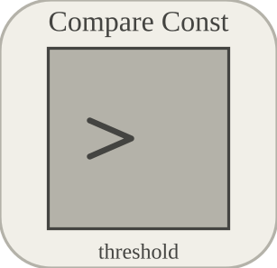

# compareToConstant

Compares one input to a constant threshold.

## 📝 Syntax

- Block type: compareToConstant

## 📥 Input argument

- input ports - 1 input port(s) declared.

## 📤 Output argument

- output ports - 1 output port(s) declared.

## 📄 Description

Compares one input to a constant threshold. 

| Field | Value |
| --- | --- |
| Module | <code>nflow_blocks</code> | 
| Library | Logic blocks | 
| Type | <code>compareToConstant</code> | 
| Label | Compare Const | 

  

<b>Description</b> 

Compares the input signal with a configured constant threshold and outputs 1 when the comparison is true, otherwise 0. 

<b>Ports</b> 

<b>Input(s)</b> 

| Port | Role | Side | Position | 
| --- | --- | --- | --- | 
| Port\_1 | Numeric signal read by the block. | left | x=0, y=40 | 

 

<b>Output(s)</b> 

| Port | Role | Side | Position | 
| --- | --- | --- | --- | 
| Port\_1 | Numeric signal produced by the block. | right | x=100, y=40 | 

 

<b>Parameters</b> 

| Parameter | Default value | 
| --- | --- | 
| <code>operator</code> | ge | 
| <code>threshold</code> | 0 | 

 

<b>Inspector Keys</b> 

These serialized keys are exposed by the block inspector. 

- <code>operator</code> 
- <code>threshold</code> 

<b>Block Characteristics</b> 

| Field | Value |
| --- | --- |
| Block type | compareToConstant | 
| Family | Logic blocks | 
| Rendered size | 100 x 80 | 
| Phases | ALGEBRAIC | 
| Direct feedthrough | yes | 
| Internal state or history | not observed in the documented runtime | 
| Signal data type | double numeric values | 

 

<b>Algorithms</b> 

- Algebraic block. Requires the first input port. 
- Supported operators are ge, gt, and ne; unknown values fall back to ge. 
- threshold is resolved numerically. 

<b>Equation or Rule</b> 
$$y = \operatorname{compare}(u,\,threshold,\,operator)$$
 

<b>Extended Capabilities</b> 

This page describes the native runtime behavior observed in the module C++ sources. Declared phases indicate when the simulation engine calls the block. 

Code generation: supported for C and Rust. 

<b>Implementation Sources</b> 

**Manifest:** `modules/nflow_blocks/libraries/logic/library.json`
 

**Runtime:** `modules/nflow_blocks/src/cpp/logic/compareToConstant.cpp`

## 🔗 See also

[compareToZero](../../nflow_blocks/logic/compareToZero.md), [relationalOperator](../../nflow_blocks/logic/relationalOperator.md).

## 🕔 History

| Version | 📄 Description     |
| ------- | --------------- |
| 1.0.0   | initial version |

<!--
## 👤 Author

Allan CORNET
-->
