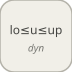

# intervalTestDynamic


<p align="center">

</p>
Like intervalTest but the bounds come from input ports (lo, u, up).

## 📝 Syntax

- Block type: intervalTestDynamic

## 📥 Input argument

- input ports - 3 input port(s) declared.

## 📤 Output argument

- output ports - 1 output port(s) declared.

## 📄 Description


Like intervalTest but the bounds come from input ports (lo, u, up). 

| Field | Value |
| --- | --- |
| Module | <code>nflow_blocks</code> | 
| Library | Logic / Bit Operations | 
| Type | <code>intervalTestDynamic</code> | 
| Label | Interval Test Dynamic | 

  

<b>Description</b> 

Signal-driven variant of <code>intervalTest</code>: instead of parameters, the lower bound, the value and the upper bound are read from input ports 1, 2 and 3 respectively, so the acceptance window can move at run time. Output is 1 when <code>lo <= u <= up</code>. <code>IntervalClosedLeft</code>/<code>IntervalClosedRight</code> control end inclusivity. Element-wise over the value width; scalar bounds broadcast. 

<b>Ports</b> 

<b>Input(s)</b> 

| Port | Role | Side | Position | 
| --- | --- | --- | --- | 
| Port\_1 | Numeric signal read by the block. | left | x=0, y=20 | 
| Port\_2 | Numeric signal read by the block. | left | x=0, y=40 | 
| Port\_3 | Numeric signal read by the block. | left | x=0, y=60 | 

 

<b>Output(s)</b> 

| Port | Role | Side | Position | 
| --- | --- | --- | --- | 
| Port\_1 | Numeric signal produced by the block. | right | x=100, y=40 | 

 

<b>Parameters</b> 

| Parameter | Default value | 
| --- | --- | 
| <code>IntervalClosedLeft</code> | 1 | 
| <code>IntervalClosedRight</code> | 1 | 

 

<b>Block Characteristics</b> 

| Field | Value |
| --- | --- |
| Block type | intervalTestDynamic | 
| Family | Logic / Bit Operations | 
| Rendered size | 100 x 80 | 
| Phases | ALGEBRAIC | 
| Internal state or history | no | 
| Signal data type | double numeric values | 

 

<b>Algorithms</b> 

- ALGEBRAIC: reads port 0 = lower, port 1 = value, port 2 = upper; out = 1 when the value is inside the (possibly open) interval. 

<b>Equation or Rule</b> 
$$y = \begin{cases} 1 & \text{lo} \le u \le \text{up} \\ 0 & \text{otherwise} \end{cases}$$
 

<b>Extended Capabilities</b> 

Code generation: supported for C and Rust. 

<b>Implementation Sources</b> 

**Manifest:** `modules/nflow_blocks/libraries/logic/library.json`
 

**Runtime:** `modules/nflow_blocks/src/cpp/logic/intervalTestDynamic.cpp`


## 💡 Example

Feed lo=1, u=ramp, up=3 and record when the ramp enters the window.

```matlab
d.blocks={ struct('id','lo','type','constant','inputs',0,'outputs',1,'params',struct('Value',1)), struct('id','u','type','ramp','inputs',0,'outputs',1,'params',struct('slope',1)), struct('id','up','type','constant','inputs',0,'outputs',1,'params',struct('Value',3)), struct('id','it','type','intervalTestDynamic','inputs',3,'outputs',1,'params',struct()), struct('id','w','type','toWorkspace','inputs',1,'outputs',0,'params',struct('VariableName','y','SaveFormat','Array')) };
d.connections={ struct('from','lo','to','it','fromIndex',0,'toIndex',0), struct('from','u','to','it','fromIndex',0,'toIndex',1), struct('from','up','to','it','fromIndex',0,'toIndex',2), struct('from','it','to','w','fromIndex',0,'toIndex',0) };
d.sampleTime=0.1; d.duration=1.0; d.solver='discrete'; d.variables=struct();
r=jsondecode(__nflow_simulate__(jsonencode(d)));
```


## 🔗 See also

[intervalTest](../../nflow_blocks/logic/intervalTest.md).

## 🕔 History

| Version | 📄 Description     |
| ------- | --------------- |
| 1.0.0   | initial version |

<!--
## 👤 Author

Allan CORNET
-->
