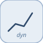

# lookupDynamic


<p align="center">

</p>
1-D interpolated lookup with breakpoints and table taken from input ports.

## 📝 Syntax

- Block type: lookupDynamic

## 📥 Input argument

- input ports - 3 input port(s) declared.

## 📤 Output argument

- output ports - 1 output port(s) declared.

## 📄 Description


1-D interpolated lookup with breakpoints and table taken from input ports. 

| Field | Value |
| --- | --- |
| Module | <code>nflow_blocks</code> | 
| Library | Lookup Tables | 
| Type | <code>lookupDynamic</code> | 
| Label | Lookup Table Dynamic | 

  

<b>Description</b> 

A 1-D linearly interpolated lookup whose breakpoint and table data come from input ports instead of parameters, so the table can change at run time. Port 0 = value x; port 1 = breakpoint vector xdat (strictly increasing); port 2 = table vector ydat (same length). The output is the linear interpolation of (xdat, ydat) at x, clipped outside the range. 

Native runtime (the run-time vector table is a follow-up for code generation). 

<b>Ports</b> 

<b>Input(s)</b> 

| Port | Role | Side | Position | 
| --- | --- | --- | --- | 
| Port\_1 | Numeric signal read by the block. | left | x=0, y=20 | 
| Port\_2 | Numeric signal read by the block. | left | x=0, y=40 | 
| Port\_3 | Numeric signal read by the block. | left | x=0, y=60 | 

 

<b>Output(s)</b> 

| Port | Role | Side | Position | 
| --- | --- | --- | --- | 
| Port\_1 | Numeric signal produced by the block. | right | x=90, y=40 | 

 

<b>Parameters</b> 

| Parameter | Default value | 
| --- | --- | 
| *none* |  | 

 

<b>Block Characteristics</b> 

| Field | Value |
| --- | --- |
| Block type | lookupDynamic | 
| Family | Lookup Tables | 
| Rendered size | 90 x 80 | 
| Phases | ALGEBRAIC | 
| Internal state or history | no | 
| Signal data type | double numeric values | 

 

<b>Algorithms</b> 

- ALGEBRAIC: locate the interval in xdat, interpolate ydat linearly, clip outside range. 

<b>Equation or Rule</b> 
$$y = \text{interp}(\text{xdat}, \text{ydat}, x)$$
 

<b>Extended Capabilities</b> 

Code generation: supported for C and Rust. 

<b>Implementation Sources</b> 

**Manifest:** `modules/nflow_blocks/libraries/lookup/library.json`
 

**Runtime:** `modules/nflow_blocks/src/cpp/lookup/lookupDynamic.cpp`


## 💡 Example

Interpolate ydat=[0 1 4 9 16] over xdat=[0 1 2 3 4] at x=2.5 -> 6.5.

```matlab
d.blocks={ struct('id','x','type','constant','inputs',0,'outputs',1,'params',struct('Value',2.5)), struct('id','xd','type','constant','inputs',0,'outputs',1,'params',struct('Value',[0 1 2 3 4])), struct('id','yd','type','constant','inputs',0,'outputs',1,'params',struct('Value',[0 1 4 9 16])), struct('id','ld','type','lookupDynamic','inputs',3,'outputs',1,'params',struct()), struct('id','w','type','toWorkspace','inputs',1,'outputs',0,'params',struct('VariableName','y','SaveFormat','Array')) };
d.connections={ struct('from','x','to','ld','fromIndex',0,'toIndex',0), struct('from','xd','to','ld','fromIndex',0,'toIndex',1), struct('from','yd','to','ld','fromIndex',0,'toIndex',2), struct('from','ld','to','w','fromIndex',0,'toIndex',0) };
d.sampleTime=0.1; d.duration=0.2; d.solver='discrete'; d.variables=struct();
r=jsondecode(__nflow_simulate__(jsonencode(d)));
```


## 🔗 See also

[lookup1D](../../nflow_blocks/lookup/lookup1D.md), [prelookup](../../nflow_blocks/lookup/prelookup.md).

## 🕔 History

| Version | 📄 Description     |
| ------- | --------------- |
| 1.0.0   | initial version |

<!--
## 👤 Author

Allan CORNET
-->
