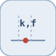

# prelookup


<p align="center">

</p>
Computes the interval index k and fraction f for a shared breakpoint search.

## 📝 Syntax

- Block type: prelookup

## 📥 Input argument

- input ports - 1 input port(s) declared.

## 📤 Output argument

- output ports - 1 output port(s) declared.

## 📄 Description


Computes the interval index k and fraction f for a shared breakpoint search. 

| Field | Value |
| --- | --- |
| Module | <code>nflow_blocks</code> | 
| Library | Lookup Tables | 
| Type | <code>prelookup</code> | 
| Label | Prelookup | 

  

<b>Description</b> 

Given a scalar input <code>u</code> and the strictly increasing <code>BreakpointsForDimension1</code> vector, computes the interval index k with bp[k] <= u < bp[k+1] and the fraction f = (u - bp[k]) / (bp[k+1] - bp[k]). The output is the 2-element vector <code>[k, f]</code>, which one or more <code>interpolationPrelookup</code> blocks can reuse to interpolate several tables without repeating the interval search. 

Out-of-range inputs are clipped: below the first breakpoint gives [0, 0]; at or above the last gives [N-2, 1]. Code generation is supported for C and Rust (the vector-expansion pass lowers the block into scalar helpers). 

<b>Ports</b> 

<b>Input(s)</b> 

| Port | Role | Side | Position | 
| --- | --- | --- | --- | 
| Port\_1 | Numeric signal read by the block. | left | x=0, y=40 | 

 

<b>Output(s)</b> 

| Port | Role | Side | Position | 
| --- | --- | --- | --- | 
| Port\_1 | Numeric signal produced by the block. | right | x=90, y=40 | 

 

<b>Parameters</b> 

| Parameter | Default value | 
| --- | --- | 
| <code>BreakpointsForDimension1</code> | [0 1 2 3 4] | 

 

<b>Block Characteristics</b> 

| Field | Value |
| --- | --- |
| Block type | prelookup | 
| Family | Lookup Tables | 
| Rendered size | 90 x 80 | 
| Phases | ALGEBRAIC | 
| Internal state or history | no | 
| Signal data type | double numeric values | 

 

<b>Algorithms</b> 

- ALGEBRAIC: locate k, compute f, output [k, f]. 

<b>Equation or Rule</b> 
$$k : b_k \le u < b_{k+1},\quad f = \frac{u - b_k}{b_{k+1} - b_k}$$
 

<b>Extended Capabilities</b> 

Code generation: supported for C and Rust. 

<b>Implementation Sources</b> 

**Manifest:** `modules/nflow_blocks/libraries/lookup/library.json`
 

**Runtime:** `modules/nflow_blocks/src/cpp/lookup/prelookup.cpp`


## 💡 Example

Prelookup u = 2.5 over [0 1 2 3 4], then interpolate table [0 1 4 9 16] -> 6.5.

```matlab
d.blocks={ struct('id','c','type','constant','inputs',0,'outputs',1,'params',struct('Value',2.5)), struct('id','pl','type','prelookup','inputs',1,'outputs',1,'params',struct('BreakpointsForDimension1',[0 1 2 3 4])), struct('id','ip','type','interpolationPrelookup','inputs',1,'outputs',1,'params',struct('Table',[0 1 4 9 16])), struct('id','w','type','toWorkspace','inputs',1,'outputs',0,'params',struct('VariableName','y','SaveFormat','Array')) };
d.connections={ struct('from','c','to','pl','fromIndex',0,'toIndex',0), struct('from','pl','to','ip','fromIndex',0,'toIndex',0), struct('from','ip','to','w','fromIndex',0,'toIndex',0) };
d.sampleTime=0.1; d.duration=0.2; d.solver='discrete'; d.variables=struct();
r=jsondecode(__nflow_simulate__(jsonencode(d)));
```


## 🔗 See also

[interpolationPrelookup](../../nflow_blocks/lookup/interpolationPrelookup.md), [lookup1D](../../nflow_blocks/lookup/lookup1D.md).

## 🕔 History

| Version | 📄 Description     |
| ------- | --------------- |
| 1.0.0   | initial version |

<!--
## 👤 Author

Allan CORNET
-->
