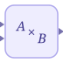

# matmul

Multiplies two matrix signals or applies element-wise multiplication.

## 📝 Syntax

- Block type: matmul

## 📄 Description

The <b>MatMul</b> block has two inputs and one output. With <b>MultiplicationRule</b> set to <b>matrix</b>, it computes the matrix product A \* B. With <b>elementwise</b>, it multiplies corresponding elements. 

Matrix dimensions must be compatible with the selected rule. Scalars are expanded where the signal-layout rules allow it.  

<b>Extended Capabilities</b> 

Code generation: supported for C and Rust. 

<b>Implementation Sources</b> 

**Manifest:** `modules/nflow_blocks/libraries/math/library.json`
 

**Runtime:** `modules/nflow_blocks/src/cpp/matrix/matmul.cpp`

## 🔗 See also

[mult](../../nflow_blocks/math/mult.md).