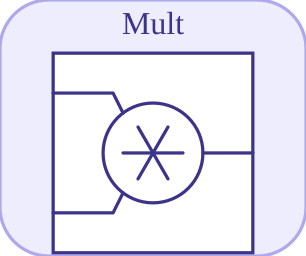

# mult

<p align="center">

</p>
Multiplies connected inputs.

## 📝 Syntax

- Block type: mult

## 📥 Input argument

- input ports - 3 input port(s) declared.

## 📤 Output argument

- output ports - 1 output port(s) declared.

## 📄 Description

Multiplies connected inputs.

| Field   | Value                     |
| ------- | ------------------------- |
| Module  | <code>nflow_blocks</code> |
| Library | Math blocks               |
| Type    | <code>mult</code>         |
| Label   | Mult                      |

<b>Description</b>

Multiplies up to three inputs together.

<b>Ports</b>

<b>Input(s)</b>

| Port   | Role                              | Side   | Position    |
| ------ | --------------------------------- | ------ | ----------- |
| Port_1 | Numeric signal read by the block. | left   | x=-30, y=10 |
| Port_2 | Numeric signal read by the block. | top    | x=10, y=-30 |
| Port_3 | Numeric signal read by the block. | bottom | x=10, y=50  |

<b>Output(s)</b>

| Port   | Role                                  | Side  | Position   |
| ------ | ------------------------------------- | ----- | ---------- |
| Port_1 | Numeric signal produced by the block. | right | x=50, y=10 |

<b>Parameters</b>

No block parameters are declared in the manifest.

<b>Block Characteristics</b>

| Field                     | Value                                  |
| ------------------------- | -------------------------------------- |
| Block type                | mult                                   |
| Family                    | Math blocks                            |
| Rendered size             | 20 x 20                                |
| Phases                    | ALGEBRAIC                              |
| Direct feedthrough        | yes                                    |
| Internal state or history | not observed in the documented runtime |
| Signal data type          | double numeric values                  |

<b>Algorithms</b>

- Algebraic block.
- Starts at 1 and multiplies each connected input; unconnected ports are skipped.

<b>Equation or Rule</b>
$$y = \prod_i u_i$$

<b>Extended Capabilities</b>

This page describes the native runtime behavior observed in the module C++ sources. Declared phases indicate when the simulation engine calls the block.

Code generation: supported for C and Rust.

<b>Implementation Sources</b>

<details>
<summary>Manifest: <code>modules/nflow_blocks/libraries/math/library.json</code></summary>

```json
{
  "id": "builtin.math",
  "title": "Math",
  "version": "1.0.0",
  "format": "nflow-2",
  "metadata": {
    "author": "Allan CORNET",
    "created": "2026-03-21",
    "tool": "Nelson nflow"
  },
  "builtin": true,
  "comment": "Basic math blocks",
  "license": "LGPL-3.0",
  "blocks": [
    {
      "type": "matmul",
      "label": "MatMul",
      "icon": "matmul.svg",
      "phases": ["ALGEBRAIC"],
      "width": 60,
      "height": 60,
      "inputs": [
        {
          "x": 0,
          "y": 20,
          "side": "left"
        },
        {
          "x": 0,
          "y": 40,
          "side": "left"
        }
      ],
      "outputs": [
        {
          "x": 60,
          "y": 30,
          "side": "right"
        }
      ],
      "defaultParams": {
        "MultiplicationRule": "matrix"
      }
    },
    {
      "type": "sumElements",
      "label": "Sum of Elements",
      "icon": "sumElements.svg",
      "phases": ["ALGEBRAIC"],
      "width": 80,
      "height": 80,
      "inputs": [
        {
          "x": 0,
          "y": 40,
          "side": "left"
        }
      ],
      "outputs": [
        {
          "x": 80,
          "y": 40,
          "side": "right"
        }
      ],
      "defaultParams": {},
      "render": {
        "type": "image",
        "src": "exports/sumElements.svg",
        "svgMode": "element",
        "preserveAspectRatio": "none",
        "x": 0,
        "y": 0,
        "width": 80,
        "height": 80
      }
    },
    {
      "type": "productOfElements",
      "label": "Product of Elements",
      "icon": "productOfElements.svg",
      "phases": ["ALGEBRAIC"],
      "width": 80,
      "height": 80,
      "inputs": [
        {
          "x": 0,
          "y": 40,
          "side": "left"
        }
      ],
      "outputs": [
        {
          "x": 80,
          "y": 40,
          "side": "right"
        }
      ],
      "defaultParams": {},
      "render": {
        "type": "image",
        "src": "exports/productOfElements.svg",
        "svgMode": "element",
        "preserveAspectRatio": "none",
        "x": 0,
        "y": 0,
        "width": 80,
        "height": 80
      }
    },
    {
      "type": "dotProduct",
      "label": "Dot Product",
      "icon": "dotProduct.svg",
      "phases": ["ALGEBRAIC"],
      "width": 80,
      "height": 80,
      "inputs": [
        {
          "x": 0,
          "y": 30,
          "side": "left"
        },
        {
          "x": 0,
          "y": 50,
          "side": "left"
        }
      ],
      "outputs": [
        {
          "x": 80,
          "y": 40,
          "side": "right"
        }
      ],
      "defaultParams": {},
      "render": {
        "type": "image",
        "src": "exports/dotProduct.svg",
        "svgMode": "element",
        "preserveAspectRatio": "none",
        "x": 0,
        "y": 0,
        "width": 80,
        "height": 80
      }
    },
    {
      "type": "crossProduct",
      "label": "Cross Product",
      "icon": "crossProduct.svg",
      "phases": ["ALGEBRAIC"],
      "width": 80,
      "height": 80,
      "inputs": [
        {
          "x": 0,
          "y": 30,
          "side": "left"
        },
        {
          "x": 0,
          "y": 50,
          "side": "left"
        }
      ],
      "outputs": [
        {
          "x": 80,
          "y": 40,
          "side": "right"
        }
      ],
      "defaultParams": {},
      "render": {
        "type": "image",
        "src": "exports/crossProduct.svg",
        "svgMode": "element",
        "preserveAspectRatio": "none",
        "x": 0,
        "y": 0,
        "width": 80,
        "height": 80
      }
    },
    {
      "type": "gain",
      "label": "Gain",
      "icon": "gain.svg",
      "phases": ["ALGEBRAIC"],
      "width": 100,
      "height": 80,
      "inputs": [
        {
          "x": 0,
          "y": 40,
          "side": "left"
        }
      ],
      "outputs": [
        {
          "x": 100,
          "y": 40,
          "side": "right"
        }
      ],
      "defaultParams": {
        "Gain": 2
      },
      "render": {
        "type": "math",
        "formula": "{params.Gain}",
        "mathGroupClass": "gain-math",
        "textSize": "16px",
        "width": 100,
        "height": 80
      }
    },
    {
      "type": "sum",
      "label": "Sum",
      "icon": "sum.svg",
      "phases": ["ALGEBRAIC"],
      "width": 20,
      "height": 20,
      "inputs": [
        {
          "x": -30,
          "y": 10,
          "side": "left",
          "wireX": -10,
          "wireY": 10
        },
        {
          "x": 10,
          "y": -30,
          "side": "top",
          "wireX": 10,
          "wireY": -10
        },
        {
          "x": 10,
          "y": 50,
          "side": "bottom",
          "wireX": 10,
          "wireY": 30
        }
      ],
      "outputs": [
        {
          "x": 50,
          "y": 10,
          "side": "right",
          "wireX": 30,
          "wireY": 10
        }
      ],
      "defaultParams": {
        "Inputs": "+++"
      },
      "render": {
        "type": "math",
        "formula": "\\oplus",
        "mathGroupClass": "sum-math",
        "textSize": "16px",
        "width": 20,
        "height": 20
      }
    },
    {
      "type": "mult",
      "label": "Mult",
      "icon": "mult.svg",
      "phases": ["ALGEBRAIC"],
      "width": 20,
      "height": 20,
      "inputs": [
        {
          "x": -30,
          "y": 10,
          "side": "left",
          "wireX": -10,
          "wireY": 10
        },
        {
          "x": 10,
          "y": -30,
          "side": "top",
          "wireX": 10,
          "wireY": -10
        },
        {
          "x": 10,
          "y": 50,
          "side": "bottom",
          "wireX": 10,
          "wireY": 30
        }
      ],
      "outputs": [
        {
          "x": 50,
          "y": 10,
          "side": "right",
          "wireX": 30,
          "wireY": 10
        }
      ],
      "defaultParams": {},
      "render": {
        "type": "math",
        "formula": "\\otimes",
        "mathGroupClass": "mult-math",
        "textSize": "16px",
        "width": 20,
        "height": 20
      }
    },
    {
      "type": "abs",
      "label": "Abs",
      "icon": "abs.svg",
      "phases": ["ALGEBRAIC"],
      "width": 80,
      "height": 80,
      "inputs": [
        {
          "x": 0,
          "y": 40,
          "side": "left"
        }
      ],
      "outputs": [
        {
          "x": 80,
          "y": 40,
          "side": "right"
        }
      ],
      "defaultParams": {},
      "render": {
        "type": "math",
        "formula": "|x|",
        "mathGroupClass": "abs-math",
        "textSize": "16px",
        "width": 80,
        "height": 80
      }
    },
    {
      "type": "mathFunction",
      "label": "Math Function",
      "icon": "mathFunction.svg",
      "phases": ["ALGEBRAIC"],
      "width": 80,
      "height": 80,
      "inputs": [
        {
          "x": 0,
          "y": 40,
          "side": "left"
        }
      ],
      "outputs": [
        {
          "x": 80,
          "y": 40,
          "side": "right"
        }
      ],
      "defaultParams": {
        "Function": "exp"
      },
      "render": {
        "type": "image",
        "src": "exports/mathFunction.svg",
        "svgMode": "element",
        "preserveAspectRatio": "none",
        "x": 0,
        "y": 0,
        "width": 80,
        "height": 80
      }
    },
    {
      "type": "trigFunction",
      "label": "Trigonometric Function",
      "icon": "trigFunction.svg",
      "phases": ["ALGEBRAIC"],
      "width": 80,
      "height": 80,
      "inputs": [
        {
          "x": 0,
          "y": 40,
          "side": "left"
        }
      ],
      "outputs": [
        {
          "x": 80,
          "y": 40,
          "side": "right"
        }
      ],
      "defaultParams": {
        "Function": "sin"
      },
      "render": {
        "type": "image",
        "src": "exports/trigFunction.svg",
        "svgMode": "element",
        "preserveAspectRatio": "none",
        "x": 0,
        "y": 0,
        "width": 80,
        "height": 80
      }
    },
    {
      "type": "roundingFunction",
      "label": "Rounding Function",
      "icon": "roundingFunction.svg",
      "phases": ["ALGEBRAIC"],
      "width": 80,
      "height": 80,
      "inputs": [
        {
          "x": 0,
          "y": 40,
          "side": "left"
        }
      ],
      "outputs": [
        {
          "x": 80,
          "y": 40,
          "side": "right"
        }
      ],
      "defaultParams": {
        "Operator": "floor"
      },
      "render": {
        "type": "image",
        "src": "exports/roundingFunction.svg",
        "svgMode": "element",
        "preserveAspectRatio": "none",
        "x": 0,
        "y": 0,
        "width": 80,
        "height": 80
      }
    },
    {
      "type": "sign",
      "label": "Sign",
      "icon": "sign.svg",
      "phases": ["ALGEBRAIC"],
      "width": 80,
      "height": 80,
      "inputs": [
        {
          "x": 0,
          "y": 40,
          "side": "left"
        }
      ],
      "outputs": [
        {
          "x": 80,
          "y": 40,
          "side": "right"
        }
      ],
      "defaultParams": {},
      "render": {
        "type": "image",
        "src": "exports/sign.svg",
        "svgMode": "element",
        "preserveAspectRatio": "none",
        "x": 0,
        "y": 0,
        "width": 80,
        "height": 80
      }
    },
    {
      "type": "sqrt",
      "label": "Sqrt",
      "icon": "sqrt.svg",
      "phases": ["ALGEBRAIC"],
      "width": 80,
      "height": 80,
      "inputs": [
        {
          "x": 0,
          "y": 40,
          "side": "left"
        }
      ],
      "outputs": [
        {
          "x": 80,
          "y": 40,
          "side": "right"
        }
      ],
      "defaultParams": {
        "Function": "sqrt"
      },
      "render": {
        "type": "image",
        "src": "exports/sqrt.svg",
        "svgMode": "element",
        "preserveAspectRatio": "none",
        "x": 0,
        "y": 0,
        "width": 80,
        "height": 80
      }
    },
    {
      "type": "divide",
      "label": "Divide",
      "icon": "divide.svg",
      "phases": ["ALGEBRAIC"],
      "width": 80,
      "height": 80,
      "inputs": [
        {
          "x": 0,
          "y": 30,
          "side": "left"
        },
        {
          "x": 0,
          "y": 50,
          "side": "left"
        }
      ],
      "outputs": [
        {
          "x": 80,
          "y": 40,
          "side": "right"
        }
      ],
      "defaultParams": {},
      "render": {
        "type": "image",
        "src": "exports/divide.svg",
        "svgMode": "element",
        "preserveAspectRatio": "none",
        "x": 0,
        "y": 0,
        "width": 80,
        "height": 80
      }
    },
    {
      "type": "negate",
      "label": "Negate",
      "icon": "negate.svg",
      "phases": ["ALGEBRAIC"],
      "width": 80,
      "height": 80,
      "inputs": [
        {
          "x": 0,
          "y": 40,
          "side": "left"
        }
      ],
      "outputs": [
        {
          "x": 80,
          "y": 40,
          "side": "right"
        }
      ],
      "defaultParams": {},
      "render": {
        "type": "image",
        "src": "exports/negate.svg",
        "svgMode": "element",
        "preserveAspectRatio": "none",
        "x": 0,
        "y": 0,
        "width": 80,
        "height": 80
      }
    },
    {
      "type": "bias",
      "label": "Bias",
      "icon": "bias.svg",
      "phases": ["ALGEBRAIC"],
      "width": 80,
      "height": 80,
      "inputs": [
        {
          "x": 0,
          "y": 40,
          "side": "left"
        }
      ],
      "outputs": [
        {
          "x": 80,
          "y": 40,
          "side": "right"
        }
      ],
      "defaultParams": {
        "Bias": 1
      },
      "render": {
        "type": "image",
        "src": "exports/bias.svg",
        "svgMode": "element",
        "preserveAspectRatio": "none",
        "x": 0,
        "y": 0,
        "width": 80,
        "height": 80
      }
    },
    {
      "type": "min",
      "label": "Min",
      "icon": "min.svg",
      "phases": ["ALGEBRAIC"],
      "width": 80,
      "height": 80,
      "inputs": [
        {
          "x": 0,
          "y": 30,
          "side": "left"
        },
        {
          "x": 0,
          "y": 50,
          "side": "left"
        }
      ],
      "outputs": [
        {
          "x": 80,
          "y": 40,
          "side": "right"
        }
      ],
      "defaultParams": {},
      "render": {
        "type": "math",
        "formula": "min(x,y)",
        "mathGroupClass": "min-math",
        "textSize": "16px",
        "width": 80,
        "height": 80
      }
    },
    {
      "type": "max",
      "label": "Max",
      "icon": "max.svg",
      "phases": ["ALGEBRAIC"],
      "width": 80,
      "height": 80,
      "inputs": [
        {
          "x": 0,
          "y": 30,
          "side": "left"
        },
        {
          "x": 0,
          "y": 50,
          "side": "left"
        }
      ],
      "outputs": [
        {
          "x": 80,
          "y": 40,
          "side": "right"
        }
      ],
      "defaultParams": {},
      "render": {
        "type": "math",
        "formula": "max(x,y)",
        "mathGroupClass": "max-math",
        "textSize": "16px",
        "width": 80,
        "height": 80
      }
    },
    {
      "type": "realImagToComplex",
      "label": "Re-Im to Complex",
      "icon": "realImagToComplex.svg",
      "phases": ["ALGEBRAIC"],
      "width": 60,
      "height": 60,
      "inputs": [
        {
          "x": 0,
          "y": 20,
          "side": "left"
        },
        {
          "x": 0,
          "y": 40,
          "side": "left"
        }
      ],
      "outputs": [
        {
          "x": 60,
          "y": 30,
          "side": "right"
        }
      ],
      "defaultParams": {}
    },
    {
      "type": "complexToRealImag",
      "label": "Complex to Re-Im",
      "icon": "complexToRealImag.svg",
      "phases": ["ALGEBRAIC"],
      "width": 60,
      "height": 60,
      "inputs": [
        {
          "x": 0,
          "y": 30,
          "side": "left"
        }
      ],
      "outputs": [
        {
          "x": 60,
          "y": 20,
          "side": "right"
        },
        {
          "x": 60,
          "y": 40,
          "side": "right"
        }
      ],
      "defaultParams": {}
    },
    {
      "type": "magnitudeAngleToComplex",
      "label": "Mag-Angle to Complex",
      "icon": "magnitudeAngleToComplex.svg",
      "phases": ["ALGEBRAIC"],
      "width": 60,
      "height": 60,
      "inputs": [
        {
          "x": 0,
          "y": 20,
          "side": "left"
        },
        {
          "x": 0,
          "y": 40,
          "side": "left"
        }
      ],
      "outputs": [
        {
          "x": 60,
          "y": 30,
          "side": "right"
        }
      ],
      "defaultParams": {}
    },
    {
      "type": "complexToMagnitudeAngle",
      "label": "Complex to Mag-Angle",
      "icon": "complexToMagnitudeAngle.svg",
      "phases": ["ALGEBRAIC"],
      "width": 60,
      "height": 60,
      "inputs": [
        {
          "x": 0,
          "y": 30,
          "side": "left"
        }
      ],
      "outputs": [
        {
          "x": 60,
          "y": 20,
          "side": "right"
        },
        {
          "x": 60,
          "y": 40,
          "side": "right"
        }
      ],
      "defaultParams": {}
    },
    {
      "type": "conjugate",
      "label": "Conjugate",
      "icon": "conjugate.svg",
      "phases": ["ALGEBRAIC"],
      "width": 60,
      "height": 60,
      "inputs": [
        {
          "x": 0,
          "y": 30,
          "side": "left"
        }
      ],
      "outputs": [
        {
          "x": 60,
          "y": 30,
          "side": "right"
        }
      ],
      "defaultParams": {}
    },
    {
      "type": "atan2",
      "label": "Atan2",
      "icon": "atan2.svg",
      "phases": ["ALGEBRAIC"],
      "width": 60,
      "height": 60,
      "inputs": [
        {
          "x": 0,
          "y": 20,
          "side": "left"
        },
        {
          "x": 0,
          "y": 40,
          "side": "left"
        }
      ],
      "outputs": [
        {
          "x": 60,
          "y": 30,
          "side": "right"
        }
      ],
      "defaultParams": {}
    },
    {
      "type": "wrapToZero",
      "label": "Wrap To Zero",
      "icon": "wrapToZero.svg",
      "phases": ["ALGEBRAIC"],
      "width": 80,
      "height": 80,
      "inputs": [
        {
          "x": 0,
          "y": 40,
          "side": "left"
        }
      ],
      "outputs": [
        {
          "x": 80,
          "y": 40,
          "side": "right"
        }
      ],
      "defaultParams": {
        "Threshold": 255
      },
      "render": {
        "type": "image",
        "src": "exports/wrapToZero.svg",
        "svgMode": "element",
        "preserveAspectRatio": "none",
        "x": 0,
        "y": 0,
        "width": 80,
        "height": 80
      }
    },
    {
      "type": "polynomial",
      "label": "Polynomial",
      "icon": "polynomial.svg",
      "phases": ["ALGEBRAIC"],
      "width": 80,
      "height": 80,
      "inputs": [
        {
          "x": 0,
          "y": 40,
          "side": "left"
        }
      ],
      "outputs": [
        {
          "x": 80,
          "y": 40,
          "side": "right"
        }
      ],
      "defaultParams": {
        "Coefficients": [1, 0, 0]
      },
      "render": {
        "type": "image",
        "src": "exports/polynomial.svg",
        "svgMode": "element",
        "preserveAspectRatio": "none",
        "x": 0,
        "y": 0,
        "width": 80,
        "height": 80
      }
    }
  ]
}
```

</details>


<details>
<summary>Runtime: <code>modules/nflow_blocks/src/cpp/math/mult.cpp</code></summary>

```cpp
//=============================================================================
// Copyright (c) 2016-present Allan CORNET (Nelson)
//=============================================================================
// This file is part of Nelson.
//=============================================================================
// LICENCE_BLOCK_BEGIN
// SPDX-License-Identifier: LGPL-3.0-or-later
// LICENCE_BLOCK_END
//=============================================================================
#include "SimEngineTypes.hpp"
#include "BlockRegistry.hpp"
#include "FieldNames.hpp"
#include "NFlowBlockDescriptor.hpp"
#include "NFlowCodegenTyped.hpp"
#include "math_blocks.hpp"
#include <cmath>
#include <algorithm>
//=============================================================================
bool
Nelson::NFlow::handleMult(SimCtx& ctx, const Block& b, Phase phase)
{
    if (phase != Phase::ALGEBRAIC) {
        return false;
    }
    int n = numInputs(ctx, b.nid);
    std::vector<SigView> ins(n);
    for (int i = 0; i < n; ++i) {
        ins[i] = getInputSig(ctx, b.nid, i);
    }
    if (const PortSig* ps = exact64OutPort(ctx, b.nid)) {
        const SigType ty = ps->type;
        const bool sat = blockSaturates(ctx, b.nid);
        return emitElementwiseI64(ctx, b.nid, [&](int k) {
            long long out = 1;
            for (int i = 0; i < n; ++i) {
                out = i64ApplyMul(out, sigAtI64(ins[i], k, ty, 1), ty, sat);
            }
            return out;
        });
    }
    if (complexOutPort(ctx, b.nid)) {
        return emitElementwiseComplex(ctx, b.nid, [&](int k) {
            std::complex<double> out { 1.0, 0.0 };
            for (int i = 0; i < n; ++i) {
                out *= sigAtC(ins[i], k, 1.0);
            }
            return out;
        });
    }
    return emitElementwise(ctx, b.nid, [&](int k) {
        double out = 1.0;
        for (int i = 0; i < n; ++i) {
            out *= sigAt(ins[i], k, 1.0);
        }
        return out;
    });
}
//=============================================================================
namespace {
// Exact-64 product emission: fold the connected inputs through
// saturating/wrapping multiplication.
Nelson::NFlow::BlockCodegenEmitFn
multTypedEmitter(bool cLang)
{
    using namespace Nelson::NFlow;
    return [cLang](const BlockCodegenArgs& a) {
        const bool uns = codegenIsU64(a.outType);
        const bool sat = codegenSaturates(a);
        std::string acc;
        for (int i = 0; i < static_cast<int>(a.inputIds.size()); ++i) {
            if (a.inputIds[i].empty()) {
                continue;
            }
            const std::string expr = (i < (int)a.in.size()) ? a.in[i] : "";
            if (acc.empty()) {
                acc = expr;
                continue;
            }
            acc = codegenI64BinOp("mul", acc, expr, uns, sat, cLang);
        }
        if (acc.empty()) {
            acc = cLang ? (uns ? "1ULL" : "1LL") : (uns ? "1_u64" : "1_i64");
        }
        a.line("out_" + a.id + " = " + acc + ";");
    };
}
} // namespace
//=============================================================================
// Variable-arity product over the connected inputs (the empty product is 1),
// matching the interpreter's fold. A fixed "{in0} * {in1} * {in2}" template
// silently dropped inputs past a hard-coded count -- and dropped a DIFFERENT
// count per language (C stopped at 3, Rust at 2), so a 3-input Product gave
// two different results.
static Nelson::NFlow::BlockCodegenTemplate
makeMultCodegen(bool cLang)
{
    using namespace Nelson::NFlow;
    BlockCodegenTemplate t;
    const std::string one = cLang ? "1.0" : "1.0_f64";
    t.inputDefault = one;
    t.emitStep = [one](const BlockCodegenArgs& a) {
        std::vector<std::string> factors;
        for (int i = 0; i < static_cast<int>(a.inputIds.size()); ++i) {
            if (a.inputIds[i].empty()) {
                continue;
            }
            // a.in[i] is the per-port input expression (already wrapped).
            factors.push_back((i < static_cast<int>(a.in.size())) ? a.in[i] : one);
        }
        if (factors.empty()) {
            factors.push_back(one);
        }
        std::string joined;
        for (size_t i = 0; i < factors.size(); ++i) {
            if (i > 0) {
                joined += " * ";
            }
            joined += factors[i];
        }
        a.line("out_" + a.id + " = " + joined + ";");
    };
    t.emitStepTyped = multTypedEmitter(cLang);
    return t;
}
//=============================================================================
Nelson::NFlow::BlockCodegenTemplate
Nelson::NFlow::getCodeGenCMult()
{
    return makeMultCodegen(true);
}
//=============================================================================
Nelson::NFlow::BlockCodegenTemplate
Nelson::NFlow::getCodeGenRustMult()
{
    return makeMultCodegen(false);
}
//=============================================================================

```

</details>

## 🔗 See also

[divide](../../nflow_blocks/math/divide.md), [gain](../../nflow_blocks/math/gain.md).

## 🕔 History

| Version | 📄 Description  |
| ------- | --------------- |
| 1.0.0   | initial version |

<!--
## 👤 Author

Allan CORNET
-->
