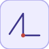

# wrapToZero

<p align="center">

</p>
Outputs 0 when the input reaches Threshold, else passes it through.

## 📝 Syntax

- Block type: wrapToZero

## 📥 Input argument

- input ports - 1 input port(s) declared.

## 📤 Output argument

- output ports - 1 output port(s) declared.

## 📄 Description

Outputs 0 when the input reaches Threshold, else passes it through.

| Field   | Value                     |
| ------- | ------------------------- |
| Module  | <code>nflow_blocks</code> |
| Library | Math                      |
| Type    | <code>wrapToZero</code>   |
| Label   | Wrap To Zero              |

<b>Description</b>

Outputs 0 when the input is at or above <code>Threshold</code>, else passes the input through unchanged (Wrap To Zero). Pure algebraic feedthrough, element-wise over the input width.

<b>Ports</b>

<b>Input(s)</b>

| Port   | Role                              | Side | Position  |
| ------ | --------------------------------- | ---- | --------- |
| Port_1 | Numeric signal read by the block. | left | x=0, y=40 |

<b>Output(s)</b>

| Port   | Role                                  | Side  | Position   |
| ------ | ------------------------------------- | ----- | ---------- |
| Port_1 | Numeric signal produced by the block. | right | x=80, y=40 |

<b>Parameters</b>

| Parameter              | Default value |
| ---------------------- | ------------- |
| <code>Threshold</code> | 255           |

<b>Block Characteristics</b>

| Field                     | Value                 |
| ------------------------- | --------------------- |
| Block type                | wrapToZero            |
| Family                    | Math                  |
| Rendered size             | 80 x 80               |
| Phases                    | ALGEBRAIC             |
| Internal state or history | no                    |
| Signal data type          | double numeric values |

<b>Algorithms</b>

- ALGEBRAIC: out = (u >= Threshold) ? 0 : u.

<b>Equation or Rule</b>
$$y = \begin{cases} 0 & u \ge \text{Threshold} \\ u & \text{otherwise} \end{cases}$$

<b>Extended Capabilities</b>

Code generation: supported for C and Rust.

<b>Implementation Sources</b>

<details>
<summary>Manifest: <code>modules/nflow_blocks/libraries/math/library.json</code></summary>

```json
{
  "id": "builtin.math",
  "title": "Math",
  "version": "1.0.0",
  "format": "nflow-2",
  "metadata": {
    "author": "Allan CORNET",
    "created": "2026-03-21",
    "tool": "Nelson nflow"
  },
  "builtin": true,
  "comment": "Basic math blocks",
  "license": "LGPL-3.0",
  "blocks": [
    {
      "type": "matmul",
      "label": "MatMul",
      "icon": "matmul.svg",
      "phases": ["ALGEBRAIC"],
      "width": 60,
      "height": 60,
      "inputs": [
        {
          "x": 0,
          "y": 20,
          "side": "left"
        },
        {
          "x": 0,
          "y": 40,
          "side": "left"
        }
      ],
      "outputs": [
        {
          "x": 60,
          "y": 30,
          "side": "right"
        }
      ],
      "defaultParams": {
        "MultiplicationRule": "matrix"
      }
    },
    {
      "type": "sumElements",
      "label": "Sum of Elements",
      "icon": "sumElements.svg",
      "phases": ["ALGEBRAIC"],
      "width": 80,
      "height": 80,
      "inputs": [
        {
          "x": 0,
          "y": 40,
          "side": "left"
        }
      ],
      "outputs": [
        {
          "x": 80,
          "y": 40,
          "side": "right"
        }
      ],
      "defaultParams": {},
      "render": {
        "type": "image",
        "src": "exports/sumElements.svg",
        "svgMode": "element",
        "preserveAspectRatio": "none",
        "x": 0,
        "y": 0,
        "width": 80,
        "height": 80
      }
    },
    {
      "type": "productOfElements",
      "label": "Product of Elements",
      "icon": "productOfElements.svg",
      "phases": ["ALGEBRAIC"],
      "width": 80,
      "height": 80,
      "inputs": [
        {
          "x": 0,
          "y": 40,
          "side": "left"
        }
      ],
      "outputs": [
        {
          "x": 80,
          "y": 40,
          "side": "right"
        }
      ],
      "defaultParams": {},
      "render": {
        "type": "image",
        "src": "exports/productOfElements.svg",
        "svgMode": "element",
        "preserveAspectRatio": "none",
        "x": 0,
        "y": 0,
        "width": 80,
        "height": 80
      }
    },
    {
      "type": "dotProduct",
      "label": "Dot Product",
      "icon": "dotProduct.svg",
      "phases": ["ALGEBRAIC"],
      "width": 80,
      "height": 80,
      "inputs": [
        {
          "x": 0,
          "y": 30,
          "side": "left"
        },
        {
          "x": 0,
          "y": 50,
          "side": "left"
        }
      ],
      "outputs": [
        {
          "x": 80,
          "y": 40,
          "side": "right"
        }
      ],
      "defaultParams": {},
      "render": {
        "type": "image",
        "src": "exports/dotProduct.svg",
        "svgMode": "element",
        "preserveAspectRatio": "none",
        "x": 0,
        "y": 0,
        "width": 80,
        "height": 80
      }
    },
    {
      "type": "crossProduct",
      "label": "Cross Product",
      "icon": "crossProduct.svg",
      "phases": ["ALGEBRAIC"],
      "width": 80,
      "height": 80,
      "inputs": [
        {
          "x": 0,
          "y": 30,
          "side": "left"
        },
        {
          "x": 0,
          "y": 50,
          "side": "left"
        }
      ],
      "outputs": [
        {
          "x": 80,
          "y": 40,
          "side": "right"
        }
      ],
      "defaultParams": {},
      "render": {
        "type": "image",
        "src": "exports/crossProduct.svg",
        "svgMode": "element",
        "preserveAspectRatio": "none",
        "x": 0,
        "y": 0,
        "width": 80,
        "height": 80
      }
    },
    {
      "type": "gain",
      "label": "Gain",
      "icon": "gain.svg",
      "phases": ["ALGEBRAIC"],
      "width": 100,
      "height": 80,
      "inputs": [
        {
          "x": 0,
          "y": 40,
          "side": "left"
        }
      ],
      "outputs": [
        {
          "x": 100,
          "y": 40,
          "side": "right"
        }
      ],
      "defaultParams": {
        "Gain": 2
      },
      "render": {
        "type": "math",
        "formula": "{params.Gain}",
        "mathGroupClass": "gain-math",
        "textSize": "16px",
        "width": 100,
        "height": 80
      }
    },
    {
      "type": "sum",
      "label": "Sum",
      "icon": "sum.svg",
      "phases": ["ALGEBRAIC"],
      "width": 20,
      "height": 20,
      "inputs": [
        {
          "x": -30,
          "y": 10,
          "side": "left",
          "wireX": -10,
          "wireY": 10
        },
        {
          "x": 10,
          "y": -30,
          "side": "top",
          "wireX": 10,
          "wireY": -10
        },
        {
          "x": 10,
          "y": 50,
          "side": "bottom",
          "wireX": 10,
          "wireY": 30
        }
      ],
      "outputs": [
        {
          "x": 50,
          "y": 10,
          "side": "right",
          "wireX": 30,
          "wireY": 10
        }
      ],
      "defaultParams": {
        "Inputs": "+++"
      },
      "render": {
        "type": "math",
        "formula": "\\oplus",
        "mathGroupClass": "sum-math",
        "textSize": "16px",
        "width": 20,
        "height": 20
      }
    },
    {
      "type": "mult",
      "label": "Mult",
      "icon": "mult.svg",
      "phases": ["ALGEBRAIC"],
      "width": 20,
      "height": 20,
      "inputs": [
        {
          "x": -30,
          "y": 10,
          "side": "left",
          "wireX": -10,
          "wireY": 10
        },
        {
          "x": 10,
          "y": -30,
          "side": "top",
          "wireX": 10,
          "wireY": -10
        },
        {
          "x": 10,
          "y": 50,
          "side": "bottom",
          "wireX": 10,
          "wireY": 30
        }
      ],
      "outputs": [
        {
          "x": 50,
          "y": 10,
          "side": "right",
          "wireX": 30,
          "wireY": 10
        }
      ],
      "defaultParams": {},
      "render": {
        "type": "math",
        "formula": "\\otimes",
        "mathGroupClass": "mult-math",
        "textSize": "16px",
        "width": 20,
        "height": 20
      }
    },
    {
      "type": "abs",
      "label": "Abs",
      "icon": "abs.svg",
      "phases": ["ALGEBRAIC"],
      "width": 80,
      "height": 80,
      "inputs": [
        {
          "x": 0,
          "y": 40,
          "side": "left"
        }
      ],
      "outputs": [
        {
          "x": 80,
          "y": 40,
          "side": "right"
        }
      ],
      "defaultParams": {},
      "render": {
        "type": "math",
        "formula": "|x|",
        "mathGroupClass": "abs-math",
        "textSize": "16px",
        "width": 80,
        "height": 80
      }
    },
    {
      "type": "mathFunction",
      "label": "Math Function",
      "icon": "mathFunction.svg",
      "phases": ["ALGEBRAIC"],
      "width": 80,
      "height": 80,
      "inputs": [
        {
          "x": 0,
          "y": 40,
          "side": "left"
        }
      ],
      "outputs": [
        {
          "x": 80,
          "y": 40,
          "side": "right"
        }
      ],
      "defaultParams": {
        "Function": "exp"
      },
      "render": {
        "type": "image",
        "src": "exports/mathFunction.svg",
        "svgMode": "element",
        "preserveAspectRatio": "none",
        "x": 0,
        "y": 0,
        "width": 80,
        "height": 80
      }
    },
    {
      "type": "trigFunction",
      "label": "Trigonometric Function",
      "icon": "trigFunction.svg",
      "phases": ["ALGEBRAIC"],
      "width": 80,
      "height": 80,
      "inputs": [
        {
          "x": 0,
          "y": 40,
          "side": "left"
        }
      ],
      "outputs": [
        {
          "x": 80,
          "y": 40,
          "side": "right"
        }
      ],
      "defaultParams": {
        "Function": "sin"
      },
      "render": {
        "type": "image",
        "src": "exports/trigFunction.svg",
        "svgMode": "element",
        "preserveAspectRatio": "none",
        "x": 0,
        "y": 0,
        "width": 80,
        "height": 80
      }
    },
    {
      "type": "roundingFunction",
      "label": "Rounding Function",
      "icon": "roundingFunction.svg",
      "phases": ["ALGEBRAIC"],
      "width": 80,
      "height": 80,
      "inputs": [
        {
          "x": 0,
          "y": 40,
          "side": "left"
        }
      ],
      "outputs": [
        {
          "x": 80,
          "y": 40,
          "side": "right"
        }
      ],
      "defaultParams": {
        "Operator": "floor"
      },
      "render": {
        "type": "image",
        "src": "exports/roundingFunction.svg",
        "svgMode": "element",
        "preserveAspectRatio": "none",
        "x": 0,
        "y": 0,
        "width": 80,
        "height": 80
      }
    },
    {
      "type": "sign",
      "label": "Sign",
      "icon": "sign.svg",
      "phases": ["ALGEBRAIC"],
      "width": 80,
      "height": 80,
      "inputs": [
        {
          "x": 0,
          "y": 40,
          "side": "left"
        }
      ],
      "outputs": [
        {
          "x": 80,
          "y": 40,
          "side": "right"
        }
      ],
      "defaultParams": {},
      "render": {
        "type": "image",
        "src": "exports/sign.svg",
        "svgMode": "element",
        "preserveAspectRatio": "none",
        "x": 0,
        "y": 0,
        "width": 80,
        "height": 80
      }
    },
    {
      "type": "sqrt",
      "label": "Sqrt",
      "icon": "sqrt.svg",
      "phases": ["ALGEBRAIC"],
      "width": 80,
      "height": 80,
      "inputs": [
        {
          "x": 0,
          "y": 40,
          "side": "left"
        }
      ],
      "outputs": [
        {
          "x": 80,
          "y": 40,
          "side": "right"
        }
      ],
      "defaultParams": {
        "Function": "sqrt"
      },
      "render": {
        "type": "image",
        "src": "exports/sqrt.svg",
        "svgMode": "element",
        "preserveAspectRatio": "none",
        "x": 0,
        "y": 0,
        "width": 80,
        "height": 80
      }
    },
    {
      "type": "divide",
      "label": "Divide",
      "icon": "divide.svg",
      "phases": ["ALGEBRAIC"],
      "width": 80,
      "height": 80,
      "inputs": [
        {
          "x": 0,
          "y": 30,
          "side": "left"
        },
        {
          "x": 0,
          "y": 50,
          "side": "left"
        }
      ],
      "outputs": [
        {
          "x": 80,
          "y": 40,
          "side": "right"
        }
      ],
      "defaultParams": {},
      "render": {
        "type": "image",
        "src": "exports/divide.svg",
        "svgMode": "element",
        "preserveAspectRatio": "none",
        "x": 0,
        "y": 0,
        "width": 80,
        "height": 80
      }
    },
    {
      "type": "negate",
      "label": "Negate",
      "icon": "negate.svg",
      "phases": ["ALGEBRAIC"],
      "width": 80,
      "height": 80,
      "inputs": [
        {
          "x": 0,
          "y": 40,
          "side": "left"
        }
      ],
      "outputs": [
        {
          "x": 80,
          "y": 40,
          "side": "right"
        }
      ],
      "defaultParams": {},
      "render": {
        "type": "image",
        "src": "exports/negate.svg",
        "svgMode": "element",
        "preserveAspectRatio": "none",
        "x": 0,
        "y": 0,
        "width": 80,
        "height": 80
      }
    },
    {
      "type": "bias",
      "label": "Bias",
      "icon": "bias.svg",
      "phases": ["ALGEBRAIC"],
      "width": 80,
      "height": 80,
      "inputs": [
        {
          "x": 0,
          "y": 40,
          "side": "left"
        }
      ],
      "outputs": [
        {
          "x": 80,
          "y": 40,
          "side": "right"
        }
      ],
      "defaultParams": {
        "Bias": 1
      },
      "render": {
        "type": "image",
        "src": "exports/bias.svg",
        "svgMode": "element",
        "preserveAspectRatio": "none",
        "x": 0,
        "y": 0,
        "width": 80,
        "height": 80
      }
    },
    {
      "type": "min",
      "label": "Min",
      "icon": "min.svg",
      "phases": ["ALGEBRAIC"],
      "width": 80,
      "height": 80,
      "inputs": [
        {
          "x": 0,
          "y": 30,
          "side": "left"
        },
        {
          "x": 0,
          "y": 50,
          "side": "left"
        }
      ],
      "outputs": [
        {
          "x": 80,
          "y": 40,
          "side": "right"
        }
      ],
      "defaultParams": {},
      "render": {
        "type": "math",
        "formula": "min(x,y)",
        "mathGroupClass": "min-math",
        "textSize": "16px",
        "width": 80,
        "height": 80
      }
    },
    {
      "type": "max",
      "label": "Max",
      "icon": "max.svg",
      "phases": ["ALGEBRAIC"],
      "width": 80,
      "height": 80,
      "inputs": [
        {
          "x": 0,
          "y": 30,
          "side": "left"
        },
        {
          "x": 0,
          "y": 50,
          "side": "left"
        }
      ],
      "outputs": [
        {
          "x": 80,
          "y": 40,
          "side": "right"
        }
      ],
      "defaultParams": {},
      "render": {
        "type": "math",
        "formula": "max(x,y)",
        "mathGroupClass": "max-math",
        "textSize": "16px",
        "width": 80,
        "height": 80
      }
    },
    {
      "type": "realImagToComplex",
      "label": "Re-Im to Complex",
      "icon": "realImagToComplex.svg",
      "phases": ["ALGEBRAIC"],
      "width": 60,
      "height": 60,
      "inputs": [
        {
          "x": 0,
          "y": 20,
          "side": "left"
        },
        {
          "x": 0,
          "y": 40,
          "side": "left"
        }
      ],
      "outputs": [
        {
          "x": 60,
          "y": 30,
          "side": "right"
        }
      ],
      "defaultParams": {}
    },
    {
      "type": "complexToRealImag",
      "label": "Complex to Re-Im",
      "icon": "complexToRealImag.svg",
      "phases": ["ALGEBRAIC"],
      "width": 60,
      "height": 60,
      "inputs": [
        {
          "x": 0,
          "y": 30,
          "side": "left"
        }
      ],
      "outputs": [
        {
          "x": 60,
          "y": 20,
          "side": "right"
        },
        {
          "x": 60,
          "y": 40,
          "side": "right"
        }
      ],
      "defaultParams": {}
    },
    {
      "type": "magnitudeAngleToComplex",
      "label": "Mag-Angle to Complex",
      "icon": "magnitudeAngleToComplex.svg",
      "phases": ["ALGEBRAIC"],
      "width": 60,
      "height": 60,
      "inputs": [
        {
          "x": 0,
          "y": 20,
          "side": "left"
        },
        {
          "x": 0,
          "y": 40,
          "side": "left"
        }
      ],
      "outputs": [
        {
          "x": 60,
          "y": 30,
          "side": "right"
        }
      ],
      "defaultParams": {}
    },
    {
      "type": "complexToMagnitudeAngle",
      "label": "Complex to Mag-Angle",
      "icon": "complexToMagnitudeAngle.svg",
      "phases": ["ALGEBRAIC"],
      "width": 60,
      "height": 60,
      "inputs": [
        {
          "x": 0,
          "y": 30,
          "side": "left"
        }
      ],
      "outputs": [
        {
          "x": 60,
          "y": 20,
          "side": "right"
        },
        {
          "x": 60,
          "y": 40,
          "side": "right"
        }
      ],
      "defaultParams": {}
    },
    {
      "type": "conjugate",
      "label": "Conjugate",
      "icon": "conjugate.svg",
      "phases": ["ALGEBRAIC"],
      "width": 60,
      "height": 60,
      "inputs": [
        {
          "x": 0,
          "y": 30,
          "side": "left"
        }
      ],
      "outputs": [
        {
          "x": 60,
          "y": 30,
          "side": "right"
        }
      ],
      "defaultParams": {}
    },
    {
      "type": "atan2",
      "label": "Atan2",
      "icon": "atan2.svg",
      "phases": ["ALGEBRAIC"],
      "width": 60,
      "height": 60,
      "inputs": [
        {
          "x": 0,
          "y": 20,
          "side": "left"
        },
        {
          "x": 0,
          "y": 40,
          "side": "left"
        }
      ],
      "outputs": [
        {
          "x": 60,
          "y": 30,
          "side": "right"
        }
      ],
      "defaultParams": {}
    },
    {
      "type": "wrapToZero",
      "label": "Wrap To Zero",
      "icon": "wrapToZero.svg",
      "phases": ["ALGEBRAIC"],
      "width": 80,
      "height": 80,
      "inputs": [
        {
          "x": 0,
          "y": 40,
          "side": "left"
        }
      ],
      "outputs": [
        {
          "x": 80,
          "y": 40,
          "side": "right"
        }
      ],
      "defaultParams": {
        "Threshold": 255
      },
      "render": {
        "type": "image",
        "src": "exports/wrapToZero.svg",
        "svgMode": "element",
        "preserveAspectRatio": "none",
        "x": 0,
        "y": 0,
        "width": 80,
        "height": 80
      }
    },
    {
      "type": "polynomial",
      "label": "Polynomial",
      "icon": "polynomial.svg",
      "phases": ["ALGEBRAIC"],
      "width": 80,
      "height": 80,
      "inputs": [
        {
          "x": 0,
          "y": 40,
          "side": "left"
        }
      ],
      "outputs": [
        {
          "x": 80,
          "y": 40,
          "side": "right"
        }
      ],
      "defaultParams": {
        "Coefficients": [1, 0, 0]
      },
      "render": {
        "type": "image",
        "src": "exports/polynomial.svg",
        "svgMode": "element",
        "preserveAspectRatio": "none",
        "x": 0,
        "y": 0,
        "width": 80,
        "height": 80
      }
    }
  ]
}
```

</details>


<details>
<summary>Runtime: <code>modules/nflow_blocks/src/cpp/math/wrapToZero.cpp</code></summary>

```cpp
//=============================================================================
// Copyright (c) 2016-present Allan CORNET (Nelson)
//=============================================================================
// This file is part of Nelson.
//=============================================================================
// LICENCE_BLOCK_BEGIN
// SPDX-License-Identifier: LGPL-3.0-or-later
// LICENCE_BLOCK_END
//=============================================================================
// wrapToZero: outputs 0 when the input is at or above Threshold, else passes the
// input through unchanged (Wrap To Zero). Pure algebraic feedthrough, element-
// wise over the input width; C / Rust code generation.
//=============================================================================
#include "SimEngineTypes.hpp"
#include "BlockRegistry.hpp"
#include "FieldNames.hpp"
#include "NFlowBlockDescriptor.hpp"
#include "math_blocks.hpp"
//=============================================================================
bool
Nelson::NFlow::handleWrapToZero(SimCtx& ctx, const Block& b, Phase phase)
{
    if (phase != Phase::ALGEBRAIC) {
        return false;
    }
    if (!hasInput(ctx, b.nid, 0)) {
        return false;
    }
    nflow::BlockDescriptor bd(b, ctx.variables);
    const double threshold = bd.paramDouble("Threshold", 255.0);
    SigView u = getInputSig(ctx, b.nid, 0);
    return emitElementwise(ctx, b.nid, [&](int i) {
        // The threshold itself is NOT above the threshold: an input landing
        // exactly on it passes through, and only what exceeds it wraps.
        const double v = sigAt(u, i);
        return (v > threshold) ? 0.0 : v;
    });
}
//=============================================================================
Nelson::NFlow::BlockCodegenTemplate
Nelson::NFlow::getCodeGenCWrapToZero()
{
    BlockCodegenTemplate t;
    t.step = "out_{id} = ({in0} > {param:Threshold:255.0}) ? 0.0 : {in0};";
    return t;
}
//=============================================================================
Nelson::NFlow::BlockCodegenTemplate
Nelson::NFlow::getCodeGenRustWrapToZero()
{
    BlockCodegenTemplate t;
    t.step = "out_{id} = if {in0} > {param:Threshold:255.0} { 0.0_f64 } else { {in0} };";
    return t;
}
//=============================================================================

```

</details>

## 💡 Example

With Threshold = 5: input 7 wraps to 0, input 3 passes through.

```matlab
d.blocks={ struct('id','c','type','constant','inputs',0,'outputs',1,'params',struct('Value',7)), struct('id','g','type','wrapToZero','inputs',1,'outputs',1,'params',struct('Threshold',5)), struct('id','w','type','toWorkspace','inputs',1,'outputs',0,'params',struct('VariableName','y','SaveFormat','Array')) };
d.connections={ struct('from','c','to','g','fromIndex',0,'toIndex',0), struct('from','g','to','w','fromIndex',0,'toIndex',0) };
d.sampleTime=0.1; d.duration=0.2; d.solver='discrete'; d.variables=struct();
r=jsondecode(__nflow_simulate__(jsonencode(d)));
```

## 🔗 See also

[saturation](../../nflow_blocks/nonlinear/saturation.md), [deadZone](../../nflow_blocks/nonlinear/deadZone.md).

## 🕔 History

| Version | 📄 Description  |
| ------- | --------------- |
| 1.0.0   | initial version |

<!--
## 👤 Author

Allan CORNET
-->
