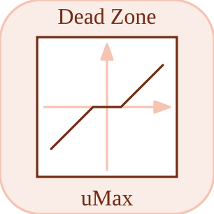

# deadZone

<p align="center">

</p>
Suppresses values inside a dead zone.

## 📝 Syntax

- Block type: deadZone

## 📥 Input argument

- input ports - 1 input port(s) declared.

## 📤 Output argument

- output ports - 1 output port(s) declared.

## 📄 Description

Suppresses values inside a dead zone.

| Field   | Value                     |
| ------- | ------------------------- |
| Module  | <code>nflow_blocks</code> |
| Library | Nonlinear blocks          |
| Type    | <code>deadZone</code>     |
| Label   | Dead Zone                 |

<b>Description</b>

Suppresses small input values inside a configured interval.

<b>Ports</b>

<b>Input(s)</b>

| Port   | Role                              | Side | Position  |
| ------ | --------------------------------- | ---- | --------- |
| Port_1 | Numeric signal read by the block. | left | x=0, y=40 |

<b>Output(s)</b>

| Port   | Role                                  | Side  | Position   |
| ------ | ------------------------------------- | ----- | ---------- |
| Port_1 | Numeric signal produced by the block. | right | x=80, y=40 |

<b>Parameters</b>

| Parameter        | Default value |
| ---------------- | ------------- |
| <code>min</code> | -1            |
| <code>max</code> | 1             |

<b>Inspector Keys</b>

These serialized keys are exposed by the block inspector.

- <code>min</code>
- <code>max</code>

<b>Block Characteristics</b>

| Field                     | Value                                  |
| ------------------------- | -------------------------------------- |
| Block type                | deadZone                               |
| Family                    | Nonlinear blocks                       |
| Rendered size             | 80 x 80                                |
| Phases                    | ALGEBRAIC                              |
| Direct feedthrough        | yes                                    |
| Internal state or history | not observed in the documented runtime |
| Signal data type          | double numeric values                  |

<b>Algorithms</b>

- Algebraic block. Requires the first input port.
- Inputs below min output u - min, inputs above max output u - max, and values inside the band output 0.

<b>Equation or Rule</b>
$$y = 0\quad \mathrm{for}\quad min \le u \le max$$

<b>Extended Capabilities</b>

This page describes the native runtime behavior observed in the module C++ sources. Declared phases indicate when the simulation engine calls the block.

Code generation: supported for C and Rust.

<b>Implementation Sources</b>

<details>
<summary>Manifest: <code>modules/nflow_blocks/libraries/nonlinear/library.json</code></summary>

```json
{
  "id": "builtin.nonlinear",
  "title": "Non-Linear",
  "version": "1.0.0",
  "format": "nflow-2",
  "metadata": {
    "author": "Allan CORNET",
    "created": "2026-03-21",
    "tool": "Nelson nflow"
  },
  "comment": "Blocks for non-linearities",
  "license": "LGPL-3.0",
  "builtin": true,
  "blocks": [
    {
      "type": "saturation",
      "icon": "saturation.svg",
      "label": "Saturation",
      "phases": ["ALGEBRAIC"],
      "width": 80,
      "height": 80,
      "inputs": [
        {
          "x": 0,
          "y": 40,
          "side": "left"
        }
      ],
      "outputs": [
        {
          "x": 80,
          "y": 40,
          "side": "right"
        }
      ],
      "defaultParams": {
        "LowerLimit": -1,
        "UpperLimit": 1
      },
      "render": {
        "type": "image",
        "src": "saturation.svg"
      }
    },
    {
      "type": "hysteresis",
      "label": "Relay",
      "icon": "hysteresis.svg",
      "phases": ["INIT", "OUTPUT", "UPDATE"],
      "width": 80,
      "height": 80,
      "inputs": [
        {
          "x": 0,
          "y": 40,
          "side": "left"
        }
      ],
      "outputs": [
        {
          "x": 80,
          "y": 40,
          "side": "right"
        }
      ],
      "defaultParams": {
        "uHigh": 1,
        "uLow": -1,
        "yHigh": 1,
        "yLow": 0
      },
      "render": {
        "type": "image",
        "src": "hysteresis.svg"
      }
    },
    {
      "type": "rate",
      "label": "Rate Lim.",
      "icon": "rate.svg",
      "phases": ["INIT", "OUTPUT", "UPDATE"],
      "width": 80,
      "height": 80,
      "inputs": [
        {
          "x": 0,
          "y": 40,
          "side": "left"
        }
      ],
      "outputs": [
        {
          "x": 80,
          "y": 40,
          "side": "right"
        }
      ],
      "defaultParams": {
        "RisingSlewLimit": 1,
        "FallingSlewLimit": 1
      },
      "render": {
        "type": "image",
        "src": "rate.svg"
      }
    },
    {
      "type": "backlash",
      "label": "Backlash",
      "icon": "backlash.svg",
      "phases": ["INIT", "OUTPUT", "UPDATE"],
      "width": 80,
      "height": 80,
      "inputs": [
        {
          "x": 0,
          "y": 40,
          "side": "left"
        }
      ],
      "outputs": [
        {
          "x": 80,
          "y": 40,
          "side": "right"
        }
      ],
      "defaultParams": {
        "BacklashWidth": 1
      },
      "render": {
        "type": "image",
        "src": "backlash.svg"
      }
    },
    {
      "type": "deadZone",
      "label": "Dead Zone",
      "icon": "deadZone.svg",
      "phases": ["ALGEBRAIC"],
      "width": 80,
      "height": 80,
      "inputs": [
        {
          "x": 0,
          "y": 40,
          "side": "left"
        }
      ],
      "outputs": [
        {
          "x": 80,
          "y": 40,
          "side": "right"
        }
      ],
      "defaultParams": {
        "LowerValue": -1,
        "UpperValue": 1
      },
      "render": {
        "type": "image",
        "src": "deadZone.svg",
        "svgMode": "element",
        "preserveAspectRatio": "none",
        "x": 0,
        "y": 0,
        "width": 80,
        "height": 80
      }
    },
    {
      "type": "quantizer",
      "label": "Quantizer",
      "icon": "quantizer.svg",
      "phases": ["ALGEBRAIC"],
      "width": 80,
      "height": 80,
      "inputs": [
        {
          "x": 0,
          "y": 40,
          "side": "left"
        }
      ],
      "outputs": [
        {
          "x": 80,
          "y": 40,
          "side": "right"
        }
      ],
      "defaultParams": {
        "QuantizationInterval": 1
      },
      "render": {
        "type": "image",
        "src": "quantizer.svg",
        "svgMode": "element",
        "preserveAspectRatio": "none",
        "x": 0,
        "y": 0,
        "width": 80,
        "height": 80
      }
    },
    {
      "type": "hitCrossing",
      "icon": "hitCrossing.svg",
      "label": "Hit Crossing",
      "phases": ["INIT", "OUTPUT", "UPDATE"],
      "width": 80,
      "height": 80,
      "inputs": [
        {
          "x": 0,
          "y": 40,
          "side": "left"
        }
      ],
      "outputs": [
        {
          "x": 80,
          "y": 40,
          "side": "right"
        }
      ],
      "defaultParams": {
        "HitCrossingOffset": 0,
        "HitCrossingDirection": "either"
      },
      "render": {
        "type": "image",
        "src": "hitCrossing.svg"
      }
    },
    {
      "type": "coulombViscousFriction",
      "label": "Coulomb & Viscous Friction",
      "icon": "coulombViscousFriction.svg",
      "phases": ["ALGEBRAIC"],
      "width": 80,
      "height": 80,
      "inputs": [
        {
          "x": 0,
          "y": 40,
          "side": "left"
        }
      ],
      "outputs": [
        {
          "x": 80,
          "y": 40,
          "side": "right"
        }
      ],
      "defaultParams": {
        "Gain": 1,
        "Offset": 1
      },
      "render": {
        "type": "image",
        "src": "coulombViscousFriction.svg",
        "svgMode": "element",
        "preserveAspectRatio": "none",
        "x": 0,
        "y": 0,
        "width": 80,
        "height": 80
      }
    }
  ]
}
```

</details>


<details>
<summary>Runtime: <code>modules/nflow_blocks/src/cpp/nonlinear/deadZone.cpp</code></summary>

```cpp
//=============================================================================
// Copyright (c) 2016-present Allan CORNET (Nelson)
//=============================================================================
// This file is part of Nelson.
//=============================================================================
// LICENCE_BLOCK_BEGIN
// SPDX-License-Identifier: LGPL-3.0-or-later
// LICENCE_BLOCK_END
//=============================================================================
#include "SimEngineTypes.hpp"
#include "BlockRegistry.hpp"
#include "FieldNames.hpp"
#include "NFlowBlockDescriptor.hpp"
#include <cmath>
#include <algorithm>
#include "nonlinear_blocks.hpp"
//=============================================================================
bool
Nelson::NFlow::handleDeadZone(SimCtx& ctx, const Block& b, Phase phase)
{
    nflow::BlockDescriptor bd(b, ctx.variables);
    double lo = bd.paramDouble(nflow::kLowerValue, -1.0);
    double hi = bd.paramDouble(nflow::kUpperValue, 1.0);
    if (phase == Phase::ZERO_CROSSING) {
        // Surfaces where the dead-band edges engage: u - lower, u - upper, two
        // per signal element.
        double* g = blockG(ctx, b.nid);
        if (g) {
            SigView u = getInputSig(ctx, b.nid, 0);
            const int w = std::max(1, outputWidth(ctx, b.nid, 0));
            for (int i = 0; i < w; ++i) {
                const double ui = sigAt(u, i);
                g[2 * i] = ui - lo;
                g[2 * i + 1] = ui - hi;
            }
        }
        return false;
    }
    if (phase != Phase::ALGEBRAIC) {
        return false;
    }
    if (!hasInput(ctx, b.nid, 0)) {
        return false;
    }
    SigView uv = getInputSig(ctx, b.nid, 0);
    return emitElementwise(ctx, b.nid, [&](int i) {
        double u = sigAt(uv, i);
        if (u < lo) {
            return u - lo;
        }
        if (u > hi) {
            return u - hi;
        }
        return 0.0;
    });
}
//=============================================================================
namespace {
// Zero-crossing seam (plan V4): the dead-band edges u - lower and u - upper
// (sim ZERO_CROSSING parity, two surfaces).
void
deadZoneCrossing(const Nelson::NFlow::BlockCodegenArgs& a)
{
    if (a.rk4Op != Nelson::NFlow::Rk4Crossing) {
        return;
    }
    nflow::BlockDescriptor bd(*a.block, *a.variables);
    const double lo = bd.paramDouble(nflow::kLowerValue, -1.0);
    const double hi = bd.paramDouble(nflow::kUpperValue, 1.0);
    a.line(a.rk4Arr + "[" + std::to_string(a.crossingOffset) + "] = (" + a.in[0] + ") - "
        + a.fmt(lo) + ";");
    a.line(a.rk4Arr + "[" + std::to_string(a.crossingOffset + 1) + "] = (" + a.in[0] + ") - "
        + a.fmt(hi) + ";");
}
int
deadZoneCrossingCount(const Nelson::NFlow::BlockCodegenArgs&)
{
    return 2;
}
} // namespace
//=============================================================================
Nelson::NFlow::BlockCodegenTemplate
Nelson::NFlow::getCodeGenCDeadZone()
{
    BlockCodegenTemplate t;
    t.step = "{ double u = {in0};\n"
             "  out_{id} = (u < {param:LowerValue:-1.0}) ? u - {param:LowerValue:-1.0} : ((u > "
             "{param:UpperValue:1.0}) ? u - {param:UpperValue:1.0} : 0.0); }";
    t.emitRk4 = deadZoneCrossing;
    t.crossingCount = deadZoneCrossingCount;
    return t;
}
//=============================================================================
Nelson::NFlow::BlockCodegenTemplate
Nelson::NFlow::getCodeGenRustDeadZone()
{
    BlockCodegenTemplate t;
    t.step
        = "out_{id} = if {in0} < {param:LowerValue:-1.0} { {in0} - {param:LowerValue:-1.0} } else "
          "if {in0} > {param:UpperValue:1.0} { {in0} - {param:UpperValue:1.0} } else { 0.0_f64 };";
    t.emitRk4 = deadZoneCrossing;
    t.crossingCount = deadZoneCrossingCount;
    return t;
}
//=============================================================================

```

</details>

## 🔗 See also

[saturation](../../nflow_blocks/nonlinear/saturation.md), [backlash](../../nflow_blocks/nonlinear/backlash.md).

## 🕔 History

| Version | 📄 Description  |
| ------- | --------------- |
| 1.0.0   | initial version |

<!--
## 👤 Author

Allan CORNET
-->
