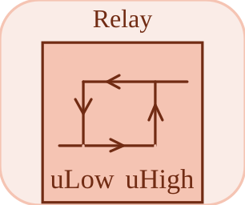

# hysteresis


<p align="center">

</p>
Relay: latching two-threshold switch (uHigh, uLow, yHigh, yLow).

## 📝 Syntax

- Block type: hysteresis

## 📥 Input argument

- input ports - 1 input port(s) declared.

## 📤 Output argument

- output ports - 1 output port(s) declared.

## 📄 Description


Relay: a latching switch with two thresholds (hysteresis). 

| Field | Value |
| --- | --- |
| Module | <code>nflow_blocks</code> | 
| Library | Nonlinear | 
| Type | <code>hysteresis</code> | 
| Label | Relay | 

  

<b>Description</b> 

The output latches: it switches to <code>yHigh</code> when the input rises to or above <code>uHigh</code>, to <code>yLow</code> when it falls to or below <code>uLow</code>, and holds its previous value in between. This two-threshold behaviour is the classic relay with hysteresis. Stateful (latched output). 

<b>Ports</b> 

| Port | Role | Side | Position | 
| --- | --- | --- | --- | 
| Port\_1 | Control input compared against the thresholds. | left | x=0, y=40 | 

 

<b>Output(s)</b> 

| Port | Role | Side | Position | 
| --- | --- | --- | --- | 
| Port\_1 | Latched relay output (yHigh or yLow). | right | x=80, y=40 | 

 

<b>Parameters</b> 

| Parameter | Default value | 
| --- | --- | 
| <code>uHigh</code> | 1 | 
| <code>uLow</code> | -1 | 
| <code>yHigh</code> | 1 | 
| <code>yLow</code> | 0 | 

 

<b>Block Characteristics</b> 

| Field | Value |
| --- | --- |
| Block type | hysteresis | 
| Family | Nonlinear | 
| Rendered size | 80 x 80 | 
| Phases | INIT, OUTPUT, UPDATE | 
| Internal state or history | yes (latched output) | 
| Signal data type | double numeric values | 

 

<b>Algorithms</b> 

- INIT: start at yLow. 
- OUTPUT: emit the latched value. 
- UPDATE: switch to yHigh above uHigh, to yLow below uLow, otherwise hold. 

<b>Equation or Rule</b> 
$$y \leftarrow \begin{cases} y_{High} & u \ge u_{High} \\ y_{Low} & u \le u_{Low} \\ y & \text{otherwise} \end{cases}$$
 

<b>Extended Capabilities</b> 

Code generation: supported for C and Rust. 

<b>Implementation Sources</b> 

**Manifest:** `modules/nflow_blocks/libraries/nonlinear/library.json`
 

**Runtime:** `modules/nflow_blocks/src/cpp/nonlinear/hysteresis.cpp`


## 💡 Example

Relay driven by a sine crossing both thresholds.

```matlab
d.blocks={ struct('id','s','type','sine','inputs',0,'outputs',1,'params',struct('Amplitude',2,'Frequency',1)), struct('id','r','type','hysteresis','inputs',1,'outputs',1,'params',struct('uHigh',1,'uLow',-1,'yHigh',1,'yLow',0)), struct('id','w','type','toWorkspace','inputs',1,'outputs',0,'params',struct('VariableName','y','SaveFormat','Array')) };
d.connections={ struct('from','s','to','r','fromIndex',0,'toIndex',0), struct('from','r','to','w','fromIndex',0,'toIndex',0) };
d.sampleTime=0.02; d.duration=2.0; d.solver='discrete'; d.variables=struct();
r=jsondecode(__nflow_simulate__(jsonencode(d)));
```


## 🔗 See also

[saturation](../../nflow_blocks/nonlinear/saturation.md), [deadZone](../../nflow_blocks/nonlinear/deadZone.md).

## 🕔 History

| Version | 📄 Description     |
| ------- | --------------- |
| 1.0.0   | initial version |

<!--
## 👤 Author

Allan CORNET
-->
