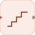

# quantizer

<p align="center">

</p>
Rounds the input to the nearest interval.

## 📝 Syntax

- Block type: quantizer

## 📥 Input argument

- input ports - 1 input port(s) declared.

## 📤 Output argument

- output ports - 1 output port(s) declared.

## 📄 Description

Rounds the input to the nearest interval.

| Field   | Value                     |
| ------- | ------------------------- |
| Module  | <code>nflow_blocks</code> |
| Library | Nonlinear blocks          |
| Type    | <code>quantizer</code>    |
| Label   | Quantizer                 |

<b>Description</b>

Rounds the input to the nearest multiple of a configured interval.

<b>Ports</b>

<b>Input(s)</b>

| Port   | Role                              | Side | Position  |
| ------ | --------------------------------- | ---- | --------- |
| Port_1 | Numeric signal read by the block. | left | x=0, y=40 |

<b>Output(s)</b>

| Port   | Role                                  | Side  | Position   |
| ------ | ------------------------------------- | ----- | ---------- |
| Port_1 | Numeric signal produced by the block. | right | x=80, y=40 |

<b>Parameters</b>

| Parameter             | Default value |
| --------------------- | ------------- |
| <code>interval</code> | 1             |

<b>Inspector Keys</b>

These serialized keys are exposed by the block inspector.

- <code>interval</code>

<b>Block Characteristics</b>

| Field                     | Value                                  |
| ------------------------- | -------------------------------------- |
| Block type                | quantizer                              |
| Family                    | Nonlinear blocks                       |
| Rendered size             | 80 x 80                                |
| Phases                    | ALGEBRAIC                              |
| Direct feedthrough        | yes                                    |
| Internal state or history | not observed in the documented runtime |
| Signal data type          | double numeric values                  |

<b>Algorithms</b>

- Algebraic block. Requires input 1.
- interval is converted to abs(interval); values below 1e-12 are replaced by 1.

<b>Equation or Rule</b>
$$y = interval\,\operatorname{round}\left(\frac{u}{interval}\right)$$

<b>Extended Capabilities</b>

This page describes the native runtime behavior observed in the module C++ sources. Declared phases indicate when the simulation engine calls the block.

Code generation: supported for C and Rust.

<b>Implementation Sources</b>

<details>
<summary>Manifest: <code>modules/nflow_blocks/libraries/nonlinear/library.json</code></summary>

```json
{
  "id": "builtin.nonlinear",
  "title": "Non-Linear",
  "version": "1.0.0",
  "format": "nflow-2",
  "metadata": {
    "author": "Allan CORNET",
    "created": "2026-03-21",
    "tool": "Nelson nflow"
  },
  "comment": "Blocks for non-linearities",
  "license": "LGPL-3.0",
  "builtin": true,
  "blocks": [
    {
      "type": "saturation",
      "icon": "saturation.svg",
      "label": "Saturation",
      "phases": ["ALGEBRAIC"],
      "width": 80,
      "height": 80,
      "inputs": [
        {
          "x": 0,
          "y": 40,
          "side": "left"
        }
      ],
      "outputs": [
        {
          "x": 80,
          "y": 40,
          "side": "right"
        }
      ],
      "defaultParams": {
        "LowerLimit": -1,
        "UpperLimit": 1
      },
      "render": {
        "type": "image",
        "src": "saturation.svg"
      }
    },
    {
      "type": "hysteresis",
      "label": "Relay",
      "icon": "hysteresis.svg",
      "phases": ["INIT", "OUTPUT", "UPDATE"],
      "width": 80,
      "height": 80,
      "inputs": [
        {
          "x": 0,
          "y": 40,
          "side": "left"
        }
      ],
      "outputs": [
        {
          "x": 80,
          "y": 40,
          "side": "right"
        }
      ],
      "defaultParams": {
        "uHigh": 1,
        "uLow": -1,
        "yHigh": 1,
        "yLow": 0
      },
      "render": {
        "type": "image",
        "src": "hysteresis.svg"
      }
    },
    {
      "type": "rate",
      "label": "Rate Lim.",
      "icon": "rate.svg",
      "phases": ["INIT", "OUTPUT", "UPDATE"],
      "width": 80,
      "height": 80,
      "inputs": [
        {
          "x": 0,
          "y": 40,
          "side": "left"
        }
      ],
      "outputs": [
        {
          "x": 80,
          "y": 40,
          "side": "right"
        }
      ],
      "defaultParams": {
        "RisingSlewLimit": 1,
        "FallingSlewLimit": 1
      },
      "render": {
        "type": "image",
        "src": "rate.svg"
      }
    },
    {
      "type": "backlash",
      "label": "Backlash",
      "icon": "backlash.svg",
      "phases": ["INIT", "OUTPUT", "UPDATE"],
      "width": 80,
      "height": 80,
      "inputs": [
        {
          "x": 0,
          "y": 40,
          "side": "left"
        }
      ],
      "outputs": [
        {
          "x": 80,
          "y": 40,
          "side": "right"
        }
      ],
      "defaultParams": {
        "BacklashWidth": 1
      },
      "render": {
        "type": "image",
        "src": "backlash.svg"
      }
    },
    {
      "type": "deadZone",
      "label": "Dead Zone",
      "icon": "deadZone.svg",
      "phases": ["ALGEBRAIC"],
      "width": 80,
      "height": 80,
      "inputs": [
        {
          "x": 0,
          "y": 40,
          "side": "left"
        }
      ],
      "outputs": [
        {
          "x": 80,
          "y": 40,
          "side": "right"
        }
      ],
      "defaultParams": {
        "LowerValue": -1,
        "UpperValue": 1
      },
      "render": {
        "type": "image",
        "src": "deadZone.svg",
        "svgMode": "element",
        "preserveAspectRatio": "none",
        "x": 0,
        "y": 0,
        "width": 80,
        "height": 80
      }
    },
    {
      "type": "quantizer",
      "label": "Quantizer",
      "icon": "quantizer.svg",
      "phases": ["ALGEBRAIC"],
      "width": 80,
      "height": 80,
      "inputs": [
        {
          "x": 0,
          "y": 40,
          "side": "left"
        }
      ],
      "outputs": [
        {
          "x": 80,
          "y": 40,
          "side": "right"
        }
      ],
      "defaultParams": {
        "QuantizationInterval": 1
      },
      "render": {
        "type": "image",
        "src": "quantizer.svg",
        "svgMode": "element",
        "preserveAspectRatio": "none",
        "x": 0,
        "y": 0,
        "width": 80,
        "height": 80
      }
    },
    {
      "type": "hitCrossing",
      "icon": "hitCrossing.svg",
      "label": "Hit Crossing",
      "phases": ["INIT", "OUTPUT", "UPDATE"],
      "width": 80,
      "height": 80,
      "inputs": [
        {
          "x": 0,
          "y": 40,
          "side": "left"
        }
      ],
      "outputs": [
        {
          "x": 80,
          "y": 40,
          "side": "right"
        }
      ],
      "defaultParams": {
        "HitCrossingOffset": 0,
        "HitCrossingDirection": "either"
      },
      "render": {
        "type": "image",
        "src": "hitCrossing.svg"
      }
    },
    {
      "type": "coulombViscousFriction",
      "label": "Coulomb & Viscous Friction",
      "icon": "coulombViscousFriction.svg",
      "phases": ["ALGEBRAIC"],
      "width": 80,
      "height": 80,
      "inputs": [
        {
          "x": 0,
          "y": 40,
          "side": "left"
        }
      ],
      "outputs": [
        {
          "x": 80,
          "y": 40,
          "side": "right"
        }
      ],
      "defaultParams": {
        "Gain": 1,
        "Offset": 1
      },
      "render": {
        "type": "image",
        "src": "coulombViscousFriction.svg",
        "svgMode": "element",
        "preserveAspectRatio": "none",
        "x": 0,
        "y": 0,
        "width": 80,
        "height": 80
      }
    }
  ]
}
```

</details>


<details>
<summary>Runtime: <code>modules/nflow_blocks/src/cpp/nonlinear/quantizer.cpp</code></summary>

```cpp
//=============================================================================
// Copyright (c) 2016-present Allan CORNET (Nelson)
//=============================================================================
// This file is part of Nelson.
//=============================================================================
// LICENCE_BLOCK_BEGIN
// SPDX-License-Identifier: LGPL-3.0-or-later
// LICENCE_BLOCK_END
//=============================================================================
#include "SimEngineTypes.hpp"
#include "BlockRegistry.hpp"
#include "FieldNames.hpp"
#include "NFlowBlockDescriptor.hpp"
#include <cmath>
#include <algorithm>
#include "nonlinear_blocks.hpp"
//=============================================================================
bool
Nelson::NFlow::handleQuantizer(SimCtx& ctx, const Block& b, Phase phase)
{
    if (phase != Phase::ALGEBRAIC) {
        return false;
    }
    if (!hasInput(ctx, b.nid, 0)) {
        return false;
    }
    nflow::BlockDescriptor bd(b, ctx.variables);
    double interval = std::abs(bd.paramDouble(nflow::kQuantizationInterval, 1.0));
    if (interval < 1e-12) {
        interval = 1.0;
    }
    SigView u = getInputSig(ctx, b.nid, 0);
    return emitElementwise(
        ctx, b.nid, [&](int i) { return interval * std::round(sigAt(u, i) / interval); });
}
//=============================================================================
Nelson::NFlow::BlockCodegenTemplate
Nelson::NFlow::getCodeGenCQuantizer()
{
    BlockCodegenTemplate t;
    // The interval parameter is normalized (abs, zero-guard): native emitter.
    t.emitStep = [](const BlockCodegenArgs& a) {
        nflow::BlockDescriptor bd(*a.block, *a.variables);
        double interval = std::abs(bd.paramDouble(nflow::kQuantizationInterval, 1.0));
        if (interval < 1e-12) {
            interval = 1.0;
        }
        a.line("out_" + a.id + " = " + a.fmt(interval) + " * round(" + a.in[0] + " / "
            + a.fmt(interval) + ");");
    };
    return t;
}
//=============================================================================
Nelson::NFlow::BlockCodegenTemplate
Nelson::NFlow::getCodeGenRustQuantizer()
{
    BlockCodegenTemplate t;
    t.emitStep = [](const BlockCodegenArgs& a) {
        nflow::BlockDescriptor bd(*a.block, *a.variables);
        double interval = std::abs(bd.paramDouble(nflow::kQuantizationInterval, 1.0));
        if (interval < 1e-12) {
            interval = 1.0;
        }
        a.line("out_" + a.id + " = " + a.fmt(interval) + " * libm::round(" + a.in[0] + " / "
            + a.fmt(interval) + ");");
    };
    return t;
}
//=============================================================================

```

</details>

## 🔗 See also

[rate](../../nflow_blocks/nonlinear/rate.md), [saturation](../../nflow_blocks/nonlinear/saturation.md).

## 🕔 History

| Version | 📄 Description  |
| ------- | --------------- |
| 1.0.0   | initial version |

<!--
## 👤 Author

Allan CORNET
-->
