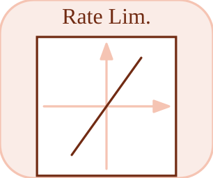

# rate

<p align="center">

</p>
Limits rising and falling signal rates.

## 📝 Syntax

- Block type: rate

## 📥 Input argument

- input ports - 1 input port(s) declared.

## 📤 Output argument

- output ports - 1 output port(s) declared.

## 📄 Description

Limits rising and falling signal rates.

| Field   | Value                     |
| ------- | ------------------------- |
| Module  | <code>nflow_blocks</code> |
| Library | Nonlinear blocks          |
| Type    | <code>rate</code>         |
| Label   | Rate Lim.                 |

<b>Description</b>

Limits the rate of change (rise/fall) of the input signal.

<b>Ports</b>

<b>Input(s)</b>

| Port   | Role                              | Side | Position  |
| ------ | --------------------------------- | ---- | --------- |
| Port_1 | Numeric signal read by the block. | left | x=0, y=40 |

<b>Output(s)</b>

| Port   | Role                                  | Side  | Position   |
| ------ | ------------------------------------- | ----- | ---------- |
| Port_1 | Numeric signal produced by the block. | right | x=80, y=40 |

<b>Parameters</b>

| Parameter         | Default value |
| ----------------- | ------------- |
| <code>rise</code> | 1             |
| <code>fall</code> | 1             |

<b>Inspector Keys</b>

These serialized keys are exposed by the block inspector.

- <code>rise</code>
- <code>fall</code>

<b>Block Characteristics</b>

| Field                     | Value                 |
| ------------------------- | --------------------- |
| Block type                | rate                  |
| Family                    | Nonlinear blocks      |
| Rendered size             | 80 x 80               |
| Phases                    | INIT, OUTPUT, UPDATE  |
| Direct feedthrough        | see Algorithms        |
| Internal state or history | yes                   |
| Signal data type          | double numeric values |

<b>Algorithms</b>

- INIT sets the stored output to 0.
- OUTPUT emits the stored value. UPDATE clamps input between previous - fall\*dt and previous + rise\*dt.
- rise and fall are clamped to nonnegative values.

<b>Equation or Rule</b>
$$y = \operatorname{clamp}(u,\,y_{prev} - fall\,dt,\,y_{prev} + rise\,dt)$$

<b>Extended Capabilities</b>

This page describes the native runtime behavior observed in the module C++ sources. Declared phases indicate when the simulation engine calls the block.

Code generation: supported for C and Rust.

<b>Implementation Sources</b>

<details>
<summary>Manifest: <code>modules/nflow_blocks/libraries/nonlinear/library.json</code></summary>

```json
{
  "id": "builtin.nonlinear",
  "title": "Non-Linear",
  "version": "1.0.0",
  "format": "nflow-2",
  "metadata": {
    "author": "Allan CORNET",
    "created": "2026-03-21",
    "tool": "Nelson nflow"
  },
  "comment": "Blocks for non-linearities",
  "license": "LGPL-3.0",
  "builtin": true,
  "blocks": [
    {
      "type": "saturation",
      "icon": "saturation.svg",
      "label": "Saturation",
      "phases": ["ALGEBRAIC"],
      "width": 80,
      "height": 80,
      "inputs": [
        {
          "x": 0,
          "y": 40,
          "side": "left"
        }
      ],
      "outputs": [
        {
          "x": 80,
          "y": 40,
          "side": "right"
        }
      ],
      "defaultParams": {
        "LowerLimit": -1,
        "UpperLimit": 1
      },
      "render": {
        "type": "image",
        "src": "saturation.svg"
      }
    },
    {
      "type": "hysteresis",
      "label": "Relay",
      "icon": "hysteresis.svg",
      "phases": ["INIT", "OUTPUT", "UPDATE"],
      "width": 80,
      "height": 80,
      "inputs": [
        {
          "x": 0,
          "y": 40,
          "side": "left"
        }
      ],
      "outputs": [
        {
          "x": 80,
          "y": 40,
          "side": "right"
        }
      ],
      "defaultParams": {
        "uHigh": 1,
        "uLow": -1,
        "yHigh": 1,
        "yLow": 0
      },
      "render": {
        "type": "image",
        "src": "hysteresis.svg"
      }
    },
    {
      "type": "rate",
      "label": "Rate Lim.",
      "icon": "rate.svg",
      "phases": ["INIT", "OUTPUT", "UPDATE"],
      "width": 80,
      "height": 80,
      "inputs": [
        {
          "x": 0,
          "y": 40,
          "side": "left"
        }
      ],
      "outputs": [
        {
          "x": 80,
          "y": 40,
          "side": "right"
        }
      ],
      "defaultParams": {
        "RisingSlewLimit": 1,
        "FallingSlewLimit": 1
      },
      "render": {
        "type": "image",
        "src": "rate.svg"
      }
    },
    {
      "type": "backlash",
      "label": "Backlash",
      "icon": "backlash.svg",
      "phases": ["INIT", "OUTPUT", "UPDATE"],
      "width": 80,
      "height": 80,
      "inputs": [
        {
          "x": 0,
          "y": 40,
          "side": "left"
        }
      ],
      "outputs": [
        {
          "x": 80,
          "y": 40,
          "side": "right"
        }
      ],
      "defaultParams": {
        "BacklashWidth": 1
      },
      "render": {
        "type": "image",
        "src": "backlash.svg"
      }
    },
    {
      "type": "deadZone",
      "label": "Dead Zone",
      "icon": "deadZone.svg",
      "phases": ["ALGEBRAIC"],
      "width": 80,
      "height": 80,
      "inputs": [
        {
          "x": 0,
          "y": 40,
          "side": "left"
        }
      ],
      "outputs": [
        {
          "x": 80,
          "y": 40,
          "side": "right"
        }
      ],
      "defaultParams": {
        "LowerValue": -1,
        "UpperValue": 1
      },
      "render": {
        "type": "image",
        "src": "deadZone.svg",
        "svgMode": "element",
        "preserveAspectRatio": "none",
        "x": 0,
        "y": 0,
        "width": 80,
        "height": 80
      }
    },
    {
      "type": "quantizer",
      "label": "Quantizer",
      "icon": "quantizer.svg",
      "phases": ["ALGEBRAIC"],
      "width": 80,
      "height": 80,
      "inputs": [
        {
          "x": 0,
          "y": 40,
          "side": "left"
        }
      ],
      "outputs": [
        {
          "x": 80,
          "y": 40,
          "side": "right"
        }
      ],
      "defaultParams": {
        "QuantizationInterval": 1
      },
      "render": {
        "type": "image",
        "src": "quantizer.svg",
        "svgMode": "element",
        "preserveAspectRatio": "none",
        "x": 0,
        "y": 0,
        "width": 80,
        "height": 80
      }
    },
    {
      "type": "hitCrossing",
      "icon": "hitCrossing.svg",
      "label": "Hit Crossing",
      "phases": ["INIT", "OUTPUT", "UPDATE"],
      "width": 80,
      "height": 80,
      "inputs": [
        {
          "x": 0,
          "y": 40,
          "side": "left"
        }
      ],
      "outputs": [
        {
          "x": 80,
          "y": 40,
          "side": "right"
        }
      ],
      "defaultParams": {
        "HitCrossingOffset": 0,
        "HitCrossingDirection": "either"
      },
      "render": {
        "type": "image",
        "src": "hitCrossing.svg"
      }
    },
    {
      "type": "coulombViscousFriction",
      "label": "Coulomb & Viscous Friction",
      "icon": "coulombViscousFriction.svg",
      "phases": ["ALGEBRAIC"],
      "width": 80,
      "height": 80,
      "inputs": [
        {
          "x": 0,
          "y": 40,
          "side": "left"
        }
      ],
      "outputs": [
        {
          "x": 80,
          "y": 40,
          "side": "right"
        }
      ],
      "defaultParams": {
        "Gain": 1,
        "Offset": 1
      },
      "render": {
        "type": "image",
        "src": "coulombViscousFriction.svg",
        "svgMode": "element",
        "preserveAspectRatio": "none",
        "x": 0,
        "y": 0,
        "width": 80,
        "height": 80
      }
    }
  ]
}
```

</details>


<details>
<summary>Runtime: <code>modules/nflow_blocks/src/cpp/nonlinear/rate.cpp</code></summary>

```cpp
//=============================================================================
// Copyright (c) 2016-present Allan CORNET (Nelson)
//=============================================================================
// This file is part of Nelson.
//=============================================================================
// LICENCE_BLOCK_BEGIN
// SPDX-License-Identifier: LGPL-3.0-or-later
// LICENCE_BLOCK_END
//=============================================================================
#include "SimEngineTypes.hpp"
#include "BlockRegistry.hpp"
#include "FieldNames.hpp"
#include "NFlowBlockDescriptor.hpp"
#include <cmath>
#include <algorithm>
#include "nonlinear_blocks.hpp"
//=============================================================================
bool
Nelson::NFlow::handleRate(SimCtx& ctx, const Block& b, Phase phase)
{
    auto& st = getState(ctx, b.nid);
    const int w = outputWidth(ctx, b.nid, 0);
    if (phase == Phase::INIT) {
        st.scalar = 0.0;
        if (w > 1) {
            st.vec.assign(w, 0.0);
        }
        return false;
    }
    if (phase == Phase::ALGEBRAIC) {
        // Direct feedthrough, as the emitted C/Rust step is: the output at t is
        // the current input slewed from the state committed at the end of the
        // previous step. Emitting the committed state instead delayed the block
        // by one step. Pure: the state is committed by UPDATE, never here, so
        // re-entering this from an RK stage or an algebraic-loop sweep is safe.
        nflow::BlockDescriptor bd(b, ctx.variables);
        const double rise = std::max(0.0, bd.paramDouble(nflow::kRise, 0.0));
        const double fall = std::max(0.0, bd.paramDouble(nflow::kFall, 0.0));
        SigView u = getInputSig(ctx, b.nid, 0);
        return emitElementwise(ctx, b.nid, [&](int i) {
            const double prev = (w <= 1) ? st.scalar : ((i < (int)st.vec.size()) ? st.vec[i] : 0.0);
            return std::min(prev + rise * ctx.dt, std::max(prev - fall * ctx.dt, sigAt(u, i)));
        });
    }
    if (phase == Phase::UPDATE) {
        nflow::BlockDescriptor bd(b, ctx.variables);
        double rise = std::max(0.0, bd.paramDouble(nflow::kRise, 0.0));
        double fall = std::max(0.0, bd.paramDouble(nflow::kFall, 0.0));
        if (w <= 1) {
            double inp = getInput(ctx, b.nid, 0, 0.0);
            double maxRise = st.scalar + rise * ctx.dt;
            double maxFall = st.scalar - fall * ctx.dt;
            st.scalar = std::min(maxRise, std::max(maxFall, inp));
        } else {
            SigView u = getInputSig(ctx, b.nid, 0);
            if ((int)st.vec.size() != w) {
                st.vec.assign(w, 0.0);
            }
            for (int i = 0; i < w; ++i) {
                double maxRise = st.vec[i] + rise * ctx.dt;
                double maxFall = st.vec[i] - fall * ctx.dt;
                st.vec[i] = std::min(maxRise, std::max(maxFall, sigAt(u, i)));
            }
        }
        return false;
    }
    return false;
}
//=============================================================================
Nelson::NFlow::BlockCodegenTemplate
Nelson::NFlow::getCodeGenCRate()
{
    BlockCodegenTemplate t;
    t.emitState = [](const BlockCodegenStateArgs& a) { a.addState("rate_" + a.id, "", ""); };
    t.emitStep = [](const BlockCodegenArgs& a) {
        nflow::BlockDescriptor bd(*a.block, *a.variables);
        double rise = std::fmax(0.0, bd.paramDouble(nflow::kRise, 0.0));
        double fall = std::fmax(0.0, bd.paramDouble(nflow::kFall, 0.0));
        a.line("{ double maxRise = s->rate_" + a.id + " + " + a.fmt(rise) + " * dt;");
        a.line("  double maxFall = s->rate_" + a.id + " - " + a.fmt(fall) + " * dt;");
        a.line("  double v = " + a.in[0] + ";");
        a.line("  if (v > maxRise) v = maxRise;");
        a.line("  if (v < maxFall) v = maxFall;");
        a.line("  s->rate_" + a.id + " = v;");
        a.line("  out_" + a.id + " = v; }");
    };
    return t;
}
//=============================================================================
Nelson::NFlow::BlockCodegenTemplate
Nelson::NFlow::getCodeGenRustRate()
{
    BlockCodegenTemplate t;
    t.emitState = [](const BlockCodegenStateArgs& a) { a.addState("rate_" + a.id, "", ""); };
    t.emitStep = [](const BlockCodegenArgs& a) {
        nflow::BlockDescriptor bd(*a.block, *a.variables);
        double rise = std::fmax(0.0, bd.paramDouble(nflow::kRise, 0.0));
        double fall = std::fmax(0.0, bd.paramDouble(nflow::kFall, 0.0));
        a.line("{");
        a.line("    let max_rise = s.rate_" + a.id + " + " + a.fmt(rise) + " * dt;");
        a.line("    let max_fall = s.rate_" + a.id + " - " + a.fmt(fall) + " * dt;");
        a.line("    let mut v = " + a.in[0] + ";");
        a.line("    if v > max_rise { v = max_rise; }");
        a.line("    if v < max_fall { v = max_fall; }");
        a.line("    s.rate_" + a.id + " = v;");
        a.line("    out_" + a.id + " = v;");
        a.line("}");
    };
    return t;
}
//=============================================================================

```

</details>

## 🔗 See also

[saturation](../../nflow_blocks/nonlinear/saturation.md), [quantizer](../../nflow_blocks/nonlinear/quantizer.md), [delay](../../nflow_blocks/continuous/delay.md).

## 🕔 History

| Version | 📄 Description  |
| ------- | --------------- |
| 1.0.0   | initial version |

<!--
## 👤 Author

Allan CORNET
-->
