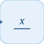

# labelSink

Names an input signal for label routing.

## 📝 Syntax

- Block type: labelSink

## 📥 Input argument

- input ports - 1 input port(s) declared.

## 📄 Description

Names an input signal for label routing. 

| Field | Value |
| --- | --- |
| Module | <code>nflow_blocks</code> | 
| Library | Sink blocks | 
| Type | <code>labelSink</code> | 
| Label | Label Sink | 

  

<b>Description</b> 

Receives a named label input and optionally shows a node in the diagram. Matches Label Source by name for wiring. 

<b>Ports</b> 

<b>Input(s)</b> 

| Port | Role | Side | Position | 
| --- | --- | --- | --- | 
| Port\_1 | Numeric signal read by the block. | left | x=0, y=20 | 

 

<b>Output(s)</b> 

This block declares no output ports. 

<b>Parameters</b> 

| Parameter | Default value | 
| --- | --- | 
| <code>name</code> | x | 
| <code>showNode</code> | true | 

 

<b>Inspector Keys</b> 

These serialized keys are exposed by the block inspector. 

- <code>name</code> 
- <code>showNode</code> 

<b>Block Characteristics</b> 

| Field | Value |
| --- | --- |
| Block type | labelSink | 
| Family | Sink blocks | 
| Rendered size | 40 x 40 | 
| Phases | none | 
| Direct feedthrough | see Algorithms | 
| Internal state or history | not observed in the documented runtime | 
| Signal data type | double numeric values | 

 

<b>Algorithms</b> 

- The handler performs no numeric computation. 
- Subsystem scheduling indexes labelSink blocks by name so matching labelSource blocks can read their input. 

<b>Extended Capabilities</b> 

This page describes the native runtime behavior observed in the module C++ sources. Declared phases indicate when the simulation engine calls the block. 

Code generation: supported for C and Rust. 

<b>Implementation Sources</b> 

**Manifest:** `modules/nflow_blocks/libraries/sink/library.json`
 

**Runtime:** `modules/nflow_blocks/src/cpp/sink/labelSink.cpp`

## 🔗 See also

[labelSource](../../nflow_blocks/source/labelSource.md), [display](../../nflow_blocks/sink/display.md).

## 🕔 History

| Version | 📄 Description     |
| ------- | --------------- |
| 1.0.0   | initial version |

<!--
## 👤 Author

Allan CORNET
-->
