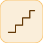

# counterFreeRunning


<p align="center">

</p>
Free-running up-counter, wraps modulo 2^NumBits.

## 📝 Syntax

- Block type: counterFreeRunning

## 📥 Input argument

- input ports - No input ports (this block has none).

## 📤 Output argument

- output ports - 1 output port(s) declared.

## 📄 Description


Free-running up-counter, wraps modulo 2^NumBits. 

| Field | Value |
| --- | --- |
| Module | <code>nflow_blocks</code> | 
| Library | Source | 
| Type | <code>counterFreeRunning</code> | 
| Label | Counter Free-Running | 

  

<b>Description</b> 

A free-running up-counter with no input. Starts at 0 and increments by 1 at every sample step, wrapping back to 0 after 2^<code>NumBits</code> - 1 (unsigned modulo arithmetic). The current count is emitted before the step's increment, so the first sample is 0. 

<b>Ports</b> 

This block has no input ports. 

<b>Output(s)</b> 

| Port | Role | Side | Position | 
| --- | --- | --- | --- | 
| Port\_1 | Numeric signal produced by the block. | right | x=80, y=40 | 

 

<b>Parameters</b> 

| Parameter | Default value | 
| --- | --- | 
| <code>NumBits</code> | 16 | 

 

<b>Block Characteristics</b> 

| Field | Value |
| --- | --- |
| Block type | counterFreeRunning | 
| Family | Source | 
| Rendered size | 80 x 80 | 
| Phases | INIT, OUTPUT, UPDATE | 
| Internal state or history | yes | 
| Signal data type | double numeric values | 

 

<b>Algorithms</b> 

- OUTPUT: out = count. UPDATE: count = (count + 1) mod 2^NumBits. 

<b>Equation or Rule</b> 
$$y_k = k \bmod 2^{\text{NumBits}}$$
 

<b>Extended Capabilities</b> 

Code generation: supported for C and Rust. 

<b>Implementation Sources</b> 

**Manifest:** `modules/nflow_blocks/libraries/source/library.json`
 

**Runtime:** `modules/nflow_blocks/src/cpp/source/counterFreeRunning.cpp`


## 💡 Example

A 2-bit counter cycles 0,1,2,3,0,1,...

```matlab
d.blocks={ struct('id','c','type','counterFreeRunning','inputs',0,'outputs',1,'params',struct('NumBits',2)), struct('id','w','type','toWorkspace','inputs',1,'outputs',0,'params',struct('VariableName','y','SaveFormat','Array')) };
d.connections={ struct('from','c','to','w','fromIndex',0,'toIndex',0) };
d.sampleTime=0.1; d.duration=1.0; d.solver='discrete'; d.variables=struct();
r=jsondecode(__nflow_simulate__(jsonencode(d)));
```


## 🔗 See also

[counterLimited](../../nflow_blocks/source/counterLimited.md), [repeatingSequenceStair](../../nflow_blocks/source/repeatingSequenceStair.md).

## 🕔 History

| Version | 📄 Description     |
| ------- | --------------- |
| 1.0.0   | initial version |

<!--
## 👤 Author

Allan CORNET
-->
