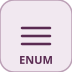

# enumeratedConstant

<p align="center">

</p>
Outputs a fixed enumeration value (EnumClass documents it, Value is the number).

## 📝 Syntax

- Block type: enumeratedConstant

## 📥 Input argument

- input ports - No input ports (this block has none).

## 📤 Output argument

- output ports - 1 output port(s) declared.

## 📄 Description

Outputs a fixed enumeration value (EnumClass documents it, Value is the number).

| Field   | Value                           |
| ------- | ------------------------------- |
| Module  | <code>nflow_blocks</code>       |
| Library | Source                          |
| Type    | <code>enumeratedConstant</code> |
| Label   | Enumerated Constant             |

<b>Description</b>

Outputs a fixed enumeration value. <code>EnumClass</code> names the enumeration (documentation only) and <code>Value</code> is the underlying numeric value of the selected member. Behaves like a constant carrying an enumerated meaning; scalar output.

<b>Ports</b>

This block has no input ports.

<b>Output(s)</b>

| Port   | Role                                  | Side  | Position   |
| ------ | ------------------------------------- | ----- | ---------- |
| Port_1 | Numeric signal produced by the block. | right | x=90, y=25 |

<b>Parameters</b>

| Parameter              | Default value |
| ---------------------- | ------------- |
| <code>EnumClass</code> |               |
| <code>Value</code>     | 0             |

<b>Block Characteristics</b>

| Field                     | Value                 |
| ------------------------- | --------------------- |
| Block type                | enumeratedConstant    |
| Family                    | Source                |
| Rendered size             | 90 x 50               |
| Phases                    | OUTPUT                |
| Internal state or history | no                    |
| Signal data type          | double numeric values |

<b>Algorithms</b>

- OUTPUT: out = Value (constant, every step).

<b>Extended Capabilities</b>

Code generation: supported for C and Rust.

<b>Implementation Sources</b>

<details>
<summary>Manifest: <code>modules/nflow_blocks/libraries/source/library.json</code></summary>

```json
{
  "id": "builtin.source",
  "title": "Source",
  "version": "1.0.0",
  "format": "nflow-2",
  "metadata": {
    "author": "Allan CORNET",
    "created": "2026-03-21",
    "tool": "Nelson nflow"
  },
  "comment": "Basic source blocks",
  "license": "LGPL-3.0",
  "builtin": true,
  "blocks": [
    {
      "type": "constant",
      "label": "Constant",
      "icon": "constant.svg",
      "phases": ["OUTPUT"],
      "width": 80,
      "height": 80,
      "inputs": [],
      "outputs": [
        {
          "x": 80,
          "y": 40,
          "side": "right"
        }
      ],
      "defaultParams": {
        "Value": 1,
        "OutDataType": "double"
      },
      "render": {
        "type": "math",
        "bodyClass": "block-body",
        "mathGroupClass": "constant-math",
        "formula": "{params.Value}"
      }
    },
    {
      "type": "step",
      "label": "Step",
      "icon": "step.svg",
      "phases": ["OUTPUT"],
      "width": 80,
      "height": 80,
      "inputs": [],
      "outputs": [
        {
          "x": 80,
          "y": 40,
          "side": "right"
        }
      ],
      "defaultParams": {
        "Time": 0
      },
      "render": {
        "type": "image",
        "src": "step.svg"
      }
    },
    {
      "type": "ramp",
      "label": "Ramp",
      "icon": "ramp.svg",
      "phases": ["OUTPUT"],
      "width": 80,
      "height": 80,
      "inputs": [],
      "outputs": [
        {
          "x": 80,
          "y": 40,
          "side": "right"
        }
      ],
      "defaultParams": {
        "slope": 1,
        "start": 0
      },
      "render": {
        "type": "image",
        "src": "ramp.svg"
      }
    },
    {
      "type": "counterFreeRunning",
      "label": "Counter Free-Running",
      "icon": "counterFreeRunning.svg",
      "phases": ["INIT", "OUTPUT", "UPDATE"],
      "width": 80,
      "height": 80,
      "inputs": [],
      "outputs": [
        {
          "x": 80,
          "y": 40,
          "side": "right"
        }
      ],
      "defaultParams": {
        "NumBits": 16
      },
      "render": {
        "type": "image",
        "src": "counterFreeRunning.svg"
      }
    },
    {
      "type": "counterLimited",
      "label": "Counter Limited",
      "icon": "counterLimited.svg",
      "phases": ["INIT", "OUTPUT", "UPDATE"],
      "width": 80,
      "height": 80,
      "inputs": [],
      "outputs": [
        {
          "x": 80,
          "y": 40,
          "side": "right"
        }
      ],
      "defaultParams": {
        "UpperLimit": 7
      },
      "render": {
        "type": "image",
        "src": "counterLimited.svg"
      }
    },
    {
      "type": "repeatingSequenceStair",
      "label": "Repeating Sequence Stair",
      "icon": "repeatingSequenceStair.svg",
      "phases": ["INIT", "OUTPUT", "UPDATE"],
      "width": 80,
      "height": 80,
      "inputs": [],
      "outputs": [
        {
          "x": 80,
          "y": 40,
          "side": "right"
        }
      ],
      "defaultParams": {
        "OutValues": [0, 1, 2, 3, 2, 1]
      },
      "render": {
        "type": "image",
        "src": "repeatingSequenceStair.svg"
      }
    },
    {
      "type": "repeatingSequenceInterpolated",
      "label": "Repeating Sequence Interpolated",
      "icon": "repeatingSequenceInterpolated.svg",
      "phases": ["OUTPUT"],
      "width": 80,
      "height": 80,
      "inputs": [],
      "outputs": [
        {
          "x": 80,
          "y": 40,
          "side": "right"
        }
      ],
      "defaultParams": {
        "TimeValues": [0, 1, 2],
        "OutValues": [0, 2, 0]
      },
      "render": {
        "type": "image",
        "src": "repeatingSequenceInterpolated.svg"
      }
    },
    {
      "type": "signalGenerator",
      "label": "Signal Generator",
      "icon": "signalGenerator.svg",
      "phases": ["OUTPUT"],
      "width": 80,
      "height": 80,
      "inputs": [],
      "outputs": [
        {
          "x": 80,
          "y": 40,
          "side": "right"
        }
      ],
      "defaultParams": {
        "Waveform": "sine",
        "Amplitude": 1,
        "Frequency": 1
      },
      "render": {
        "type": "image",
        "src": "signalGenerator.svg"
      }
    },
    {
      "type": "pulse",
      "label": "Pulse Generator",
      "icon": "pulse.svg",
      "phases": ["OUTPUT"],
      "width": 80,
      "height": 80,
      "inputs": [],
      "outputs": [
        {
          "x": 80,
          "y": 40,
          "side": "right"
        }
      ],
      "defaultParams": {
        "Amplitude": 1,
        "Period": 1,
        "Width": 50,
        "StartTime": 0,
        "Offset": 0
      },
      "render": {
        "type": "image",
        "src": "pulse.svg"
      }
    },
    {
      "type": "impulse",
      "label": "Impulse",
      "icon": "impulse.svg",
      "phases": ["OUTPUT"],
      "width": 80,
      "height": 80,
      "inputs": [],
      "outputs": [
        {
          "x": 80,
          "y": 40,
          "side": "right"
        }
      ],
      "defaultParams": {
        "Time": 0,
        "Amplitude": 1
      },
      "render": {
        "type": "image",
        "src": "impulse.svg"
      }
    },
    {
      "type": "sine",
      "label": "Sine",
      "icon": "sine.svg",
      "phases": ["OUTPUT"],
      "width": 80,
      "height": 80,
      "inputs": [],
      "outputs": [
        {
          "x": 80,
          "y": 40,
          "side": "right"
        }
      ],
      "defaultParams": {
        "Amplitude": 1,
        "Frequency": 1,
        "Phase": 0
      },
      "render": {
        "type": "image",
        "src": "sine.svg"
      }
    },
    {
      "type": "chirp",
      "label": "Chirp",
      "icon": "chirp.svg",
      "phases": ["OUTPUT"],
      "width": 80,
      "height": 80,
      "inputs": [],
      "outputs": [
        {
          "x": 80,
          "y": 40,
          "side": "right"
        }
      ],
      "defaultParams": {
        "Amplitude": 1,
        "f1": 1,
        "f2": 10,
        "T": 10
      },
      "render": {
        "type": "image",
        "src": "chirp.svg"
      }
    },
    {
      "type": "fileSource",
      "label": "File",
      "icon": "fileSource.svg",
      "phases": ["OUTPUT"],
      "width": 80,
      "height": 80,
      "inputs": [],
      "outputs": [
        {
          "x": 80,
          "y": 40,
          "side": "right"
        }
      ],
      "defaultParams": {
        "FileName": ""
      },
      "render": {
        "type": "image",
        "src": "fileSource.svg"
      }
    },
    {
      "type": "fromWorkspace",
      "label": "From Workspace",
      "icon": "fromWorkspace.svg",
      "phases": ["OUTPUT"],
      "width": 80,
      "height": 48,
      "inputs": [],
      "outputs": [
        {
          "x": 80,
          "y": 24,
          "side": "right"
        }
      ],
      "defaultParams": {
        "VariableName": "simin",
        "SampleTime": "0",
        "Interpolate": "on",
        "OutputAfterFinalValue": "Extrapolation"
      },
      "render": {
        "type": "math",
        "formula": "\\mathtt{{params.VariableName}}",
        "textSize": 14
      }
    },
    {
      "type": "labelSource",
      "label": "Label",
      "icon": "labelSource.svg",
      "phases": ["OUTPUT"],
      "width": 40,
      "height": 40,
      "inputs": [],
      "outputs": [
        {
          "x": 40,
          "y": 20,
          "side": "right"
        }
      ],
      "defaultParams": {
        "GotoTag": "x"
      },
      "render": {
        "type": "image",
        "src": "labelSource.svg"
      }
    },
    {
      "type": "noise",
      "label": "Noise",
      "icon": "noise.svg",
      "phases": ["OUTPUT"],
      "width": 80,
      "height": 80,
      "inputs": [],
      "outputs": [
        {
          "x": 80,
          "y": 40,
          "side": "right"
        }
      ],
      "defaultParams": {
        "Amplitude": 1
      },
      "render": {
        "type": "image",
        "src": "noise.svg"
      }
    },
    {
      "type": "clock",
      "label": "Clock",
      "icon": "clock.svg",
      "phases": ["OUTPUT"],
      "width": 80,
      "height": 80,
      "inputs": [],
      "outputs": [
        {
          "x": 80,
          "y": 40,
          "side": "right"
        }
      ],
      "defaultParams": {
        "DisplayTime": false,
        "Decimation": 10
      },
      "render": {
        "type": "image",
        "src": "clock.svg",
        "svgMode": "element",
        "preserveAspectRatio": "none",
        "x": 0,
        "y": 0,
        "width": 80,
        "height": 80
      }
    },
    {
      "type": "enumeratedConstant",
      "label": "Enumerated Constant",
      "icon": "enumeratedConstant.svg",
      "phases": ["OUTPUT"],
      "width": 90,
      "height": 50,
      "inputs": [],
      "outputs": [
        {
          "x": 90,
          "y": 25,
          "side": "right"
        }
      ],
      "defaultParams": {
        "EnumClass": "",
        "Value": 0
      }
    }
  ]
}
```

</details>


<details>
<summary>Runtime: <code>modules/nflow_blocks/src/cpp/source/enumeratedConstant.cpp</code></summary>

```cpp
//=============================================================================
// Copyright (c) 2016-present Allan CORNET (Nelson)
//=============================================================================
// This file is part of Nelson.
//=============================================================================
// LICENCE_BLOCK_BEGIN
// SPDX-License-Identifier: LGPL-3.0-or-later
// LICENCE_BLOCK_END
//=============================================================================
// enumeratedConstant: outputs a fixed enumeration value. EnumClass names the
// enumeration (documentation only) and Value is the underlying numeric value of
// the selected member. Behaves like a constant carrying an enumerated meaning;
// scalar output. C / Rust code generation.
//=============================================================================
#include "SimEngineTypes.hpp"
#include "BlockRegistry.hpp"
#include "FieldNames.hpp"
#include "NFlowBlockDescriptor.hpp"
#include "source_blocks.hpp"
//=============================================================================
bool
Nelson::NFlow::handleEnumeratedConstant(SimCtx& ctx, const Block& b, Phase phase)
{
    if (phase != Phase::OUTPUT) {
        return false;
    }
    nflow::BlockDescriptor bd(b, ctx.variables);
    setOutput(ctx, b.nid, bd.paramDouble("Value", 0.0));
    return false;
}
//=============================================================================
Nelson::NFlow::BlockCodegenTemplate
Nelson::NFlow::getCodeGenCEnumeratedConstant()
{
    BlockCodegenTemplate t;
    t.step = "out_{id} = {param:Value:0.0};";
    return t;
}
//=============================================================================
Nelson::NFlow::BlockCodegenTemplate
Nelson::NFlow::getCodeGenRustEnumeratedConstant()
{
    BlockCodegenTemplate t;
    t.step = "out_{id} = {param:Value:0.0};";
    return t;
}
//=============================================================================

```

</details>

## 💡 Example

EnumClass 'Color', Value 7 outputs 7 at every step.

```matlab
d.blocks={ struct('id','e','type','enumeratedConstant','inputs',0,'outputs',1,'params',struct('EnumClass','Color','Value',7)), struct('id','w','type','toWorkspace','inputs',1,'outputs',0,'params',struct('VariableName','y','SaveFormat','Array')) };
d.connections={ struct('from','e','to','w','fromIndex',0,'toIndex',0) };
d.sampleTime=0.1; d.duration=0.2; d.solver='discrete'; d.variables=struct();
r=jsondecode(__nflow_simulate__(jsonencode(d)));
```

## 🔗 See also

[constant](../../nflow_blocks/source/constant.md).

## 🕔 History

| Version | 📄 Description  |
| ------- | --------------- |
| 1.0.0   | initial version |

<!--
## 👤 Author

Allan CORNET
-->
