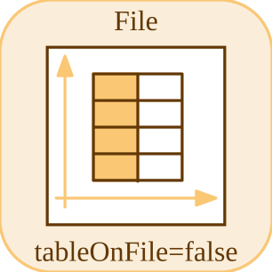

# fileSource

<p align="center">

</p>
Outputs values from preloaded times and values arrays.

## 📝 Syntax

- Block type: fileSource

## 📤 Output argument

- output ports - 1 output port(s) declared.

## 📄 Description

Outputs values from preloaded times and values arrays.

| Field   | Value                     |
| ------- | ------------------------- |
| Module  | <code>nflow_blocks</code> |
| Library | Source blocks             |
| Type    | <code>fileSource</code>   |
| Label   | File                      |

<b>Description</b>

Reads values from a CSV file and supplies them as a time series source.

<b>Ports</b>

<b>Input(s)</b>

This block declares no input ports.

<b>Output(s)</b>

| Port   | Role                                  | Side  | Position   |
| ------ | ------------------------------------- | ----- | ---------- |
| Port_1 | Numeric signal produced by the block. | right | x=80, y=40 |

<b>Parameters</b>

| Parameter         | Default value |
| ----------------- | ------------- |
| <code>path</code> |               |

<b>Inspector Keys</b>

These serialized keys are exposed by the block inspector.

- <code>path</code>

<b>Block Characteristics</b>

| Field                     | Value                 |
| ------------------------- | --------------------- |
| Block type                | fileSource            |
| Family                    | Source blocks         |
| Rendered size             | 80 x 80               |
| Phases                    | OUTPUT                |
| Direct feedthrough        | see Algorithms        |
| Internal state or history | yes                   |
| Signal data type          | double numeric values |

<b>Algorithms</b>

- INIT copies numeric params.times and params.values into state and resets the index.
- OUTPUT returns 0 when data is empty; otherwise it advances to the latest time not greater than t.
- path is configuration metadata for loading; the native handler consumes preloaded arrays.

<b>Equation or Rule</b>
$$y = values_{index(t)}$$

<b>Extended Capabilities</b>

This page describes the native runtime behavior observed in the module C++ sources. Declared phases indicate when the simulation engine calls the block.

Code generation: supported for C and Rust.

<b>Implementation Sources</b>

<details>
<summary>Manifest: <code>modules/nflow_blocks/libraries/source/library.json</code></summary>

```json
{
  "id": "builtin.source",
  "title": "Source",
  "version": "1.0.0",
  "format": "nflow-2",
  "metadata": {
    "author": "Allan CORNET",
    "created": "2026-03-21",
    "tool": "Nelson nflow"
  },
  "comment": "Basic source blocks",
  "license": "LGPL-3.0",
  "builtin": true,
  "blocks": [
    {
      "type": "constant",
      "label": "Constant",
      "icon": "constant.svg",
      "phases": ["OUTPUT"],
      "width": 80,
      "height": 80,
      "inputs": [],
      "outputs": [
        {
          "x": 80,
          "y": 40,
          "side": "right"
        }
      ],
      "defaultParams": {
        "Value": 1,
        "OutDataType": "double"
      },
      "render": {
        "type": "math",
        "bodyClass": "block-body",
        "mathGroupClass": "constant-math",
        "formula": "{params.Value}"
      }
    },
    {
      "type": "step",
      "label": "Step",
      "icon": "step.svg",
      "phases": ["OUTPUT"],
      "width": 80,
      "height": 80,
      "inputs": [],
      "outputs": [
        {
          "x": 80,
          "y": 40,
          "side": "right"
        }
      ],
      "defaultParams": {
        "Time": 0
      },
      "render": {
        "type": "image",
        "src": "step.svg"
      }
    },
    {
      "type": "ramp",
      "label": "Ramp",
      "icon": "ramp.svg",
      "phases": ["OUTPUT"],
      "width": 80,
      "height": 80,
      "inputs": [],
      "outputs": [
        {
          "x": 80,
          "y": 40,
          "side": "right"
        }
      ],
      "defaultParams": {
        "slope": 1,
        "start": 0
      },
      "render": {
        "type": "image",
        "src": "ramp.svg"
      }
    },
    {
      "type": "counterFreeRunning",
      "label": "Counter Free-Running",
      "icon": "counterFreeRunning.svg",
      "phases": ["INIT", "OUTPUT", "UPDATE"],
      "width": 80,
      "height": 80,
      "inputs": [],
      "outputs": [
        {
          "x": 80,
          "y": 40,
          "side": "right"
        }
      ],
      "defaultParams": {
        "NumBits": 16
      },
      "render": {
        "type": "image",
        "src": "counterFreeRunning.svg"
      }
    },
    {
      "type": "counterLimited",
      "label": "Counter Limited",
      "icon": "counterLimited.svg",
      "phases": ["INIT", "OUTPUT", "UPDATE"],
      "width": 80,
      "height": 80,
      "inputs": [],
      "outputs": [
        {
          "x": 80,
          "y": 40,
          "side": "right"
        }
      ],
      "defaultParams": {
        "UpperLimit": 7
      },
      "render": {
        "type": "image",
        "src": "counterLimited.svg"
      }
    },
    {
      "type": "repeatingSequenceStair",
      "label": "Repeating Sequence Stair",
      "icon": "repeatingSequenceStair.svg",
      "phases": ["INIT", "OUTPUT", "UPDATE"],
      "width": 80,
      "height": 80,
      "inputs": [],
      "outputs": [
        {
          "x": 80,
          "y": 40,
          "side": "right"
        }
      ],
      "defaultParams": {
        "OutValues": [0, 1, 2, 3, 2, 1]
      },
      "render": {
        "type": "image",
        "src": "repeatingSequenceStair.svg"
      }
    },
    {
      "type": "repeatingSequenceInterpolated",
      "label": "Repeating Sequence Interpolated",
      "icon": "repeatingSequenceInterpolated.svg",
      "phases": ["OUTPUT"],
      "width": 80,
      "height": 80,
      "inputs": [],
      "outputs": [
        {
          "x": 80,
          "y": 40,
          "side": "right"
        }
      ],
      "defaultParams": {
        "TimeValues": [0, 1, 2],
        "OutValues": [0, 2, 0]
      },
      "render": {
        "type": "image",
        "src": "repeatingSequenceInterpolated.svg"
      }
    },
    {
      "type": "signalGenerator",
      "label": "Signal Generator",
      "icon": "signalGenerator.svg",
      "phases": ["OUTPUT"],
      "width": 80,
      "height": 80,
      "inputs": [],
      "outputs": [
        {
          "x": 80,
          "y": 40,
          "side": "right"
        }
      ],
      "defaultParams": {
        "Waveform": "sine",
        "Amplitude": 1,
        "Frequency": 1
      },
      "render": {
        "type": "image",
        "src": "signalGenerator.svg"
      }
    },
    {
      "type": "pulse",
      "label": "Pulse Generator",
      "icon": "pulse.svg",
      "phases": ["OUTPUT"],
      "width": 80,
      "height": 80,
      "inputs": [],
      "outputs": [
        {
          "x": 80,
          "y": 40,
          "side": "right"
        }
      ],
      "defaultParams": {
        "Amplitude": 1,
        "Period": 1,
        "Width": 50,
        "StartTime": 0,
        "Offset": 0
      },
      "render": {
        "type": "image",
        "src": "pulse.svg"
      }
    },
    {
      "type": "impulse",
      "label": "Impulse",
      "icon": "impulse.svg",
      "phases": ["OUTPUT"],
      "width": 80,
      "height": 80,
      "inputs": [],
      "outputs": [
        {
          "x": 80,
          "y": 40,
          "side": "right"
        }
      ],
      "defaultParams": {
        "Time": 0,
        "Amplitude": 1
      },
      "render": {
        "type": "image",
        "src": "impulse.svg"
      }
    },
    {
      "type": "sine",
      "label": "Sine",
      "icon": "sine.svg",
      "phases": ["OUTPUT"],
      "width": 80,
      "height": 80,
      "inputs": [],
      "outputs": [
        {
          "x": 80,
          "y": 40,
          "side": "right"
        }
      ],
      "defaultParams": {
        "Amplitude": 1,
        "Frequency": 1,
        "Phase": 0
      },
      "render": {
        "type": "image",
        "src": "sine.svg"
      }
    },
    {
      "type": "chirp",
      "label": "Chirp",
      "icon": "chirp.svg",
      "phases": ["OUTPUT"],
      "width": 80,
      "height": 80,
      "inputs": [],
      "outputs": [
        {
          "x": 80,
          "y": 40,
          "side": "right"
        }
      ],
      "defaultParams": {
        "Amplitude": 1,
        "f1": 1,
        "f2": 10,
        "T": 10
      },
      "render": {
        "type": "image",
        "src": "chirp.svg"
      }
    },
    {
      "type": "fileSource",
      "label": "File",
      "icon": "fileSource.svg",
      "phases": ["OUTPUT"],
      "width": 80,
      "height": 80,
      "inputs": [],
      "outputs": [
        {
          "x": 80,
          "y": 40,
          "side": "right"
        }
      ],
      "defaultParams": {
        "FileName": ""
      },
      "render": {
        "type": "image",
        "src": "fileSource.svg"
      }
    },
    {
      "type": "fromWorkspace",
      "label": "From Workspace",
      "icon": "fromWorkspace.svg",
      "phases": ["OUTPUT"],
      "width": 80,
      "height": 48,
      "inputs": [],
      "outputs": [
        {
          "x": 80,
          "y": 24,
          "side": "right"
        }
      ],
      "defaultParams": {
        "VariableName": "simin",
        "SampleTime": "0",
        "Interpolate": "on",
        "OutputAfterFinalValue": "Extrapolation"
      },
      "render": {
        "type": "math",
        "formula": "\\mathtt{{params.VariableName}}",
        "textSize": 14
      }
    },
    {
      "type": "labelSource",
      "label": "Label",
      "icon": "labelSource.svg",
      "phases": ["OUTPUT"],
      "width": 40,
      "height": 40,
      "inputs": [],
      "outputs": [
        {
          "x": 40,
          "y": 20,
          "side": "right"
        }
      ],
      "defaultParams": {
        "GotoTag": "x"
      },
      "render": {
        "type": "image",
        "src": "labelSource.svg"
      }
    },
    {
      "type": "noise",
      "label": "Noise",
      "icon": "noise.svg",
      "phases": ["OUTPUT"],
      "width": 80,
      "height": 80,
      "inputs": [],
      "outputs": [
        {
          "x": 80,
          "y": 40,
          "side": "right"
        }
      ],
      "defaultParams": {
        "Amplitude": 1
      },
      "render": {
        "type": "image",
        "src": "noise.svg"
      }
    },
    {
      "type": "clock",
      "label": "Clock",
      "icon": "clock.svg",
      "phases": ["OUTPUT"],
      "width": 80,
      "height": 80,
      "inputs": [],
      "outputs": [
        {
          "x": 80,
          "y": 40,
          "side": "right"
        }
      ],
      "defaultParams": {
        "DisplayTime": false,
        "Decimation": 10
      },
      "render": {
        "type": "image",
        "src": "clock.svg",
        "svgMode": "element",
        "preserveAspectRatio": "none",
        "x": 0,
        "y": 0,
        "width": 80,
        "height": 80
      }
    },
    {
      "type": "enumeratedConstant",
      "label": "Enumerated Constant",
      "icon": "enumeratedConstant.svg",
      "phases": ["OUTPUT"],
      "width": 90,
      "height": 50,
      "inputs": [],
      "outputs": [
        {
          "x": 90,
          "y": 25,
          "side": "right"
        }
      ],
      "defaultParams": {
        "EnumClass": "",
        "Value": 0
      }
    }
  ]
}
```

</details>


<details>
<summary>Runtime: <code>modules/nflow_blocks/src/cpp/source/fileSource.cpp</code></summary>

```cpp
//=============================================================================
// Copyright (c) 2016-present Allan CORNET (Nelson)
//=============================================================================
// This file is part of Nelson.
//=============================================================================
// LICENCE_BLOCK_BEGIN
// SPDX-License-Identifier: LGPL-3.0-or-later
// LICENCE_BLOCK_END
//=============================================================================
#include "SimEngineTypes.hpp"
#include "BlockRegistry.hpp"
#include "FieldNames.hpp"
#include "NFlowBlockDescriptor.hpp"
#include <cmath>
#include <algorithm>
#include <vector>
#include <string>
#include "source_blocks.hpp"
//=============================================================================
bool
Nelson::NFlow::handleFileSource(SimCtx& ctx, const Block& b, Phase phase)
{
    auto& st = getState(ctx, b.nid);
    if (phase == Phase::INIT) {
        if (b.params.contains(nflow::kTimes) && b.params[nflow::kTimes].is_array()) {
            for (const auto& v : b.params[nflow::kTimes]) {
                st.fsrcTimes.push_back(v.is_number() ? v.get<double>() : 0.0);
            }
        }
        if (b.params.contains(nflow::kValues) && b.params[nflow::kValues].is_array()) {
            for (const auto& v : b.params[nflow::kValues]) {
                st.fsrcValues.push_back(v.is_number() ? v.get<double>() : 0.0);
            }
        }
        st.fsrcIdx = 0;
        return false;
    }
    if (phase != Phase::OUTPUT) {
        return false;
    }
    if (st.fsrcTimes.empty()) {
        setOutput(ctx, b.nid, 0.0);
        return false;
    }
    // Stateless, rewind-safe lookup: largest index with fsrcTimes[idx] <= t.
    // On a monotone time grid this matches the former advancing cursor exactly,
    // but it makes OUTPUT a pure function of ctx.t (safe to re-run at any stage
    // time under a variable-step solver).
    int idx = static_cast<int>(std::upper_bound(st.fsrcTimes.begin(), st.fsrcTimes.end(), ctx.t)
                  - st.fsrcTimes.begin())
        - 1;
    if (idx < 0) {
        idx = 0;
    }
    setOutput(ctx, b.nid, idx < (int)st.fsrcValues.size() ? st.fsrcValues[idx] : 0.0);
    return false;
}
//=============================================================================
Nelson::NFlow::BlockCodegenTemplate
Nelson::NFlow::getCodeGenCFileSource()
{
    BlockCodegenTemplate t;
    // The (times, values) table is embedded in the block params, so the source
    // lowers to a static table plus the same rewind-safe piecewise-constant
    // lookup the simulator uses (largest index with times[i] <= t, clamped to 0).
    t.emitStep = [](const BlockCodegenArgs& a) {
        std::vector<double> times, values;
        if (a.params && a.params->contains(nflow::kTimes)
            && (*a.params)[nflow::kTimes].is_array()) {
            for (const auto& v : (*a.params)[nflow::kTimes]) {
                times.push_back(v.is_number() ? v.get<double>() : 0.0);
            }
        }
        if (a.params && a.params->contains(nflow::kValues)
            && (*a.params)[nflow::kValues].is_array()) {
            for (const auto& v : (*a.params)[nflow::kValues]) {
                values.push_back(v.is_number() ? v.get<double>() : 0.0);
            }
        }
        if (times.empty() || values.empty()) {
            a.line("out_" + a.id + " = 0.0;");
            return;
        }
        std::string ts = "static const double __fsrc_t_" + a.id + "[] = {";
        std::string vs = "static const double __fsrc_v_" + a.id + "[] = {";
        for (size_t i = 0; i < times.size(); ++i) {
            ts += (i ? ", " : "") + a.fmt(times[i]);
        }
        for (size_t i = 0; i < values.size(); ++i) {
            vs += (i ? ", " : "") + a.fmt(values[i]);
        }
        ts += "};";
        vs += "};";
        a.line(ts);
        a.line(vs);
        const std::string n = std::to_string(times.size());
        const std::string vn = std::to_string(values.size());
        a.line("{ int __fi = " + n + " - 1; while (__fi > 0 && __fsrc_t_" + a.id
            + "[__fi] > t) "
              "__fi--;");
        a.line("  out_" + a.id + " = __fsrc_v_" + a.id + "[__fi < " + vn + " ? __fi : " + vn
            + " - 1]; }");
    };
    return t;
}
//=============================================================================
Nelson::NFlow::BlockCodegenTemplate
Nelson::NFlow::getCodeGenRustFileSource()
{
    BlockCodegenTemplate t;
    // Mirrors the C generator: static table + rewind-safe piecewise-constant lookup.
    t.emitStep = [](const BlockCodegenArgs& a) {
        std::vector<double> times, values;
        if (a.params && a.params->contains(nflow::kTimes)
            && (*a.params)[nflow::kTimes].is_array()) {
            for (const auto& v : (*a.params)[nflow::kTimes]) {
                times.push_back(v.is_number() ? v.get<double>() : 0.0);
            }
        }
        if (a.params && a.params->contains(nflow::kValues)
            && (*a.params)[nflow::kValues].is_array()) {
            for (const auto& v : (*a.params)[nflow::kValues]) {
                values.push_back(v.is_number() ? v.get<double>() : 0.0);
            }
        }
        if (times.empty() || values.empty()) {
            a.line("out_" + a.id + " = 0.0_f64;");
            return;
        }
        std::string ts = "let __fsrc_t_" + a.id + " = [";
        std::string vs = "let __fsrc_v_" + a.id + " = [";
        for (size_t i = 0; i < times.size(); ++i) {
            ts += (i ? ", " : "") + a.fmt(times[i]);
        }
        for (size_t i = 0; i < values.size(); ++i) {
            vs += (i ? ", " : "") + a.fmt(values[i]);
        }
        ts += "];";
        vs += "];";
        a.line(ts);
        a.line(vs);
        a.line("let mut __fi: usize = " + std::to_string(times.size() - 1) + ";");
        a.line("while __fi > 0 && __fsrc_t_" + a.id + "[__fi] > t { __fi -= 1; }");
        a.line("let __fj: usize = if __fi < " + std::to_string(values.size()) + " { __fi } else { "
            + std::to_string(values.size() - 1) + " };");
        a.line("out_" + a.id + " = __fsrc_v_" + a.id + "[__fj];");
    };
    return t;
}
//=============================================================================

```

</details>

## 🔗 See also

[fileSink](../../nflow_blocks/sink/fileSink.md), [constant](../../nflow_blocks/source/constant.md).

## 🕔 History

| Version | 📄 Description  |
| ------- | --------------- |
| 1.0.0   | initial version |

<!--
## 👤 Author

Allan CORNET
-->
