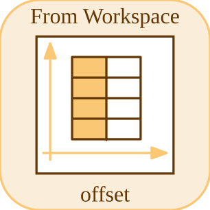

# fromWorkspace


<p align="center">

</p>
Reads a signal from a Nelson workspace variable.

## 📝 Syntax

- Block type: fromWorkspace

## 📤 Output argument

- output ports - 1 output port (scalar or vector double, width taken from the variable).

## 📄 Description


Emits the signal stored in the base-workspace variable <code>VariableName</code>. The variable is read once when the simulation starts. Two data formats are accepted: 

- a <code>[time, values]</code> matrix: first column = time, remaining columns = signal elements; 
- a struct with fields <code>time</code> (Nx1) and <code>signals.values</code> (NxW).  

Time values must be non-decreasing, without Inf or NaN; duplicated time stamps describe discontinuities. With <code>Interpolate</code> on, output is linearly interpolated (before the first point: linear extrapolation from the first two points; at a duplicated time the newest value wins). With <code>Interpolate</code> off, the block holds the latest sample (zero before the first point). 

After the final data point, <code>OutputAfterFinalValue</code> selects <code>Extrapolation</code> (linear, requires interpolation), <code>Setting to zero</code> or <code>Holding final value</code>. 

Code generation bakes the samples into constant tables with the same lookup semantics (scalar signals). 

<b>Parameters</b> 

| Parameter | Default value | 
| --- | --- | 
| <code>VariableName</code> | simin | 
| <code>SampleTime</code> | 0 | 
| <code>Interpolate</code> | on | 
| <code>OutputAfterFinalValue</code> | Extrapolation | 

 

<b>Block Characteristics</b> 

| Field | Value |
| --- | --- |
| Block type | fromWorkspace | 
| Family | Source blocks | 
| Phases | INIT, OUTPUT | 
| Signal data type | double, scalar or vector | 
| Code generation | yes (constant tables, scalar signals) | 

 

Code generation: supported for C and Rust. 

**Manifest:** `modules/nflow_blocks/libraries/source/library.json`
 

**Runtime:** `modules/nflow_blocks/src/cpp/source/fromWorkspace.cpp`


## 💡 Example

Run the From/To Workspace demo (defines 'simin' then opens the model)

```matlab
run([modulepath('nflow_blocks'), '/examples/workspace/From_Workspace_Demo.m']);
```


## 🔗 See also

[toWorkspace](../../nflow_blocks/sink/toWorkspace.md), [fileSource](../../nflow_blocks/source/fileSource.md).

## 🕔 History

| Version | 📄 Description     |
| ------- | --------------- |
| 1.0.0   | initial version |

<!--
## 👤 Author

Allan CORNET
-->
