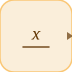

# labelSource

<p align="center">

</p>
Reads a signal from a matching labelSink.

## 📝 Syntax

- Block type: labelSource

## 📤 Output argument

- output ports - 1 output port(s) declared.

## 📄 Description

Reads a signal from a matching labelSink.

| Field   | Value                     |
| ------- | ------------------------- |
| Module  | <code>nflow_blocks</code> |
| Library | Source blocks             |
| Type    | <code>labelSource</code>  |
| Label   | Label                     |

<b>Description</b>

Provides a named signal that can be routed to a corresponding Label Sink or exported as an external input label.

<b>Ports</b>

<b>Input(s)</b>

This block declares no input ports.

<b>Output(s)</b>

| Port   | Role                                  | Side  | Position   |
| ------ | ------------------------------------- | ----- | ---------- |
| Port_1 | Numeric signal produced by the block. | right | x=40, y=20 |

<b>Parameters</b>

| Parameter         | Default value |
| ----------------- | ------------- |
| <code>name</code> | x             |

<b>Inspector Keys</b>

These serialized keys are exposed by the block inspector.

- <code>name</code>

<b>Block Characteristics</b>

| Field                     | Value                                  |
| ------------------------- | -------------------------------------- |
| Block type                | labelSource                            |
| Family                    | Source blocks                          |
| Rendered size             | 40 x 40                                |
| Phases                    | OUTPUT                                 |
| Direct feedthrough        | see Algorithms                         |
| Internal state or history | not observed in the documented runtime |
| Signal data type          | double numeric values                  |

<b>Algorithms</b>

- OUTPUT block.
- Looks up a labelSink with the same name and forwards that sink input when available.
- If the name or connection is missing, the output is not changed.

<b>Equation or Rule</b>
$$y = \mathrm{labeled\ signal}$$

<b>Extended Capabilities</b>

This page describes the native runtime behavior observed in the module C++ sources. Declared phases indicate when the simulation engine calls the block.

Code generation: supported for C and Rust.

<b>Implementation Sources</b>

<details>
<summary>Manifest: <code>modules/nflow_blocks/libraries/source/library.json</code></summary>

```json
{
  "id": "builtin.source",
  "title": "Source",
  "version": "1.0.0",
  "format": "nflow-2",
  "metadata": {
    "author": "Allan CORNET",
    "created": "2026-03-21",
    "tool": "Nelson nflow"
  },
  "comment": "Basic source blocks",
  "license": "LGPL-3.0",
  "builtin": true,
  "blocks": [
    {
      "type": "constant",
      "label": "Constant",
      "icon": "constant.svg",
      "phases": ["OUTPUT"],
      "width": 80,
      "height": 80,
      "inputs": [],
      "outputs": [
        {
          "x": 80,
          "y": 40,
          "side": "right"
        }
      ],
      "defaultParams": {
        "Value": 1,
        "OutDataType": "double"
      },
      "render": {
        "type": "math",
        "bodyClass": "block-body",
        "mathGroupClass": "constant-math",
        "formula": "{params.Value}"
      }
    },
    {
      "type": "step",
      "label": "Step",
      "icon": "step.svg",
      "phases": ["OUTPUT"],
      "width": 80,
      "height": 80,
      "inputs": [],
      "outputs": [
        {
          "x": 80,
          "y": 40,
          "side": "right"
        }
      ],
      "defaultParams": {
        "Time": 0
      },
      "render": {
        "type": "image",
        "src": "step.svg"
      }
    },
    {
      "type": "ramp",
      "label": "Ramp",
      "icon": "ramp.svg",
      "phases": ["OUTPUT"],
      "width": 80,
      "height": 80,
      "inputs": [],
      "outputs": [
        {
          "x": 80,
          "y": 40,
          "side": "right"
        }
      ],
      "defaultParams": {
        "slope": 1,
        "start": 0
      },
      "render": {
        "type": "image",
        "src": "ramp.svg"
      }
    },
    {
      "type": "counterFreeRunning",
      "label": "Counter Free-Running",
      "icon": "counterFreeRunning.svg",
      "phases": ["INIT", "OUTPUT", "UPDATE"],
      "width": 80,
      "height": 80,
      "inputs": [],
      "outputs": [
        {
          "x": 80,
          "y": 40,
          "side": "right"
        }
      ],
      "defaultParams": {
        "NumBits": 16
      },
      "render": {
        "type": "image",
        "src": "counterFreeRunning.svg"
      }
    },
    {
      "type": "counterLimited",
      "label": "Counter Limited",
      "icon": "counterLimited.svg",
      "phases": ["INIT", "OUTPUT", "UPDATE"],
      "width": 80,
      "height": 80,
      "inputs": [],
      "outputs": [
        {
          "x": 80,
          "y": 40,
          "side": "right"
        }
      ],
      "defaultParams": {
        "UpperLimit": 7
      },
      "render": {
        "type": "image",
        "src": "counterLimited.svg"
      }
    },
    {
      "type": "repeatingSequenceStair",
      "label": "Repeating Sequence Stair",
      "icon": "repeatingSequenceStair.svg",
      "phases": ["INIT", "OUTPUT", "UPDATE"],
      "width": 80,
      "height": 80,
      "inputs": [],
      "outputs": [
        {
          "x": 80,
          "y": 40,
          "side": "right"
        }
      ],
      "defaultParams": {
        "OutValues": [0, 1, 2, 3, 2, 1]
      },
      "render": {
        "type": "image",
        "src": "repeatingSequenceStair.svg"
      }
    },
    {
      "type": "repeatingSequenceInterpolated",
      "label": "Repeating Sequence Interpolated",
      "icon": "repeatingSequenceInterpolated.svg",
      "phases": ["OUTPUT"],
      "width": 80,
      "height": 80,
      "inputs": [],
      "outputs": [
        {
          "x": 80,
          "y": 40,
          "side": "right"
        }
      ],
      "defaultParams": {
        "TimeValues": [0, 1, 2],
        "OutValues": [0, 2, 0]
      },
      "render": {
        "type": "image",
        "src": "repeatingSequenceInterpolated.svg"
      }
    },
    {
      "type": "signalGenerator",
      "label": "Signal Generator",
      "icon": "signalGenerator.svg",
      "phases": ["OUTPUT"],
      "width": 80,
      "height": 80,
      "inputs": [],
      "outputs": [
        {
          "x": 80,
          "y": 40,
          "side": "right"
        }
      ],
      "defaultParams": {
        "Waveform": "sine",
        "Amplitude": 1,
        "Frequency": 1
      },
      "render": {
        "type": "image",
        "src": "signalGenerator.svg"
      }
    },
    {
      "type": "pulse",
      "label": "Pulse Generator",
      "icon": "pulse.svg",
      "phases": ["OUTPUT"],
      "width": 80,
      "height": 80,
      "inputs": [],
      "outputs": [
        {
          "x": 80,
          "y": 40,
          "side": "right"
        }
      ],
      "defaultParams": {
        "Amplitude": 1,
        "Period": 1,
        "Width": 50,
        "StartTime": 0,
        "Offset": 0
      },
      "render": {
        "type": "image",
        "src": "pulse.svg"
      }
    },
    {
      "type": "impulse",
      "label": "Impulse",
      "icon": "impulse.svg",
      "phases": ["OUTPUT"],
      "width": 80,
      "height": 80,
      "inputs": [],
      "outputs": [
        {
          "x": 80,
          "y": 40,
          "side": "right"
        }
      ],
      "defaultParams": {
        "Time": 0,
        "Amplitude": 1
      },
      "render": {
        "type": "image",
        "src": "impulse.svg"
      }
    },
    {
      "type": "sine",
      "label": "Sine",
      "icon": "sine.svg",
      "phases": ["OUTPUT"],
      "width": 80,
      "height": 80,
      "inputs": [],
      "outputs": [
        {
          "x": 80,
          "y": 40,
          "side": "right"
        }
      ],
      "defaultParams": {
        "Amplitude": 1,
        "Frequency": 1,
        "Phase": 0
      },
      "render": {
        "type": "image",
        "src": "sine.svg"
      }
    },
    {
      "type": "chirp",
      "label": "Chirp",
      "icon": "chirp.svg",
      "phases": ["OUTPUT"],
      "width": 80,
      "height": 80,
      "inputs": [],
      "outputs": [
        {
          "x": 80,
          "y": 40,
          "side": "right"
        }
      ],
      "defaultParams": {
        "Amplitude": 1,
        "f1": 1,
        "f2": 10,
        "T": 10
      },
      "render": {
        "type": "image",
        "src": "chirp.svg"
      }
    },
    {
      "type": "fileSource",
      "label": "File",
      "icon": "fileSource.svg",
      "phases": ["OUTPUT"],
      "width": 80,
      "height": 80,
      "inputs": [],
      "outputs": [
        {
          "x": 80,
          "y": 40,
          "side": "right"
        }
      ],
      "defaultParams": {
        "FileName": ""
      },
      "render": {
        "type": "image",
        "src": "fileSource.svg"
      }
    },
    {
      "type": "fromWorkspace",
      "label": "From Workspace",
      "icon": "fromWorkspace.svg",
      "phases": ["OUTPUT"],
      "width": 80,
      "height": 48,
      "inputs": [],
      "outputs": [
        {
          "x": 80,
          "y": 24,
          "side": "right"
        }
      ],
      "defaultParams": {
        "VariableName": "simin",
        "SampleTime": "0",
        "Interpolate": "on",
        "OutputAfterFinalValue": "Extrapolation"
      },
      "render": {
        "type": "math",
        "formula": "\\mathtt{{params.VariableName}}",
        "textSize": 14
      }
    },
    {
      "type": "labelSource",
      "label": "Label",
      "icon": "labelSource.svg",
      "phases": ["OUTPUT"],
      "width": 40,
      "height": 40,
      "inputs": [],
      "outputs": [
        {
          "x": 40,
          "y": 20,
          "side": "right"
        }
      ],
      "defaultParams": {
        "GotoTag": "x"
      },
      "render": {
        "type": "image",
        "src": "labelSource.svg"
      }
    },
    {
      "type": "noise",
      "label": "Noise",
      "icon": "noise.svg",
      "phases": ["OUTPUT"],
      "width": 80,
      "height": 80,
      "inputs": [],
      "outputs": [
        {
          "x": 80,
          "y": 40,
          "side": "right"
        }
      ],
      "defaultParams": {
        "Amplitude": 1
      },
      "render": {
        "type": "image",
        "src": "noise.svg"
      }
    },
    {
      "type": "clock",
      "label": "Clock",
      "icon": "clock.svg",
      "phases": ["OUTPUT"],
      "width": 80,
      "height": 80,
      "inputs": [],
      "outputs": [
        {
          "x": 80,
          "y": 40,
          "side": "right"
        }
      ],
      "defaultParams": {
        "DisplayTime": false,
        "Decimation": 10
      },
      "render": {
        "type": "image",
        "src": "clock.svg",
        "svgMode": "element",
        "preserveAspectRatio": "none",
        "x": 0,
        "y": 0,
        "width": 80,
        "height": 80
      }
    },
    {
      "type": "enumeratedConstant",
      "label": "Enumerated Constant",
      "icon": "enumeratedConstant.svg",
      "phases": ["OUTPUT"],
      "width": 90,
      "height": 50,
      "inputs": [],
      "outputs": [
        {
          "x": 90,
          "y": 25,
          "side": "right"
        }
      ],
      "defaultParams": {
        "EnumClass": "",
        "Value": 0
      }
    }
  ]
}
```

</details>


<details>
<summary>Runtime: <code>modules/nflow_blocks/src/cpp/source/labelSource.cpp</code></summary>

```cpp
//=============================================================================
// Copyright (c) 2016-present Allan CORNET (Nelson)
//=============================================================================
// This file is part of Nelson.
//=============================================================================
// LICENCE_BLOCK_BEGIN
// SPDX-License-Identifier: LGPL-3.0-or-later
// LICENCE_BLOCK_END
//=============================================================================
#include "SimEngineTypes.hpp"
#include "BlockRegistry.hpp"
#include "FieldNames.hpp"
#include "NFlowBlockDescriptor.hpp"
#include <cmath>
#include <algorithm>
#include "source_blocks.hpp"
//=============================================================================
bool
Nelson::NFlow::handleLabelSource(SimCtx& ctx, const Block& b, Phase phase)
{
    if (phase != Phase::OUTPUT) {
        return false;
    }
    if (b.params.contains(nflow::kIsExternalPort) && b.params[nflow::kIsExternalPort].get<bool>()) {
        return false;
    }
    std::string name;
    if (b.params.contains(nflow::kGotoTag) && b.params[nflow::kGotoTag].is_string()) {
        name = b.params[nflow::kGotoTag].get<std::string>();
    }
    const int w = outputWidth(ctx, b.nid, 0);
    double* y = outputSlice(ctx, b.nid, 0);
    // Sibling lanes of this goto/from wire (active when the port is
    // exact-64 / complex, or a bus whose members may use any lane): the
    // slot offsets are shared across lanes.
    const PortSig* ps = portSigOf(ctx, b.nid, 0);
    const bool busPort = ps && ps->busTypeId >= 0;
    long long* yi = (ps && (portUsesI64(*ps) || busPort)) ? outputSliceI64(ctx, b.nid, 0) : nullptr;
    double* yim = (ps && (portUsesImag(*ps) || busPort)) ? outputSliceImag(ctx, b.nid, 0) : nullptr;
    for (int i = 0; i < w; ++i) {
        y[i] = 0.0;
        if (yi) {
            yi[i] = 0;
        }
        if (yim) {
            yim[i] = 0.0;
        }
    }
    if (!name.empty()) {
        auto sit = ctx.labelSinks.find(name);
        if (sit != ctx.labelSinks.end()) {
            auto nit = ctx.nameToId.find(sit->second);
            if (nit != ctx.nameToId.end()) {
                BlockId sinkNid = nit->second;
                if (!ctx.inputIds[sinkNid].empty() && ctx.inputIds[sinkNid][0] >= 0) {
                    // Copy the full slice: the labelSource port was sized to
                    // the sink's input during signal layout.
                    const int srcSlot = ctx.inputIds[sinkNid][0];
                    for (int i = 0; i < w; ++i) {
                        y[i] = ctx.outputs[srcSlot + i];
                        if (yi && ctx.outputsI64) {
                            yi[i] = (*ctx.outputsI64)[srcSlot + i];
                        }
                        if (yim && ctx.outputsImag) {
                            yim[i] = (*ctx.outputsImag)[srcSlot + i];
                        }
                    }
                }
            }
        }
    }
    return false;
}
//=============================================================================
Nelson::NFlow::BlockCodegenTemplate
Nelson::NFlow::getCodeGenCLabelSource()
{
    // Code generation for this block still lives in the C generator
    // (emission entangled with generator-wide analysis). Explicitly not
    // implemented here yet - the generator keeps its native path.
    return BlockCodegenTemplate::unimplemented();
}
//=============================================================================
Nelson::NFlow::BlockCodegenTemplate
Nelson::NFlow::getCodeGenRustLabelSource()
{
    // Code generation for this block still lives in the Rust generator
    // (emission entangled with generator-wide analysis). Explicitly not
    // implemented here yet - the generator keeps its native path.
    return BlockCodegenTemplate::unimplemented();
}
//=============================================================================

```

</details>

## 🔗 See also

[labelSink](../../nflow_blocks/sink/labelSink.md), [constant](../../nflow_blocks/source/constant.md).

## 🕔 History

| Version | 📄 Description  |
| ------- | --------------- |
| 1.0.0   | initial version |

<!--
## 👤 Author

Allan CORNET
-->
