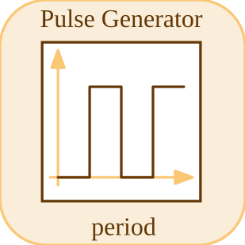

# pulse


<p align="center">

</p>
Pulse Generator: a periodic pulse train (Amplitude, Period, Width, StartTime, Offset).

## 📝 Syntax

- Block type: pulse

## 📥 Input argument

- input ports - No input ports (this block has none).

## 📤 Output argument

- output ports - 1 output port(s) declared.

## 📄 Description


Pulse Generator: a periodic pulse train. 

| Field | Value |
| --- | --- |
| Module | <code>nflow_blocks</code> | 
| Library | Source | 
| Type | <code>pulse</code> | 
| Label | Pulse Generator | 

  

<b>Description</b> 

A periodic pulse train with no input. Starting at <code>StartTime</code>, the output is <code>Offset + Amplitude</code> during the first <code>Width</code> percent of each <code>Period</code>, and <code>Offset</code> otherwise. Stateless (a pure function of time). 

<b>Ports</b> 

This block has no input ports. 

<b>Output(s)</b> 

| Port | Role | Side | Position | 
| --- | --- | --- | --- | 
| Port\_1 | Numeric signal produced by the block. | right | x=80, y=40 | 

 

<b>Parameters</b> 

| Parameter | Default value | 
| --- | --- | 
| <code>Amplitude</code> | 1 | 
| <code>Period</code> | 1 | 
| <code>Width</code> | 50 | 
| <code>StartTime</code> | 0 | 
| <code>Offset</code> | 0 | 

 

<b>Block Characteristics</b> 

| Field | Value |
| --- | --- |
| Block type | pulse | 
| Family | Source | 
| Rendered size | 80 x 80 | 
| Phases | OUTPUT | 
| Internal state or history | no | 
| Signal data type | double numeric values | 

 

<b>Algorithms</b> 

- OUTPUT: evaluates the pulse train at the current time. 

<b>Equation or Rule</b> 
$$y(t) = \text{Offset} + \begin{cases} A & \bmod(t-t_0, T) < \frac{W}{100} T \\ 0 & \text{otherwise} \end{cases}$$
 

<b>Extended Capabilities</b> 

Code generation: supported for C and Rust. 

<b>Implementation Sources</b> 

**Manifest:** `modules/nflow_blocks/libraries/source/library.json`
 

**Runtime:** `modules/nflow_blocks/src/cpp/source/periodic.cpp`


## 💡 Example

Generate a pulse train (amplitude 1, period 1, 50% duty).

```matlab
d.blocks={ struct('id','p','type','pulse','inputs',0,'outputs',1,'params',struct('Amplitude',1,'Period',1,'Width',50,'StartTime',0,'Offset',0)), struct('id','w','type','toWorkspace','inputs',1,'outputs',0,'params',struct('VariableName','y','SaveFormat','Array')) };
d.connections={ struct('from','p','to','w','fromIndex',0,'toIndex',0) };
d.sampleTime=0.05; d.duration=2.0; d.solver='discrete'; d.variables=struct();
r=jsondecode(__nflow_simulate__(jsonencode(d)));
```


## 🔗 See also

[signalGenerator](../../nflow_blocks/source/signalGenerator.md), [step](../../nflow_blocks/source/step.md).

## 🕔 History

| Version | 📄 Description     |
| ------- | --------------- |
| 1.0.0   | initial version |

<!--
## 👤 Author

Allan CORNET
-->
