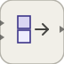

# concatenate

<p align="center">

</p>
Concatenates input signals along a selected dimension.

## 📝 Syntax

- Block type: concatenate

## 📄 Description

The <b>Concatenate</b> block joins all input signals along <b>ConcatenateDimension</b>. Dimension 1 joins rows, dimension 2 joins columns, and higher values stack along a higher dimension.

All dimensions other than the concatenation dimension must be compatible.

<b>Extended Capabilities</b>

Code generation: supported for C and Rust.

<b>Implementation Sources</b>

<details>
<summary>Manifest: <code>modules/nflow_blocks/libraries/utility/library.json</code></summary>

```json
{
  "id": "builtin.utility",
  "title": "Utility",
  "version": "1.0.0",
  "format": "nflow-2",
  "metadata": {
    "author": "Allan CORNET",
    "created": "2026-03-21",
    "tool": "Nelson nflow"
  },
  "comment": "Utility blocks such as switches, comments, and subsystems",
  "license": "LGPL-3.0",
  "builtin": true,
  "blocks": [
    {
      "type": "comment",
      "label": "Comment",
      "icon": "comment.svg",
      "phases": [],
      "width": 220,
      "height": 120,
      "inputs": [],
      "outputs": [],
      "defaultParams": {
        "CommentText": "",
        "ShowBorder": true
      },
      "render": {
        "type": "comment",
        "bodyClass": "block-body"
      }
    },
    {
      "type": "switch",
      "label": "Switch",
      "icon": "switch.svg",
      "phases": ["ALGEBRAIC"],
      "width": 80,
      "height": 80,
      "inputs": [
        {
          "x": 0,
          "y": 0,
          "side": "left"
        },
        {
          "x": 0,
          "y": 40,
          "side": "left"
        },
        {
          "x": 0,
          "y": 80,
          "side": "left"
        }
      ],
      "outputs": [
        {
          "x": 80,
          "y": 40,
          "side": "right"
        }
      ],
      "defaultParams": {
        "Criteria": "ge",
        "Threshold": 0
      },
      "render": {
        "type": "math",
        "bodyClass": "block-body",
        "mathGroupClass": "switch-math"
      }
    },
    {
      "type": "multiportSwitch",
      "label": "Multiport Switch",
      "icon": "multiportSwitch.svg",
      "phases": ["ALGEBRAIC"],
      "width": 40,
      "height": 80,
      "inputs": [
        {
          "x": 20,
          "y": 0,
          "side": "top"
        },
        {
          "x": 0,
          "y": 20,
          "side": "left"
        },
        {
          "x": 0,
          "y": 40,
          "side": "left"
        },
        {
          "x": 0,
          "y": 60,
          "side": "left"
        }
      ],
      "outputs": [
        {
          "x": 40,
          "y": 40,
          "side": "right"
        }
      ],
      "defaultParams": {
        "DataPortCount": 3
      },
      "render": {
        "type": "image",
        "src": "exports/multiportSwitch.svg",
        "svgMode": "element",
        "preserveAspectRatio": "none",
        "x": 0,
        "y": 0,
        "width": 40,
        "height": 90
      }
    },
    {
      "type": "toggleSwitch",
      "label": "Toggle Switch",
      "icon": "toggleSwitch.svg",
      "phases": ["OUTPUT"],
      "width": 80,
      "height": 50,
      "inputs": [],
      "outputs": [
        {
          "x": 80,
          "y": 25,
          "side": "right"
        }
      ],
      "defaultParams": {
        "State": 0,
        "OnLabel": "ON",
        "OffLabel": "OFF",
        "OnValue": 1,
        "OffValue": 0
      },
      "render": {
        "type": "toggle"
      }
    },
    {
      "type": "subsystem",
      "icon": "subsystem.svg",
      "label": "Subsystem",
      "phases": ["INIT", "OUTPUT", "ALGEBRAIC", "UPDATE"],
      "width": 120,
      "height": 80,
      "inputs": [
        {
          "x": 0,
          "y": 40,
          "side": "left"
        }
      ],
      "outputs": [
        {
          "x": 120,
          "y": 40,
          "side": "right"
        }
      ],
      "defaultParams": {
        "name": "Subsystem",
        "externalInputs": [],
        "externalOutputs": [],
        "subsystem": null
      },
      "render": {
        "type": "math",
        "bodyClass": "block-body",
        "mathGroupClass": "subsystem-math",
        "formula": "\\mathsf{Sub}"
      }
    },
    {
      "type": "mux",
      "label": "Mux",
      "icon": "mux.svg",
      "phases": ["OUTPUT"],
      "width": 8,
      "height": 40,
      "inputs": [
        {
          "x": 0,
          "y": 10,
          "side": "left"
        },
        {
          "x": 0,
          "y": 30,
          "side": "left"
        }
      ],
      "outputs": [
        {
          "x": 8,
          "y": 20,
          "side": "right"
        }
      ],
      "defaultParams": {
        "Inputs": 2
      }
    },
    {
      "type": "demux",
      "label": "Demux",
      "icon": "demux.svg",
      "phases": ["OUTPUT"],
      "width": 8,
      "height": 40,
      "inputs": [
        {
          "x": 0,
          "y": 20,
          "side": "left"
        }
      ],
      "outputs": [
        {
          "x": 8,
          "y": 10,
          "side": "right"
        },
        {
          "x": 8,
          "y": 30,
          "side": "right"
        }
      ],
      "defaultParams": {
        "Outputs": 2
      }
    },
    {
      "type": "convert",
      "label": "Convert",
      "icon": "convert.svg",
      "phases": ["ALGEBRAIC"],
      "width": 90,
      "height": 50,
      "inputs": [
        {
          "x": 0,
          "y": 25,
          "side": "left"
        }
      ],
      "outputs": [
        {
          "x": 90,
          "y": 25,
          "side": "right"
        }
      ],
      "defaultParams": {
        "OutDataType": "double",
        "SaturateOnOverflow": true,
        "Rounding": "nearest"
      }
    },
    {
      "type": "initialCondition",
      "label": "IC",
      "icon": "initialCondition.svg",
      "phases": ["ALGEBRAIC"],
      "width": 90,
      "height": 50,
      "inputs": [
        {
          "x": 0,
          "y": 25,
          "side": "left"
        }
      ],
      "outputs": [
        {
          "x": 90,
          "y": 25,
          "side": "right"
        }
      ],
      "defaultParams": {
        "InitialValue": 0
      }
    },
    {
      "type": "dataStoreMemory",
      "label": "Data Store Memory",
      "icon": "dataStoreMemory.svg",
      "phases": ["INIT"],
      "width": 70,
      "height": 60,
      "inputs": [],
      "outputs": [],
      "defaultParams": {
        "DataStoreName": "A",
        "InitialValue": 0
      },
      "render": {
        "type": "image",
        "src": "exports/dataStoreMemory.svg",
        "svgMode": "element",
        "preserveAspectRatio": "none",
        "x": 0,
        "y": 0,
        "width": 70,
        "height": 60
      }
    },
    {
      "type": "dataStoreWrite",
      "label": "Data Store Write",
      "icon": "dataStoreWrite.svg",
      "phases": ["INIT", "UPDATE"],
      "width": 70,
      "height": 60,
      "inputs": [
        {
          "x": 0,
          "y": 30,
          "side": "left"
        }
      ],
      "outputs": [],
      "defaultParams": {
        "DataStoreName": "A"
      },
      "render": {
        "type": "image",
        "src": "exports/dataStoreWrite.svg",
        "svgMode": "element",
        "preserveAspectRatio": "none",
        "x": 0,
        "y": 0,
        "width": 70,
        "height": 60
      }
    },
    {
      "type": "dataStoreRead",
      "label": "Data Store Read",
      "icon": "dataStoreRead.svg",
      "phases": ["OUTPUT"],
      "width": 70,
      "height": 60,
      "inputs": [],
      "outputs": [
        {
          "x": 70,
          "y": 30,
          "side": "right"
        }
      ],
      "defaultParams": {
        "DataStoreName": "A"
      },
      "render": {
        "type": "image",
        "src": "exports/dataStoreRead.svg",
        "svgMode": "element",
        "preserveAspectRatio": "none",
        "x": 0,
        "y": 0,
        "width": 70,
        "height": 60
      }
    },
    {
      "type": "selector",
      "label": "Selector",
      "icon": "selector.svg",
      "phases": ["ALGEBRAIC"],
      "width": 80,
      "height": 50,
      "inputs": [
        {
          "x": 0,
          "y": 25,
          "side": "left"
        }
      ],
      "outputs": [
        {
          "x": 80,
          "y": 25,
          "side": "right"
        }
      ],
      "defaultParams": {
        "Indices": "1"
      }
    },
    {
      "type": "reshape",
      "label": "Reshape",
      "icon": "reshape.svg",
      "phases": ["INIT", "ALGEBRAIC"],
      "width": 80,
      "height": 50,
      "inputs": [
        {
          "x": 0,
          "y": 25,
          "side": "left"
        }
      ],
      "outputs": [
        {
          "x": 80,
          "y": 25,
          "side": "right"
        }
      ],
      "defaultParams": {
        "OutputDimensions": ""
      }
    },
    {
      "type": "concatenate",
      "label": "Concatenate",
      "icon": "concatenate.svg",
      "phases": ["ALGEBRAIC"],
      "width": 60,
      "height": 60,
      "inputs": [
        {
          "x": 0,
          "y": 20,
          "side": "left"
        },
        {
          "x": 0,
          "y": 40,
          "side": "left"
        }
      ],
      "outputs": [
        {
          "x": 60,
          "y": 30,
          "side": "right"
        }
      ],
      "defaultParams": {
        "ConcatenateDimension": 1
      }
    },
    {
      "type": "busCreator",
      "label": "Bus Creator",
      "icon": "busCreator.svg",
      "phases": ["ALGEBRAIC"],
      "width": 80,
      "height": 70,
      "inputs": [
        {
          "x": 0,
          "y": 25,
          "side": "left"
        },
        {
          "x": 0,
          "y": 45,
          "side": "left"
        }
      ],
      "outputs": [
        {
          "x": 80,
          "y": 35,
          "side": "right"
        }
      ],
      "defaultParams": {
        "BusType": "",
        "NonVirtual": false,
        "MemberNames": []
      }
    },
    {
      "type": "busSelector",
      "label": "Bus Selector",
      "icon": "busSelector.svg",
      "phases": ["ALGEBRAIC"],
      "width": 85,
      "height": 70,
      "inputs": [
        {
          "x": 0,
          "y": 35,
          "side": "left"
        }
      ],
      "outputs": [
        {
          "x": 85,
          "y": 25,
          "side": "right"
        },
        {
          "x": 85,
          "y": 45,
          "side": "right"
        }
      ],
      "defaultParams": {
        "SelectedSignals": [],
        "OutputAsBus": false
      }
    },
    {
      "type": "merge",
      "label": "Merge",
      "icon": "merge.svg",
      "phases": ["INIT", "ALGEBRAIC"],
      "width": 40,
      "height": 80,
      "inputs": [
        {
          "x": 0,
          "y": 30,
          "side": "left"
        },
        {
          "x": 0,
          "y": 50,
          "side": "left"
        }
      ],
      "outputs": [
        {
          "x": 40,
          "y": 40,
          "side": "right"
        }
      ],
      "defaultParams": {
        "InitialOutput": 0
      },
      "render": {
        "type": "image",
        "src": "exports/merge.svg",
        "svgMode": "element",
        "preserveAspectRatio": "none",
        "x": 0,
        "y": 0,
        "width": 40,
        "height": 80
      }
    },
    {
      "type": "functionCallGenerator",
      "label": "Function-Call Generator",
      "icon": "functionCallGenerator.svg",
      "phases": ["ALGEBRAIC"],
      "width": 90,
      "height": 60,
      "inputs": [],
      "outputs": [
        {
          "x": 90,
          "y": 30,
          "side": "right"
        }
      ],
      "defaultParams": {
        "NumberOfIterations": 1
      },
      "render": {
        "type": "image",
        "src": "exports/functionCallGenerator.svg",
        "svgMode": "element",
        "preserveAspectRatio": "none",
        "x": 0,
        "y": 0,
        "width": 90,
        "height": 60
      }
    },
    {
      "type": "functionCallSplit",
      "label": "Function-Call Split",
      "icon": "functionCallSplit.svg",
      "phases": [],
      "width": 60,
      "height": 80,
      "inputs": [
        {
          "x": 0,
          "y": 40,
          "side": "left"
        }
      ],
      "outputs": [
        {
          "x": 60,
          "y": 30,
          "side": "right"
        },
        {
          "x": 60,
          "y": 50,
          "side": "right"
        }
      ],
      "defaultParams": {},
      "render": {
        "type": "image",
        "src": "exports/functionCallSplit.svg",
        "svgMode": "element",
        "preserveAspectRatio": "none",
        "x": 0,
        "y": 0,
        "width": 60,
        "height": 80
      }
    },
    {
      "type": "iteratorNumber",
      "label": "Iterator Number",
      "icon": "iteratorNumber.svg",
      "phases": ["OUTPUT"],
      "width": 70,
      "height": 50,
      "inputs": [],
      "outputs": [
        {
          "x": 70,
          "y": 25,
          "side": "right"
        }
      ],
      "defaultParams": {},
      "render": {
        "type": "image",
        "src": "exports/iteratorNumber.svg",
        "svgMode": "element",
        "preserveAspectRatio": "none",
        "x": 0,
        "y": 0,
        "width": 70,
        "height": 50
      }
    },
    {
      "type": "iteratorCondition",
      "label": "Iterator Condition",
      "icon": "iteratorCondition.svg",
      "phases": ["ALGEBRAIC"],
      "width": 70,
      "height": 50,
      "inputs": [
        {
          "x": 0,
          "y": 25,
          "side": "left"
        }
      ],
      "outputs": [
        {
          "x": 70,
          "y": 25,
          "side": "right"
        }
      ],
      "defaultParams": {},
      "render": {
        "type": "image",
        "src": "exports/iteratorCondition.svg",
        "svgMode": "element",
        "preserveAspectRatio": "none",
        "x": 0,
        "y": 0,
        "width": 70,
        "height": 50
      }
    },
    {
      "type": "width",
      "label": "Width",
      "icon": "width.svg",
      "phases": ["ALGEBRAIC"],
      "width": 80,
      "height": 50,
      "inputs": [
        {
          "x": 0,
          "y": 25,
          "side": "left"
        }
      ],
      "outputs": [
        {
          "x": 80,
          "y": 25,
          "side": "right"
        }
      ],
      "defaultParams": {}
    },
    {
      "type": "signalConversion",
      "label": "Signal Conversion",
      "icon": "signalConversion.svg",
      "phases": ["ALGEBRAIC"],
      "width": 90,
      "height": 50,
      "inputs": [
        {
          "x": 0,
          "y": 25,
          "side": "left"
        }
      ],
      "outputs": [
        {
          "x": 90,
          "y": 25,
          "side": "right"
        }
      ],
      "defaultParams": {}
    },
    {
      "type": "assignment",
      "label": "Assignment",
      "icon": "assignment.svg",
      "phases": ["ALGEBRAIC"],
      "width": 90,
      "height": 60,
      "inputs": [
        {
          "x": 0,
          "y": 20,
          "side": "left"
        },
        {
          "x": 0,
          "y": 40,
          "side": "left"
        }
      ],
      "outputs": [
        {
          "x": 90,
          "y": 30,
          "side": "right"
        }
      ],
      "defaultParams": {
        "Indices": [1]
      }
    },
    {
      "type": "busAssignment",
      "label": "Bus Assignment",
      "icon": "busAssignment.svg",
      "phases": ["ALGEBRAIC"],
      "width": 100,
      "height": 60,
      "inputs": [
        {
          "x": 0,
          "y": 20,
          "side": "left"
        },
        {
          "x": 0,
          "y": 40,
          "side": "left"
        }
      ],
      "outputs": [
        {
          "x": 100,
          "y": 30,
          "side": "right"
        }
      ],
      "defaultParams": {
        "AssignedSignals": []
      }
    }
  ]
}
```

</details>


<details>
<summary>Runtime: <code>modules/nflow_blocks/src/cpp/routing/concatenate.cpp</code></summary>

```cpp
//=============================================================================
// Copyright (c) 2016-present Allan CORNET (Nelson)
//=============================================================================
// This file is part of Nelson.
//=============================================================================
// LICENCE_BLOCK_BEGIN
// SPDX-License-Identifier: LGPL-3.0-or-later
// LICENCE_BLOCK_END
//=============================================================================
#include "routing_blocks.hpp"
#include "FieldNames.hpp"
#include "NFlowBlockDescriptor.hpp"
#include <algorithm>
//=============================================================================
// concatenate: N-D concatenation along ConcatenateDimension (1 = rows /
// vertical, 2 = cols / horizontal, >= 3 stacks along a higher dimension).
// Column-major layout on both sides: with P = product of the output dims
// before the concat dim and O = product of the dims after it, each outer
// slice o interleaves one contiguous chunk of P * extent_p(dim) elements per
// input. Scalar inputs broadcast via sigAt.
//=============================================================================
bool
Nelson::NFlow::handleConcatenate(SimCtx& ctx, const Block& b, Phase phase)
{
    if (phase != Phase::ALGEBRAIC) {
        return false;
    }
    nflow::BlockDescriptor bd(b, ctx.variables);
    int dim = (int)std::llround(bd.paramDouble(nflow::kConcatDim, 1.0));
    if (dim < 1) {
        dim = 1;
    }
    const PortSig* ps = portSigOf(ctx, b.nid, 0);
    const int nIn = numInputs(ctx, b.nid);
    std::vector<SigView> ins(nIn);
    for (int p = 0; p < nIn; ++p) {
        ins[p] = getInputSig(ctx, b.nid, p);
    }
    const int wOut = outputWidth(ctx, b.nid, 0);
    double* y = outputSlice(ctx, b.nid, 0);
    bool changed = false;
    // Prefix product of the output shape before the concat dim, and the
    // output extent along it (dims beyond the resolved rank count as 1).
    int prefix = 1;
    int extentOut = wOut;
    if (ps) {
        const int nd = ps->numDims();
        for (int k = 1; k < dim && k <= nd; ++k) {
            prefix *= ps->dims[(size_t)k - 1];
        }
        extentOut = (dim <= nd) ? ps->dims[(size_t)dim - 1] : 1;
    }
    const int slice = std::max(1, prefix * extentOut);
    const int nOuter = std::max(1, wOut / slice);
    const PortSig* pex = exact64OutPort(ctx, b.nid);
    long long* yi = pex ? outputSliceI64(ctx, b.nid, 0) : nullptr;
    const bool cx = complexOutPort(ctx, b.nid) != nullptr;
    double* yim = cx ? outputSliceImag(ctx, b.nid, 0) : nullptr;
    for (int o = 0; o < nOuter; ++o) {
        const int dstBase = o * slice;
        int along = 0;
        for (int p = 0; p < nIn; ++p) {
            int ep = 1;
            if (ins[p].width > 1 && ins[p].dims) {
                ep = (dim <= ins[p].numDims) ? ins[p].dims[dim - 1] : 1;
            }
            const int chunk = prefix * ep;
            for (int k = 0; k < chunk; ++k) {
                const int dstIdx = dstBase + prefix * along + k;
                int srcIdx = o * chunk + k;
                if (ins[p].width > 1 && srcIdx >= ins[p].width) {
                    srcIdx = ins[p].width - 1; // historical column clamp
                }
                if (dstIdx < wOut) {
                    if (yi) {
                        const long long iv = sigAtI64(ins[p], srcIdx, pex->type);
                        if (yi[dstIdx] != iv) {
                            yi[dstIdx] = iv;
                            changed = true;
                        }
                        y[dstIdx] = i64ToDouble(iv, pex->type);
                    } else if (yim) {
                        const std::complex<double> z = sigAtC(ins[p], srcIdx);
                        if (y[dstIdx] != z.real()) {
                            y[dstIdx] = z.real();
                            changed = true;
                        }
                        if (yim[dstIdx] != z.imag()) {
                            yim[dstIdx] = z.imag();
                            changed = true;
                        }
                    } else {
                        const double val = sigAt(ins[p], srcIdx);
                        if (y[dstIdx] != val) {
                            y[dstIdx] = val;
                            changed = true;
                        }
                    }
                }
            }
            along += ep;
        }
    }
    return changed;
}
//=============================================================================

```

</details>
