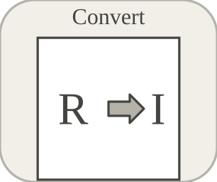

# convert

<p align="center">

</p>
Converts a signal to a selected data type.

## 📝 Syntax

- Block type: convert

## 📄 Description

The <b>Convert</b> block casts every input element to <b>OutDataType</b> while preserving signal dimensions.

<b>Rounding</b> controls conversion of non-integer values. <b>SaturateOnOverflow</b> selects saturation instead of wraparound when the target range is exceeded.

<b>Extended Capabilities</b>

Code generation: supported for C and Rust.

<b>Implementation Sources</b>

<details>
<summary>Manifest: <code>modules/nflow_blocks/libraries/utility/library.json</code></summary>

```json
{
  "id": "builtin.utility",
  "title": "Utility",
  "version": "1.0.0",
  "format": "nflow-2",
  "metadata": {
    "author": "Allan CORNET",
    "created": "2026-03-21",
    "tool": "Nelson nflow"
  },
  "comment": "Utility blocks such as switches, comments, and subsystems",
  "license": "LGPL-3.0",
  "builtin": true,
  "blocks": [
    {
      "type": "comment",
      "label": "Comment",
      "icon": "comment.svg",
      "phases": [],
      "width": 220,
      "height": 120,
      "inputs": [],
      "outputs": [],
      "defaultParams": {
        "CommentText": "",
        "ShowBorder": true
      },
      "render": {
        "type": "comment",
        "bodyClass": "block-body"
      }
    },
    {
      "type": "switch",
      "label": "Switch",
      "icon": "switch.svg",
      "phases": ["ALGEBRAIC"],
      "width": 80,
      "height": 80,
      "inputs": [
        {
          "x": 0,
          "y": 0,
          "side": "left"
        },
        {
          "x": 0,
          "y": 40,
          "side": "left"
        },
        {
          "x": 0,
          "y": 80,
          "side": "left"
        }
      ],
      "outputs": [
        {
          "x": 80,
          "y": 40,
          "side": "right"
        }
      ],
      "defaultParams": {
        "Criteria": "ge",
        "Threshold": 0
      },
      "render": {
        "type": "math",
        "bodyClass": "block-body",
        "mathGroupClass": "switch-math"
      }
    },
    {
      "type": "multiportSwitch",
      "label": "Multiport Switch",
      "icon": "multiportSwitch.svg",
      "phases": ["ALGEBRAIC"],
      "width": 40,
      "height": 80,
      "inputs": [
        {
          "x": 20,
          "y": 0,
          "side": "top"
        },
        {
          "x": 0,
          "y": 20,
          "side": "left"
        },
        {
          "x": 0,
          "y": 40,
          "side": "left"
        },
        {
          "x": 0,
          "y": 60,
          "side": "left"
        }
      ],
      "outputs": [
        {
          "x": 40,
          "y": 40,
          "side": "right"
        }
      ],
      "defaultParams": {
        "DataPortCount": 3
      },
      "render": {
        "type": "image",
        "src": "exports/multiportSwitch.svg",
        "svgMode": "element",
        "preserveAspectRatio": "none",
        "x": 0,
        "y": 0,
        "width": 40,
        "height": 90
      }
    },
    {
      "type": "toggleSwitch",
      "label": "Toggle Switch",
      "icon": "toggleSwitch.svg",
      "phases": ["OUTPUT"],
      "width": 80,
      "height": 50,
      "inputs": [],
      "outputs": [
        {
          "x": 80,
          "y": 25,
          "side": "right"
        }
      ],
      "defaultParams": {
        "State": 0,
        "OnLabel": "ON",
        "OffLabel": "OFF",
        "OnValue": 1,
        "OffValue": 0
      },
      "render": {
        "type": "toggle"
      }
    },
    {
      "type": "subsystem",
      "icon": "subsystem.svg",
      "label": "Subsystem",
      "phases": ["INIT", "OUTPUT", "ALGEBRAIC", "UPDATE"],
      "width": 120,
      "height": 80,
      "inputs": [
        {
          "x": 0,
          "y": 40,
          "side": "left"
        }
      ],
      "outputs": [
        {
          "x": 120,
          "y": 40,
          "side": "right"
        }
      ],
      "defaultParams": {
        "name": "Subsystem",
        "externalInputs": [],
        "externalOutputs": [],
        "subsystem": null
      },
      "render": {
        "type": "math",
        "bodyClass": "block-body",
        "mathGroupClass": "subsystem-math",
        "formula": "\\mathsf{Sub}"
      }
    },
    {
      "type": "mux",
      "label": "Mux",
      "icon": "mux.svg",
      "phases": ["OUTPUT"],
      "width": 8,
      "height": 40,
      "inputs": [
        {
          "x": 0,
          "y": 10,
          "side": "left"
        },
        {
          "x": 0,
          "y": 30,
          "side": "left"
        }
      ],
      "outputs": [
        {
          "x": 8,
          "y": 20,
          "side": "right"
        }
      ],
      "defaultParams": {
        "Inputs": 2
      }
    },
    {
      "type": "demux",
      "label": "Demux",
      "icon": "demux.svg",
      "phases": ["OUTPUT"],
      "width": 8,
      "height": 40,
      "inputs": [
        {
          "x": 0,
          "y": 20,
          "side": "left"
        }
      ],
      "outputs": [
        {
          "x": 8,
          "y": 10,
          "side": "right"
        },
        {
          "x": 8,
          "y": 30,
          "side": "right"
        }
      ],
      "defaultParams": {
        "Outputs": 2
      }
    },
    {
      "type": "convert",
      "label": "Convert",
      "icon": "convert.svg",
      "phases": ["ALGEBRAIC"],
      "width": 90,
      "height": 50,
      "inputs": [
        {
          "x": 0,
          "y": 25,
          "side": "left"
        }
      ],
      "outputs": [
        {
          "x": 90,
          "y": 25,
          "side": "right"
        }
      ],
      "defaultParams": {
        "OutDataType": "double",
        "SaturateOnOverflow": true,
        "Rounding": "nearest"
      }
    },
    {
      "type": "initialCondition",
      "label": "IC",
      "icon": "initialCondition.svg",
      "phases": ["ALGEBRAIC"],
      "width": 90,
      "height": 50,
      "inputs": [
        {
          "x": 0,
          "y": 25,
          "side": "left"
        }
      ],
      "outputs": [
        {
          "x": 90,
          "y": 25,
          "side": "right"
        }
      ],
      "defaultParams": {
        "InitialValue": 0
      }
    },
    {
      "type": "dataStoreMemory",
      "label": "Data Store Memory",
      "icon": "dataStoreMemory.svg",
      "phases": ["INIT"],
      "width": 70,
      "height": 60,
      "inputs": [],
      "outputs": [],
      "defaultParams": {
        "DataStoreName": "A",
        "InitialValue": 0
      },
      "render": {
        "type": "image",
        "src": "exports/dataStoreMemory.svg",
        "svgMode": "element",
        "preserveAspectRatio": "none",
        "x": 0,
        "y": 0,
        "width": 70,
        "height": 60
      }
    },
    {
      "type": "dataStoreWrite",
      "label": "Data Store Write",
      "icon": "dataStoreWrite.svg",
      "phases": ["INIT", "UPDATE"],
      "width": 70,
      "height": 60,
      "inputs": [
        {
          "x": 0,
          "y": 30,
          "side": "left"
        }
      ],
      "outputs": [],
      "defaultParams": {
        "DataStoreName": "A"
      },
      "render": {
        "type": "image",
        "src": "exports/dataStoreWrite.svg",
        "svgMode": "element",
        "preserveAspectRatio": "none",
        "x": 0,
        "y": 0,
        "width": 70,
        "height": 60
      }
    },
    {
      "type": "dataStoreRead",
      "label": "Data Store Read",
      "icon": "dataStoreRead.svg",
      "phases": ["OUTPUT"],
      "width": 70,
      "height": 60,
      "inputs": [],
      "outputs": [
        {
          "x": 70,
          "y": 30,
          "side": "right"
        }
      ],
      "defaultParams": {
        "DataStoreName": "A"
      },
      "render": {
        "type": "image",
        "src": "exports/dataStoreRead.svg",
        "svgMode": "element",
        "preserveAspectRatio": "none",
        "x": 0,
        "y": 0,
        "width": 70,
        "height": 60
      }
    },
    {
      "type": "selector",
      "label": "Selector",
      "icon": "selector.svg",
      "phases": ["ALGEBRAIC"],
      "width": 80,
      "height": 50,
      "inputs": [
        {
          "x": 0,
          "y": 25,
          "side": "left"
        }
      ],
      "outputs": [
        {
          "x": 80,
          "y": 25,
          "side": "right"
        }
      ],
      "defaultParams": {
        "Indices": "1"
      }
    },
    {
      "type": "reshape",
      "label": "Reshape",
      "icon": "reshape.svg",
      "phases": ["INIT", "ALGEBRAIC"],
      "width": 80,
      "height": 50,
      "inputs": [
        {
          "x": 0,
          "y": 25,
          "side": "left"
        }
      ],
      "outputs": [
        {
          "x": 80,
          "y": 25,
          "side": "right"
        }
      ],
      "defaultParams": {
        "OutputDimensions": ""
      }
    },
    {
      "type": "concatenate",
      "label": "Concatenate",
      "icon": "concatenate.svg",
      "phases": ["ALGEBRAIC"],
      "width": 60,
      "height": 60,
      "inputs": [
        {
          "x": 0,
          "y": 20,
          "side": "left"
        },
        {
          "x": 0,
          "y": 40,
          "side": "left"
        }
      ],
      "outputs": [
        {
          "x": 60,
          "y": 30,
          "side": "right"
        }
      ],
      "defaultParams": {
        "ConcatenateDimension": 1
      }
    },
    {
      "type": "busCreator",
      "label": "Bus Creator",
      "icon": "busCreator.svg",
      "phases": ["ALGEBRAIC"],
      "width": 80,
      "height": 70,
      "inputs": [
        {
          "x": 0,
          "y": 25,
          "side": "left"
        },
        {
          "x": 0,
          "y": 45,
          "side": "left"
        }
      ],
      "outputs": [
        {
          "x": 80,
          "y": 35,
          "side": "right"
        }
      ],
      "defaultParams": {
        "BusType": "",
        "NonVirtual": false,
        "MemberNames": []
      }
    },
    {
      "type": "busSelector",
      "label": "Bus Selector",
      "icon": "busSelector.svg",
      "phases": ["ALGEBRAIC"],
      "width": 85,
      "height": 70,
      "inputs": [
        {
          "x": 0,
          "y": 35,
          "side": "left"
        }
      ],
      "outputs": [
        {
          "x": 85,
          "y": 25,
          "side": "right"
        },
        {
          "x": 85,
          "y": 45,
          "side": "right"
        }
      ],
      "defaultParams": {
        "SelectedSignals": [],
        "OutputAsBus": false
      }
    },
    {
      "type": "merge",
      "label": "Merge",
      "icon": "merge.svg",
      "phases": ["INIT", "ALGEBRAIC"],
      "width": 40,
      "height": 80,
      "inputs": [
        {
          "x": 0,
          "y": 30,
          "side": "left"
        },
        {
          "x": 0,
          "y": 50,
          "side": "left"
        }
      ],
      "outputs": [
        {
          "x": 40,
          "y": 40,
          "side": "right"
        }
      ],
      "defaultParams": {
        "InitialOutput": 0
      },
      "render": {
        "type": "image",
        "src": "exports/merge.svg",
        "svgMode": "element",
        "preserveAspectRatio": "none",
        "x": 0,
        "y": 0,
        "width": 40,
        "height": 80
      }
    },
    {
      "type": "functionCallGenerator",
      "label": "Function-Call Generator",
      "icon": "functionCallGenerator.svg",
      "phases": ["ALGEBRAIC"],
      "width": 90,
      "height": 60,
      "inputs": [],
      "outputs": [
        {
          "x": 90,
          "y": 30,
          "side": "right"
        }
      ],
      "defaultParams": {
        "NumberOfIterations": 1
      },
      "render": {
        "type": "image",
        "src": "exports/functionCallGenerator.svg",
        "svgMode": "element",
        "preserveAspectRatio": "none",
        "x": 0,
        "y": 0,
        "width": 90,
        "height": 60
      }
    },
    {
      "type": "functionCallSplit",
      "label": "Function-Call Split",
      "icon": "functionCallSplit.svg",
      "phases": [],
      "width": 60,
      "height": 80,
      "inputs": [
        {
          "x": 0,
          "y": 40,
          "side": "left"
        }
      ],
      "outputs": [
        {
          "x": 60,
          "y": 30,
          "side": "right"
        },
        {
          "x": 60,
          "y": 50,
          "side": "right"
        }
      ],
      "defaultParams": {},
      "render": {
        "type": "image",
        "src": "exports/functionCallSplit.svg",
        "svgMode": "element",
        "preserveAspectRatio": "none",
        "x": 0,
        "y": 0,
        "width": 60,
        "height": 80
      }
    },
    {
      "type": "iteratorNumber",
      "label": "Iterator Number",
      "icon": "iteratorNumber.svg",
      "phases": ["OUTPUT"],
      "width": 70,
      "height": 50,
      "inputs": [],
      "outputs": [
        {
          "x": 70,
          "y": 25,
          "side": "right"
        }
      ],
      "defaultParams": {},
      "render": {
        "type": "image",
        "src": "exports/iteratorNumber.svg",
        "svgMode": "element",
        "preserveAspectRatio": "none",
        "x": 0,
        "y": 0,
        "width": 70,
        "height": 50
      }
    },
    {
      "type": "iteratorCondition",
      "label": "Iterator Condition",
      "icon": "iteratorCondition.svg",
      "phases": ["ALGEBRAIC"],
      "width": 70,
      "height": 50,
      "inputs": [
        {
          "x": 0,
          "y": 25,
          "side": "left"
        }
      ],
      "outputs": [
        {
          "x": 70,
          "y": 25,
          "side": "right"
        }
      ],
      "defaultParams": {},
      "render": {
        "type": "image",
        "src": "exports/iteratorCondition.svg",
        "svgMode": "element",
        "preserveAspectRatio": "none",
        "x": 0,
        "y": 0,
        "width": 70,
        "height": 50
      }
    },
    {
      "type": "width",
      "label": "Width",
      "icon": "width.svg",
      "phases": ["ALGEBRAIC"],
      "width": 80,
      "height": 50,
      "inputs": [
        {
          "x": 0,
          "y": 25,
          "side": "left"
        }
      ],
      "outputs": [
        {
          "x": 80,
          "y": 25,
          "side": "right"
        }
      ],
      "defaultParams": {}
    },
    {
      "type": "signalConversion",
      "label": "Signal Conversion",
      "icon": "signalConversion.svg",
      "phases": ["ALGEBRAIC"],
      "width": 90,
      "height": 50,
      "inputs": [
        {
          "x": 0,
          "y": 25,
          "side": "left"
        }
      ],
      "outputs": [
        {
          "x": 90,
          "y": 25,
          "side": "right"
        }
      ],
      "defaultParams": {}
    },
    {
      "type": "assignment",
      "label": "Assignment",
      "icon": "assignment.svg",
      "phases": ["ALGEBRAIC"],
      "width": 90,
      "height": 60,
      "inputs": [
        {
          "x": 0,
          "y": 20,
          "side": "left"
        },
        {
          "x": 0,
          "y": 40,
          "side": "left"
        }
      ],
      "outputs": [
        {
          "x": 90,
          "y": 30,
          "side": "right"
        }
      ],
      "defaultParams": {
        "Indices": [1]
      }
    },
    {
      "type": "busAssignment",
      "label": "Bus Assignment",
      "icon": "busAssignment.svg",
      "phases": ["ALGEBRAIC"],
      "width": 100,
      "height": 60,
      "inputs": [
        {
          "x": 0,
          "y": 20,
          "side": "left"
        },
        {
          "x": 0,
          "y": 40,
          "side": "left"
        }
      ],
      "outputs": [
        {
          "x": 100,
          "y": 30,
          "side": "right"
        }
      ],
      "defaultParams": {
        "AssignedSignals": []
      }
    }
  ]
}
```

</details>


<details>
<summary>Runtime: <code>modules/nflow_blocks/src/cpp/routing/convert.cpp</code></summary>

```cpp
//=============================================================================
// Copyright (c) 2016-present Allan CORNET (Nelson)
//=============================================================================
// This file is part of Nelson.
//=============================================================================
// LICENCE_BLOCK_BEGIN
// SPDX-License-Identifier: LGPL-3.0-or-later
// LICENCE_BLOCK_END
//=============================================================================
#include "routing_blocks.hpp"
#include "FieldNames.hpp"
#include "NFlowBlockDescriptor.hpp"
#include "NFlowCodegenTyped.hpp"
//=============================================================================
// convert: explicit signal-type cast (OutDataType), with per-block overflow
// policy (SaturateOnOverflow, default saturate) and rounding mode (Rounding:
// nearest / floor / ceiling / zero).
//=============================================================================
bool
Nelson::NFlow::handleConvert(SimCtx& ctx, const Block& b, Phase phase)
{
    if (phase != Phase::ALGEBRAIC) {
        return false;
    }
    nflow::BlockDescriptor bd(b, ctx.variables);
    SigType ty = SigType::Double;
    sigTypeFromString(bd.paramStr(nflow::kOutDataType, "double"), ty);
    const bool saturate = blockSaturates(ctx, b.nid);
    SigRounding rounding = SigRounding::Nearest;
    const std::string rname = bd.paramStr(nflow::kRounding, "nearest");
    if (rname == "floor") {
        rounding = SigRounding::Floor;
    } else if (rname == "ceiling" || rname == "ceil") {
        rounding = SigRounding::Ceiling;
    } else if (rname == "zero" || rname == "fix") {
        rounding = SigRounding::Zero;
    }
    SigView u = getInputSig(ctx, b.nid, 0);
    if (sigTypeIsExact64(ty)) {
        // Exact-64 target: integer-space cast from an exact source,
        // quantizeDoubleToI64 from a double-backed one.
        return emitElementwiseI64(ctx, b.nid, [&](int i) {
            if (u.idata) {
                return requantizeI64(sigAtI64(u, i, u.type), u.type, ty, saturate);
            }
            return quantizeDoubleToI64(sigAt(u, i), ty, saturate, rounding);
        });
    }
    // Exact-64 source into a non-exact target: the double lane already
    // carries the projection, so the double path below is the honest cast
    // (loss above 2^53 is inherent to the narrowing).
    // emitElementwise re-quantizes with round-to-nearest; the convert block
    // owns its rounding mode, so quantize here (idempotent for the second
    // pass: an already-conforming value is unchanged).
    return emitElementwise(
        ctx, b.nid, [&](int i) { return quantizeToType(sigAt(u, i), ty, saturate, rounding); });
}
//=============================================================================
// Scalar-path code generation. The generated model stores signals as double;
// convert emits the round + saturate/wrap of a scalar cast (double result).
namespace {
// Build the rounding sub-expression for language "c" / "rust".
std::string
roundExpr(const std::string& lang, const std::string& rname, const std::string& x)
{
    const bool c = (lang == "c");
    if (rname == "floor") {
        return c ? "floor(" + x + ")" : "libm::floor(" + x + ")";
    }
    if (rname == "ceiling" || rname == "ceil") {
        return c ? "ceil(" + x + ")" : "libm::ceil(" + x + ")";
    }
    if (rname == "zero" || rname == "fix") {
        return c ? "trunc(" + x + ")" : "libm::trunc(" + x + ")";
    }
    return c ? "round(" + x + ")" : "libm::round(" + x + ")";
}

Nelson::NFlow::BlockCodegenTemplate
convertTemplate(const std::string& lang)
{
    using namespace Nelson::NFlow;
    BlockCodegenTemplate t;
    const bool c = (lang == "c");
    t.emitStep = [c, lang](const BlockCodegenArgs& a) {
        nflow::BlockDescriptor bd(*a.block, *a.variables);
        SigType ty = SigType::Double;
        sigTypeFromString(bd.paramStr(nflow::kOutDataType, "double"), ty);
        const std::string in = a.in[0];
        const std::string zero = c ? "0.0" : "0.0_f64";
        if (ty == SigType::Double) {
            a.line("out_" + a.id + " = " + in + ";");
            return;
        }
        if (ty == SigType::Single) {
            a.line(c ? "out_" + a.id + " = (double)(float)(" + in + ");"
                     : "out_" + a.id + " = (" + in + " as f32) as f64;");
            return;
        }
        if (ty == SigType::Boolean) {
            a.line(c ? "out_" + a.id + " = (" + in + " != 0.0) ? 1.0 : 0.0;"
                     : "out_" + a.id + " = if " + in + " != 0.0_f64 { 1.0_f64 } else { 0.0_f64 };");
            return;
        }
        (void)zero;
        // Integer types: round then saturate (default) or leave to wrap.
        double lo = 0.0, hi = 0.0;
        sigTypeRange(ty, lo, hi);
        const std::string rname = bd.paramStr(nflow::kRounding, "nearest");
        const std::string r = roundExpr(lang, rname, in);
        const bool saturate = !(a.params && a.params->contains(nflow::kSaturateOnOverflow)
            && (*a.params)[nflow::kSaturateOnOverflow].is_boolean()
            && !(*a.params)[nflow::kSaturateOnOverflow].get<bool>());
        if (!saturate) {
            // Emit the rounded raw value: the generator's small-type
            // quantization pass appends the modular wrap right after this
            // block (nflow_quant_i with sat=0), matching the simulator.
            a.line("out_" + a.id + " = " + r + ";");
            return;
        }
        if (c) {
            a.line(
                "out_" + a.id + " = fmax(" + a.fmt(lo) + ", fmin(" + a.fmt(hi) + ", " + r + "));");
        } else {
            a.line("out_" + a.id + " = libm::fmax(" + a.fmt(lo) + ", libm::fmin(" + a.fmt(hi) + ", "
                + r + "));");
        }
    };
    // Exact-64 casts (either endpoint int64/uint64). The C generator
    // emits its nflow_d_to_* helpers whenever an exact-64 port exists.
    t.emitStepTyped = [c, lang](const BlockCodegenArgs& a) {
        nflow::BlockDescriptor bd(*a.block, *a.variables);
        SigType ty = SigType::Double;
        sigTypeFromString(bd.paramStr(nflow::kOutDataType, "double"), ty);
        const std::string dstName = sigTypeName(ty);
        const std::string srcName = a.inTypes.empty() ? "double" : a.inTypes[0];
        const bool dst64 = codegenIsExact64(dstName);
        const bool src64 = codegenIsExact64(srcName);
        const bool sat = codegenSaturates(a);
        const std::string in = a.in[0];
        const std::string rname = bd.paramStr(nflow::kRounding, "nearest");
        if (dst64 && src64) {
            const bool dstU = codegenIsU64(dstName);
            const bool srcU = codegenIsU64(srcName);
            if (dstU == srcU) {
                a.line("out_" + a.id + " = " + in + ";");
            } else if (dstU) { // int64 -> uint64
                if (c) {
                    a.line("out_" + a.id + " = "
                        + (sat ? "(" + in + " < 0) ? 0ULL : (uint64_t)" + in : "(uint64_t)" + in)
                        + ";");
                } else {
                    a.line("out_" + a.id + " = "
                        + (sat ? "if " + in + " < 0 { 0_u64 } else { " + in + " as u64 }"
                               : in + " as u64")
                        + ";");
                }
            } else { // uint64 -> int64
                if (c) {
                    a.line("out_" + a.id + " = "
                        + (sat ? "(" + in + " > (uint64_t)INT64_MAX) ? INT64_MAX : (int64_t)" + in
                               : "(int64_t)" + in)
                        + ";");
                } else {
                    a.line("out_" + a.id + " = "
                        + (sat ? "if " + in + " > i64::MAX as u64 { i64::MAX } else { " + in
                                    + " as i64 }"
                               : in + " as i64")
                        + ";");
                }
            }
            return;
        }
        if (dst64) {
            // double-backed source -> exact-64: round, then saturating
            // conversion (wrap-on-overflow is not modeled here either).
            const std::string r = roundExpr(lang, rname, in);
            const bool dstU = codegenIsU64(dstName);
            if (c) {
                a.line("out_" + a.id + " = "
                    + std::string(dstU ? "nflow_d_to_u64_sat(" : "nflow_d_to_i64_sat(") + r + ")"
                    + (sat ? "" : "; /* nflow: wrap not modeled for 64-bit casts */")
                    + (sat ? ";" : ""));
            } else {
                // Rust float->int `as` saturates (NaN -> 0) by language rule.
                a.line("out_" + a.id + " = " + r + " as " + (dstU ? "u64" : "i64")
                    + (sat ? ";" : "; // nflow: wrap not modeled for 64-bit casts"));
            }
            return;
        }
        // exact-64 source -> double-backed target: project to double,
        // then the standard double-space quantization.
        const std::string proj = c ? "(double)" + in : "(" + in + " as f64)";
        if (ty == SigType::Double) {
            a.line("out_" + a.id + " = " + proj + ";");
            return;
        }
        if (ty == SigType::Single) {
            a.line(c ? "out_" + a.id + " = (double)(float)" + proj + ";"
                     : "out_" + a.id + " = (" + proj + " as f32) as f64;");
            return;
        }
        if (ty == SigType::Boolean) {
            a.line(
                c ? "out_" + a.id + " = (" + proj + " != 0.0) ? 1.0 : 0.0;"
                  : "out_" + a.id + " = if " + proj + " != 0.0_f64 { 1.0_f64 } else { 0.0_f64 };");
            return;
        }
        double lo = 0.0, hi = 0.0;
        sigTypeRange(ty, lo, hi);
        const std::string r = roundExpr(lang, rname, proj);
        if (c) {
            a.line(
                "out_" + a.id + " = fmax(" + a.fmt(lo) + ", fmin(" + a.fmt(hi) + ", " + r + "));");
        } else {
            a.line("out_" + a.id + " = libm::fmax(" + a.fmt(lo) + ", libm::fmin(" + a.fmt(hi) + ", "
                + r + "));");
        }
    };
    return t;
}
} // namespace
//=============================================================================
Nelson::NFlow::BlockCodegenTemplate
Nelson::NFlow::getCodeGenCConvert()
{
    return convertTemplate("c");
}
//=============================================================================
Nelson::NFlow::BlockCodegenTemplate
Nelson::NFlow::getCodeGenRustConvert()
{
    return convertTemplate("rust");
}
//=============================================================================

```

</details>
