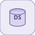

# dataStoreMemory


<p align="center">

</p>
Declares a named scalar memory shared across the model (initial value).

## 📝 Syntax

- Block type: dataStoreMemory

## 📥 Input argument

- input ports - No input ports (this block has none).

## 📤 Output argument

- output ports - No output ports (this block has none).

## 📄 Description


Declares a named scalar memory shared across the model (initial value). 

| Field | Value |
| --- | --- |
| Module | <code>nflow_blocks</code> | 
| Library | Utility | 
| Type | <code>dataStoreMemory</code> | 
| Label | Data Store Memory | 

  

<b>Description</b> 

Declares a named scalar memory (<code>DataStoreName</code>) with an <code>InitialValue</code>, without any wire. The memory is written by <code>dataStoreWrite</code> and read by <code>dataStoreRead</code> blocks referencing the same name, allowing model-wide communication without routing lines. The store is a per-thread map re-seeded at each run by this block's INIT. 

Native only; scalar. Reads observe the previous step's write (one-step latency, like a unit delay). 

<b>Ports</b> 

This block has no input ports. 

This block has no output ports. 

<b>Parameters</b> 

| Parameter | Default value | 
| --- | --- | 
| <code>DataStoreName</code> | A | 
| <code>InitialValue</code> | 0 | 

 

<b>Block Characteristics</b> 

| Field | Value |
| --- | --- |
| Block type | dataStoreMemory | 
| Family | Utility | 
| Rendered size | 70 x 60 | 
| Phases | INIT | 
| Internal state or history | no | 
| Signal data type | double numeric values | 

 

<b>Algorithms</b> 

- INIT: store[DataStoreName] = InitialValue. The block has no ports. 

<b>Extended Capabilities</b> 

Native runtime only (this block is not code-generated). 

Code generation: supported for C and Rust. 

<b>Implementation Sources</b> 

**Manifest:** `modules/nflow_blocks/libraries/utility/library.json`
 

**Runtime:** `modules/nflow_blocks/src/cpp/routing/dataStore.cpp`


## 💡 Example

Declare memory 'M', write a ramp into it and read it back with one-step latency.

```matlab
d.blocks={ struct('id','mem','type','dataStoreMemory','inputs',0,'outputs',0,'params',struct('DataStoreName','M','InitialValue',0)), struct('id','r','type','ramp','inputs',0,'outputs',1,'params',struct('slope',1)), struct('id','wr','type','dataStoreWrite','inputs',1,'outputs',0,'params',struct('DataStoreName','M')), struct('id','rd','type','dataStoreRead','inputs',0,'outputs',1,'params',struct('DataStoreName','M')), struct('id','w','type','toWorkspace','inputs',1,'outputs',0,'params',struct('VariableName','y','SaveFormat','Array')) };
d.connections={ struct('from','r','to','wr','fromIndex',0,'toIndex',0), struct('from','rd','to','w','fromIndex',0,'toIndex',0) };
d.sampleTime=0.1; d.duration=1.0; d.solver='discrete'; d.variables=struct();
r=jsondecode(__nflow_simulate__(jsonencode(d)));
```


## 🔗 See also

[dataStoreWrite](../../nflow_blocks/utility/dataStoreWrite.md), [dataStoreRead](../../nflow_blocks/utility/dataStoreRead.md).

## 🕔 History

| Version | 📄 Description     |
| ------- | --------------- |
| 1.0.0   | initial version |

<!--
## 👤 Author

Allan CORNET
-->
