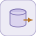

# dataStoreRead

<p align="center">

</p>
Outputs the value of the named data store.

## 📝 Syntax

- Block type: dataStoreRead

## 📥 Input argument

- input ports - No input ports (this block has none).

## 📤 Output argument

- output ports - 1 output port(s) declared.

## 📄 Description

Outputs the value of the named data store.

| Field   | Value                      |
| ------- | -------------------------- |
| Module  | <code>nflow_blocks</code>  |
| Library | Utility                    |
| Type    | <code>dataStoreRead</code> |
| Label   | Data Store Read            |

<b>Description</b>

Outputs the current value of the named memory <code>DataStoreName</code> (0 if the store was never declared or written). The read happens in the OUTPUT phase, so it returns the value written on the previous step. No input, one output. Native only; scalar.

<b>Ports</b>

This block has no input ports.

<b>Output(s)</b>

| Port   | Role                                  | Side  | Position   |
| ------ | ------------------------------------- | ----- | ---------- |
| Port_1 | Numeric signal produced by the block. | right | x=70, y=30 |

<b>Parameters</b>

| Parameter                  | Default value |
| -------------------------- | ------------- |
| <code>DataStoreName</code> | A             |

<b>Block Characteristics</b>

| Field                     | Value                 |
| ------------------------- | --------------------- |
| Block type                | dataStoreRead         |
| Family                    | Utility               |
| Rendered size             | 70 x 60               |
| Phases                    | OUTPUT                |
| Internal state or history | no                    |
| Signal data type          | double numeric values |

<b>Algorithms</b>

- OUTPUT: out = store[DataStoreName] (0 if absent).

<b>Extended Capabilities</b>

Native runtime only (this block is not code-generated).

Code generation: supported for C and Rust.

<b>Implementation Sources</b>

<details>
<summary>Manifest: <code>modules/nflow_blocks/libraries/utility/library.json</code></summary>

```json
{
  "id": "builtin.utility",
  "title": "Utility",
  "version": "1.0.0",
  "format": "nflow-2",
  "metadata": {
    "author": "Allan CORNET",
    "created": "2026-03-21",
    "tool": "Nelson nflow"
  },
  "comment": "Utility blocks such as switches, comments, and subsystems",
  "license": "LGPL-3.0",
  "builtin": true,
  "blocks": [
    {
      "type": "comment",
      "label": "Comment",
      "icon": "comment.svg",
      "phases": [],
      "width": 220,
      "height": 120,
      "inputs": [],
      "outputs": [],
      "defaultParams": {
        "CommentText": "",
        "ShowBorder": true
      },
      "render": {
        "type": "comment",
        "bodyClass": "block-body"
      }
    },
    {
      "type": "switch",
      "label": "Switch",
      "icon": "switch.svg",
      "phases": ["ALGEBRAIC"],
      "width": 80,
      "height": 80,
      "inputs": [
        {
          "x": 0,
          "y": 0,
          "side": "left"
        },
        {
          "x": 0,
          "y": 40,
          "side": "left"
        },
        {
          "x": 0,
          "y": 80,
          "side": "left"
        }
      ],
      "outputs": [
        {
          "x": 80,
          "y": 40,
          "side": "right"
        }
      ],
      "defaultParams": {
        "Criteria": "ge",
        "Threshold": 0
      },
      "render": {
        "type": "math",
        "bodyClass": "block-body",
        "mathGroupClass": "switch-math"
      }
    },
    {
      "type": "multiportSwitch",
      "label": "Multiport Switch",
      "icon": "multiportSwitch.svg",
      "phases": ["ALGEBRAIC"],
      "width": 40,
      "height": 80,
      "inputs": [
        {
          "x": 20,
          "y": 0,
          "side": "top"
        },
        {
          "x": 0,
          "y": 20,
          "side": "left"
        },
        {
          "x": 0,
          "y": 40,
          "side": "left"
        },
        {
          "x": 0,
          "y": 60,
          "side": "left"
        }
      ],
      "outputs": [
        {
          "x": 40,
          "y": 40,
          "side": "right"
        }
      ],
      "defaultParams": {
        "DataPortCount": 3
      },
      "render": {
        "type": "image",
        "src": "exports/multiportSwitch.svg",
        "svgMode": "element",
        "preserveAspectRatio": "none",
        "x": 0,
        "y": 0,
        "width": 40,
        "height": 90
      }
    },
    {
      "type": "toggleSwitch",
      "label": "Toggle Switch",
      "icon": "toggleSwitch.svg",
      "phases": ["OUTPUT"],
      "width": 80,
      "height": 50,
      "inputs": [],
      "outputs": [
        {
          "x": 80,
          "y": 25,
          "side": "right"
        }
      ],
      "defaultParams": {
        "State": 0,
        "OnLabel": "ON",
        "OffLabel": "OFF",
        "OnValue": 1,
        "OffValue": 0
      },
      "render": {
        "type": "toggle"
      }
    },
    {
      "type": "subsystem",
      "icon": "subsystem.svg",
      "label": "Subsystem",
      "phases": ["INIT", "OUTPUT", "ALGEBRAIC", "UPDATE"],
      "width": 120,
      "height": 80,
      "inputs": [
        {
          "x": 0,
          "y": 40,
          "side": "left"
        }
      ],
      "outputs": [
        {
          "x": 120,
          "y": 40,
          "side": "right"
        }
      ],
      "defaultParams": {
        "name": "Subsystem",
        "externalInputs": [],
        "externalOutputs": [],
        "subsystem": null
      },
      "render": {
        "type": "math",
        "bodyClass": "block-body",
        "mathGroupClass": "subsystem-math",
        "formula": "\\mathsf{Sub}"
      }
    },
    {
      "type": "mux",
      "label": "Mux",
      "icon": "mux.svg",
      "phases": ["OUTPUT"],
      "width": 8,
      "height": 40,
      "inputs": [
        {
          "x": 0,
          "y": 10,
          "side": "left"
        },
        {
          "x": 0,
          "y": 30,
          "side": "left"
        }
      ],
      "outputs": [
        {
          "x": 8,
          "y": 20,
          "side": "right"
        }
      ],
      "defaultParams": {
        "Inputs": 2
      }
    },
    {
      "type": "demux",
      "label": "Demux",
      "icon": "demux.svg",
      "phases": ["OUTPUT"],
      "width": 8,
      "height": 40,
      "inputs": [
        {
          "x": 0,
          "y": 20,
          "side": "left"
        }
      ],
      "outputs": [
        {
          "x": 8,
          "y": 10,
          "side": "right"
        },
        {
          "x": 8,
          "y": 30,
          "side": "right"
        }
      ],
      "defaultParams": {
        "Outputs": 2
      }
    },
    {
      "type": "convert",
      "label": "Convert",
      "icon": "convert.svg",
      "phases": ["ALGEBRAIC"],
      "width": 90,
      "height": 50,
      "inputs": [
        {
          "x": 0,
          "y": 25,
          "side": "left"
        }
      ],
      "outputs": [
        {
          "x": 90,
          "y": 25,
          "side": "right"
        }
      ],
      "defaultParams": {
        "OutDataType": "double",
        "SaturateOnOverflow": true,
        "Rounding": "nearest"
      }
    },
    {
      "type": "initialCondition",
      "label": "IC",
      "icon": "initialCondition.svg",
      "phases": ["ALGEBRAIC"],
      "width": 90,
      "height": 50,
      "inputs": [
        {
          "x": 0,
          "y": 25,
          "side": "left"
        }
      ],
      "outputs": [
        {
          "x": 90,
          "y": 25,
          "side": "right"
        }
      ],
      "defaultParams": {
        "InitialValue": 0
      }
    },
    {
      "type": "dataStoreMemory",
      "label": "Data Store Memory",
      "icon": "dataStoreMemory.svg",
      "phases": ["INIT"],
      "width": 70,
      "height": 60,
      "inputs": [],
      "outputs": [],
      "defaultParams": {
        "DataStoreName": "A",
        "InitialValue": 0
      },
      "render": {
        "type": "image",
        "src": "exports/dataStoreMemory.svg",
        "svgMode": "element",
        "preserveAspectRatio": "none",
        "x": 0,
        "y": 0,
        "width": 70,
        "height": 60
      }
    },
    {
      "type": "dataStoreWrite",
      "label": "Data Store Write",
      "icon": "dataStoreWrite.svg",
      "phases": ["INIT", "UPDATE"],
      "width": 70,
      "height": 60,
      "inputs": [
        {
          "x": 0,
          "y": 30,
          "side": "left"
        }
      ],
      "outputs": [],
      "defaultParams": {
        "DataStoreName": "A"
      },
      "render": {
        "type": "image",
        "src": "exports/dataStoreWrite.svg",
        "svgMode": "element",
        "preserveAspectRatio": "none",
        "x": 0,
        "y": 0,
        "width": 70,
        "height": 60
      }
    },
    {
      "type": "dataStoreRead",
      "label": "Data Store Read",
      "icon": "dataStoreRead.svg",
      "phases": ["OUTPUT"],
      "width": 70,
      "height": 60,
      "inputs": [],
      "outputs": [
        {
          "x": 70,
          "y": 30,
          "side": "right"
        }
      ],
      "defaultParams": {
        "DataStoreName": "A"
      },
      "render": {
        "type": "image",
        "src": "exports/dataStoreRead.svg",
        "svgMode": "element",
        "preserveAspectRatio": "none",
        "x": 0,
        "y": 0,
        "width": 70,
        "height": 60
      }
    },
    {
      "type": "selector",
      "label": "Selector",
      "icon": "selector.svg",
      "phases": ["ALGEBRAIC"],
      "width": 80,
      "height": 50,
      "inputs": [
        {
          "x": 0,
          "y": 25,
          "side": "left"
        }
      ],
      "outputs": [
        {
          "x": 80,
          "y": 25,
          "side": "right"
        }
      ],
      "defaultParams": {
        "Indices": "1"
      }
    },
    {
      "type": "reshape",
      "label": "Reshape",
      "icon": "reshape.svg",
      "phases": ["INIT", "ALGEBRAIC"],
      "width": 80,
      "height": 50,
      "inputs": [
        {
          "x": 0,
          "y": 25,
          "side": "left"
        }
      ],
      "outputs": [
        {
          "x": 80,
          "y": 25,
          "side": "right"
        }
      ],
      "defaultParams": {
        "OutputDimensions": ""
      }
    },
    {
      "type": "concatenate",
      "label": "Concatenate",
      "icon": "concatenate.svg",
      "phases": ["ALGEBRAIC"],
      "width": 60,
      "height": 60,
      "inputs": [
        {
          "x": 0,
          "y": 20,
          "side": "left"
        },
        {
          "x": 0,
          "y": 40,
          "side": "left"
        }
      ],
      "outputs": [
        {
          "x": 60,
          "y": 30,
          "side": "right"
        }
      ],
      "defaultParams": {
        "ConcatenateDimension": 1
      }
    },
    {
      "type": "busCreator",
      "label": "Bus Creator",
      "icon": "busCreator.svg",
      "phases": ["ALGEBRAIC"],
      "width": 80,
      "height": 70,
      "inputs": [
        {
          "x": 0,
          "y": 25,
          "side": "left"
        },
        {
          "x": 0,
          "y": 45,
          "side": "left"
        }
      ],
      "outputs": [
        {
          "x": 80,
          "y": 35,
          "side": "right"
        }
      ],
      "defaultParams": {
        "BusType": "",
        "NonVirtual": false,
        "MemberNames": []
      }
    },
    {
      "type": "busSelector",
      "label": "Bus Selector",
      "icon": "busSelector.svg",
      "phases": ["ALGEBRAIC"],
      "width": 85,
      "height": 70,
      "inputs": [
        {
          "x": 0,
          "y": 35,
          "side": "left"
        }
      ],
      "outputs": [
        {
          "x": 85,
          "y": 25,
          "side": "right"
        },
        {
          "x": 85,
          "y": 45,
          "side": "right"
        }
      ],
      "defaultParams": {
        "SelectedSignals": [],
        "OutputAsBus": false
      }
    },
    {
      "type": "merge",
      "label": "Merge",
      "icon": "merge.svg",
      "phases": ["INIT", "ALGEBRAIC"],
      "width": 40,
      "height": 80,
      "inputs": [
        {
          "x": 0,
          "y": 30,
          "side": "left"
        },
        {
          "x": 0,
          "y": 50,
          "side": "left"
        }
      ],
      "outputs": [
        {
          "x": 40,
          "y": 40,
          "side": "right"
        }
      ],
      "defaultParams": {
        "InitialOutput": 0
      },
      "render": {
        "type": "image",
        "src": "exports/merge.svg",
        "svgMode": "element",
        "preserveAspectRatio": "none",
        "x": 0,
        "y": 0,
        "width": 40,
        "height": 80
      }
    },
    {
      "type": "functionCallGenerator",
      "label": "Function-Call Generator",
      "icon": "functionCallGenerator.svg",
      "phases": ["ALGEBRAIC"],
      "width": 90,
      "height": 60,
      "inputs": [],
      "outputs": [
        {
          "x": 90,
          "y": 30,
          "side": "right"
        }
      ],
      "defaultParams": {
        "NumberOfIterations": 1
      },
      "render": {
        "type": "image",
        "src": "exports/functionCallGenerator.svg",
        "svgMode": "element",
        "preserveAspectRatio": "none",
        "x": 0,
        "y": 0,
        "width": 90,
        "height": 60
      }
    },
    {
      "type": "functionCallSplit",
      "label": "Function-Call Split",
      "icon": "functionCallSplit.svg",
      "phases": [],
      "width": 60,
      "height": 80,
      "inputs": [
        {
          "x": 0,
          "y": 40,
          "side": "left"
        }
      ],
      "outputs": [
        {
          "x": 60,
          "y": 30,
          "side": "right"
        },
        {
          "x": 60,
          "y": 50,
          "side": "right"
        }
      ],
      "defaultParams": {},
      "render": {
        "type": "image",
        "src": "exports/functionCallSplit.svg",
        "svgMode": "element",
        "preserveAspectRatio": "none",
        "x": 0,
        "y": 0,
        "width": 60,
        "height": 80
      }
    },
    {
      "type": "iteratorNumber",
      "label": "Iterator Number",
      "icon": "iteratorNumber.svg",
      "phases": ["OUTPUT"],
      "width": 70,
      "height": 50,
      "inputs": [],
      "outputs": [
        {
          "x": 70,
          "y": 25,
          "side": "right"
        }
      ],
      "defaultParams": {},
      "render": {
        "type": "image",
        "src": "exports/iteratorNumber.svg",
        "svgMode": "element",
        "preserveAspectRatio": "none",
        "x": 0,
        "y": 0,
        "width": 70,
        "height": 50
      }
    },
    {
      "type": "iteratorCondition",
      "label": "Iterator Condition",
      "icon": "iteratorCondition.svg",
      "phases": ["ALGEBRAIC"],
      "width": 70,
      "height": 50,
      "inputs": [
        {
          "x": 0,
          "y": 25,
          "side": "left"
        }
      ],
      "outputs": [
        {
          "x": 70,
          "y": 25,
          "side": "right"
        }
      ],
      "defaultParams": {},
      "render": {
        "type": "image",
        "src": "exports/iteratorCondition.svg",
        "svgMode": "element",
        "preserveAspectRatio": "none",
        "x": 0,
        "y": 0,
        "width": 70,
        "height": 50
      }
    },
    {
      "type": "width",
      "label": "Width",
      "icon": "width.svg",
      "phases": ["ALGEBRAIC"],
      "width": 80,
      "height": 50,
      "inputs": [
        {
          "x": 0,
          "y": 25,
          "side": "left"
        }
      ],
      "outputs": [
        {
          "x": 80,
          "y": 25,
          "side": "right"
        }
      ],
      "defaultParams": {}
    },
    {
      "type": "signalConversion",
      "label": "Signal Conversion",
      "icon": "signalConversion.svg",
      "phases": ["ALGEBRAIC"],
      "width": 90,
      "height": 50,
      "inputs": [
        {
          "x": 0,
          "y": 25,
          "side": "left"
        }
      ],
      "outputs": [
        {
          "x": 90,
          "y": 25,
          "side": "right"
        }
      ],
      "defaultParams": {}
    },
    {
      "type": "assignment",
      "label": "Assignment",
      "icon": "assignment.svg",
      "phases": ["ALGEBRAIC"],
      "width": 90,
      "height": 60,
      "inputs": [
        {
          "x": 0,
          "y": 20,
          "side": "left"
        },
        {
          "x": 0,
          "y": 40,
          "side": "left"
        }
      ],
      "outputs": [
        {
          "x": 90,
          "y": 30,
          "side": "right"
        }
      ],
      "defaultParams": {
        "Indices": [1]
      }
    },
    {
      "type": "busAssignment",
      "label": "Bus Assignment",
      "icon": "busAssignment.svg",
      "phases": ["ALGEBRAIC"],
      "width": 100,
      "height": 60,
      "inputs": [
        {
          "x": 0,
          "y": 20,
          "side": "left"
        },
        {
          "x": 0,
          "y": 40,
          "side": "left"
        }
      ],
      "outputs": [
        {
          "x": 100,
          "y": 30,
          "side": "right"
        }
      ],
      "defaultParams": {
        "AssignedSignals": []
      }
    }
  ]
}
```

</details>


<details>
<summary>Runtime: <code>modules/nflow_blocks/src/cpp/routing/dataStore.cpp</code></summary>

```cpp
//=============================================================================
// Copyright (c) 2016-present Allan CORNET (Nelson)
//=============================================================================
// This file is part of Nelson.
//=============================================================================
// LICENCE_BLOCK_BEGIN
// SPDX-License-Identifier: LGPL-3.0-or-later
// LICENCE_BLOCK_END
//=============================================================================
// Data Store Memory / Read / Write: a named scalar memory shared between blocks
// of a model without a wire (Data Store Memory declares it with an initial
// value; Data Store Write updates it; Data Store Read outputs it). The store is
// a per-thread map keyed by DataStoreName, so it persists across steps within a
// run and is re-seeded each run by the Memory block's INIT. Read observes the
// value as of the previous step's Write (Read runs in OUTPUT, Write in UPDATE),
// i.e. one-step latency, matching a unit delay. Scalar only; native (the
// cross-block store is outside the code-generation model).
//=============================================================================
#include "SimEngineTypes.hpp"
#include "BlockRegistry.hpp"
#include "FieldNames.hpp"
#include "NFlowBlockDescriptor.hpp"
#include "NFlowCodegenLang.hpp"
#include <cctype>
#include <string>
#include <unordered_map>
#include "routing_blocks.hpp"
//=============================================================================
namespace Nelson {
namespace NFlow {
    //=============================================================================
    // Per-thread named store. A sim run is synchronous on one thread, so this
    // persists across that run's steps; concurrent runs on other threads get
    // their own map. Each entry is (re)seeded by the owning Memory block's INIT.
    static std::unordered_map<std::string, double>&
    dataStoreMap()
    {
        static thread_local std::unordered_map<std::string, double> store;
        return store;
    }
    //=============================================================================
    static std::string
    dataStoreName(const Block& b, const SimCtx& ctx)
    {
        nflow::BlockDescriptor bd(b, ctx.variables);
        return bd.paramStr("DataStoreName", "A");
    }
    //=============================================================================
    bool
    handleDataStoreMemory(SimCtx& ctx, const Block& b, Phase phase)
    {
        if (phase != Phase::INIT) {
            return false;
        }
        nflow::BlockDescriptor bd(b, ctx.variables);
        const std::string name = bd.paramStr("DataStoreName", "A");
        dataStoreMap()[name] = bd.paramDouble("InitialValue", 0.0);
        return false;
    }
    //=============================================================================
    bool
    handleDataStoreWrite(SimCtx& ctx, const Block& b, Phase phase)
    {
        if (phase == Phase::INIT) {
            // Seed the entry if no Memory block declared it, so a lone
            // Write/Read pair still starts from a defined value.
            const std::string name = dataStoreName(b, ctx);
            dataStoreMap().emplace(name, 0.0);
            return false;
        }
        // The write lands in the topologically ordered phase, not at the end
        // of the step: a read placed after it then sees the value written this
        // step, which is what an execution order means.
        if (phase != Phase::ALGEBRAIC) {
            return false;
        }
        if (!hasInput(ctx, b.nid, 0)) {
            return false;
        }
        dataStoreMap()[dataStoreName(b, ctx)] = getInput(ctx, b.nid, 0, 0.0);
        return false;
    }
    //=============================================================================
    bool
    handleDataStoreRead(SimCtx& ctx, const Block& b, Phase phase)
    {
        if (phase != Phase::ALGEBRAIC) {
            return false;
        }
        const std::string name = dataStoreName(b, ctx);
        const auto& store = dataStoreMap();
        auto it = store.find(name);
        setOutput(ctx, b.nid, (it != store.end()) ? it->second : 0.0);
        return false;
    }
    //=============================================================================
    // ---- Code generation ----
    // The named store becomes ONE shared ModelState field ds_<name> per
    // DataStoreName. Ordering mirrors the simulator's one-step latency
    // (Read in OUTPUT, Write in UPDATE) without synthetic edges: a Read has
    // no wired input, so the topological sort always emits it in the first
    // wave, before any Write (which needs its producer first). The field is
    // declared once (any of the three blocks triggers it, seeded 0.0 like a
    // lone Write/Read pair); a Memory block appends its InitialValue init
    // AFTER the seed, so it wins whatever the block order.
    //=============================================================================
    static std::string
    dataStoreField(const BlockCodegenStateArgs& a)
    {
        nflow::BlockDescriptor bd(*a.block, *a.variables);
        const std::string name = bd.paramStr("DataStoreName", "A");
        std::string field = "ds_";
        for (char c : name) {
            field += (std::isalnum(static_cast<unsigned char>(c)) != 0) ? c : '_';
        }
        return field;
    }
    //=============================================================================
    static std::string
    dataStoreFieldStep(const BlockCodegenArgs& a)
    {
        nflow::BlockDescriptor bd(*a.block, *a.variables);
        const std::string name = bd.paramStr("DataStoreName", "A");
        std::string field = "ds_";
        for (char c : name) {
            field += (std::isalnum(static_cast<unsigned char>(c)) != 0) ? c : '_';
        }
        return field;
    }
    //=============================================================================
    static void
    ensureDataStoreField(const BlockCodegenStateArgs& a, CodegenLang L)
    {
        const std::string field = dataStoreField(a);
        if (!a.once("dsdecl:" + field)) {
            return;
        }
        if (L.rust) {
            a.declState("    pub " + field + ": f64,");
            a.addInit("    s." + field + " = 0.0;");
        } else {
            a.declState("double " + field + ";");
            a.addInit("  s->" + field + " = 0.0;");
        }
    }
    //=============================================================================
    static BlockCodegenTemplate
    makeDataStoreMemoryCodegen(CodegenLang L)
    {
        BlockCodegenTemplate t;
        t.emitState = [L](const BlockCodegenStateArgs& a) {
            ensureDataStoreField(a, L);
            nflow::BlockDescriptor bd(*a.block, *a.variables);
            const std::string field = dataStoreField(a);
            const std::string init = a.fmt(bd.paramDouble("InitialValue", 0.0));
            if (L.rust) {
                a.addInit("    s." + field + " = " + init + ";");
            } else {
                a.addInit("  s->" + field + " = " + init + ";");
            }
        };
        t.emitStep = [L](const BlockCodegenArgs& a) {
            a.line("out_" + a.id + " = " + L.sref(dataStoreFieldStep(a)) + ";");
        };
        return t;
    }
    //=============================================================================
    static BlockCodegenTemplate
    makeDataStoreWriteCodegen(CodegenLang L)
    {
        BlockCodegenTemplate t;
        t.emitState = [L](const BlockCodegenStateArgs& a) { ensureDataStoreField(a, L); };
        t.emitStep = [L](const BlockCodegenArgs& a) {
            a.line("out_" + a.id + " = " + a.in[0] + ";");
            a.line(L.sref(dataStoreFieldStep(a)) + " = out_" + a.id + ";");
        };
        return t;
    }
    //=============================================================================
    static BlockCodegenTemplate
    makeDataStoreReadCodegen(CodegenLang L)
    {
        BlockCodegenTemplate t;
        t.emitState = [L](const BlockCodegenStateArgs& a) { ensureDataStoreField(a, L); };
        t.emitStep = [L](const BlockCodegenArgs& a) {
            a.line("out_" + a.id + " = " + L.sref(dataStoreFieldStep(a)) + ";");
        };
        return t;
    }
    //=============================================================================
    BlockCodegenTemplate
    getCodeGenCDataStoreMemory()
    {
        return makeDataStoreMemoryCodegen({ false });
    }
    BlockCodegenTemplate
    getCodeGenRustDataStoreMemory()
    {
        return makeDataStoreMemoryCodegen({ true });
    }
    BlockCodegenTemplate
    getCodeGenCDataStoreWrite()
    {
        return makeDataStoreWriteCodegen({ false });
    }
    BlockCodegenTemplate
    getCodeGenRustDataStoreWrite()
    {
        return makeDataStoreWriteCodegen({ true });
    }
    BlockCodegenTemplate
    getCodeGenCDataStoreRead()
    {
        return makeDataStoreReadCodegen({ false });
    }
    BlockCodegenTemplate
    getCodeGenRustDataStoreRead()
    {
        return makeDataStoreReadCodegen({ true });
    }
    //=============================================================================
} // namespace NFlow
} // namespace Nelson
//=============================================================================

```

</details>

## 💡 Example

See the dataStoreMemory example, which reads 'M' back to a scope.

```matlab
% See the dataStoreMemory example for a complete Memory/Write/Read wiring.
```

## 🔗 See also

[dataStoreMemory](../../nflow_blocks/utility/dataStoreMemory.md), [dataStoreWrite](../../nflow_blocks/utility/dataStoreWrite.md).

## 🕔 History

| Version | 📄 Description  |
| ------- | --------------- |
| 1.0.0   | initial version |

<!--
## 👤 Author

Allan CORNET
-->
