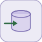

# dataStoreWrite


<p align="center">

</p>
Writes its input to the named data store.

## 📝 Syntax

- Block type: dataStoreWrite

## 📥 Input argument

- input ports - 1 input port(s) declared.

## 📤 Output argument

- output ports - No output ports (this block has none).

## 📄 Description


Writes its input to the named data store. 

| Field | Value |
| --- | --- |
| Module | <code>nflow_blocks</code> | 
| Library | Utility | 
| Type | <code>dataStoreWrite</code> | 
| Label | Data Store Write | 

  

<b>Description</b> 

Writes the input value to the named memory <code>DataStoreName</code> declared by a <code>dataStoreMemory</code> block (a matching entry is created if none exists). The write happens in the UPDATE phase, so a <code>dataStoreRead</code> of the same name observes it on the next step. One input, no output. Native only; scalar. 

<b>Ports</b> 

<b>Input(s)</b> 

| Port | Role | Side | Position | 
| --- | --- | --- | --- | 
| Port\_1 | Numeric signal read by the block. | left | x=0, y=30 | 

 

This block has no output ports. 

<b>Parameters</b> 

| Parameter | Default value | 
| --- | --- | 
| <code>DataStoreName</code> | A | 

 

<b>Block Characteristics</b> 

| Field | Value |
| --- | --- |
| Block type | dataStoreWrite | 
| Family | Utility | 
| Rendered size | 70 x 60 | 
| Phases | INIT, UPDATE | 
| Internal state or history | yes | 
| Signal data type | double numeric values | 

 

<b>Algorithms</b> 

- UPDATE: store[DataStoreName] = u. 

<b>Extended Capabilities</b> 

Native runtime only (this block is not code-generated). 

Code generation: supported for C and Rust. 

<b>Implementation Sources</b> 

**Manifest:** `modules/nflow_blocks/libraries/utility/library.json`
 

**Runtime:** `modules/nflow_blocks/src/cpp/routing/dataStore.cpp`


## 💡 Example

See the dataStoreMemory example, which wires a ramp through a Write.

```matlab
% See the dataStoreMemory example for a complete Memory/Write/Read wiring.
```


## 🔗 See also

[dataStoreMemory](../../nflow_blocks/utility/dataStoreMemory.md), [dataStoreRead](../../nflow_blocks/utility/dataStoreRead.md).

## 🕔 History

| Version | 📄 Description     |
| ------- | --------------- |
| 1.0.0   | initial version |

<!--
## 👤 Author

Allan CORNET
-->
