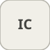

# initialCondition


<p align="center">

</p>
Forces the output to InitialValue at the first step, then passes the input.

## 📝 Syntax

- Block type: initialCondition

## 📥 Input argument

- input ports - 1 input port(s) declared.

## 📤 Output argument

- output ports - 1 output port(s) declared.

## 📄 Description


Forces the output to InitialValue at the first step, then passes the input. 

| Field | Value |
| --- | --- |
| Module | <code>nflow_blocks</code> | 
| Library | Utility | 
| Type | <code>initialCondition</code> | 
| Label | IC | 

  

<b>Description</b> 

Emits the parameter <code>InitialValue</code> at simulation time 0 and passes the input through unchanged for every step afterwards (t > 0). Useful to seed an algebraic loop or to define the value a feedback signal takes before the first real sample is available. Feedthrough for t > 0. 

<b>Ports</b> 

<b>Input(s)</b> 

| Port | Role | Side | Position | 
| --- | --- | --- | --- | 
| Port\_1 | Numeric signal read by the block. | left | x=0, y=25 | 

 

<b>Output(s)</b> 

| Port | Role | Side | Position | 
| --- | --- | --- | --- | 
| Port\_1 | Numeric signal produced by the block. | right | x=90, y=25 | 

 

<b>Parameters</b> 

| Parameter | Default value | 
| --- | --- | 
| <code>InitialValue</code> | 0 | 

 

<b>Block Characteristics</b> 

| Field | Value |
| --- | --- |
| Block type | initialCondition | 
| Family | Utility | 
| Rendered size | 90 x 50 | 
| Phases | ALGEBRAIC | 
| Internal state or history | no | 
| Signal data type | double numeric values | 

 

<b>Algorithms</b> 

- ALGEBRAIC: out = (t > 0) ? u : InitialValue. 

<b>Equation or Rule</b> 
$$y(t) = \begin{cases} \text{InitialValue} & t = 0 \\ u(t) & t > 0 \end{cases}$$
 

<b>Extended Capabilities</b> 

Code generation: supported for C and Rust. 

<b>Implementation Sources</b> 

**Manifest:** `modules/nflow_blocks/libraries/utility/library.json`
 

**Runtime:** `modules/nflow_blocks/src/cpp/routing/initialCondition.cpp`


## 💡 Example

Break an algebraic loop by seeding the first sample to 5.

```matlab
d.blocks={ struct('id','r','type','ramp','inputs',0,'outputs',1,'params',struct('slope',1)), struct('id','ic','type','initialCondition','inputs',1,'outputs',1,'params',struct('InitialValue',5)), struct('id','w','type','toWorkspace','inputs',1,'outputs',0,'params',struct('VariableName','y','SaveFormat','Array')) };
d.connections={ struct('from','r','to','ic','fromIndex',0,'toIndex',0), struct('from','ic','to','w','fromIndex',0,'toIndex',0) };
d.sampleTime=0.1; d.duration=0.5; d.solver='discrete'; d.variables=struct();
r=jsondecode(__nflow_simulate__(jsonencode(d)));
```


## 🔗 See also

[unitDelay](../../nflow_blocks/discrete/unitDelay.md), [dataStoreMemory](../../nflow_blocks/utility/dataStoreMemory.md).

## 🕔 History

| Version | 📄 Description     |
| ------- | --------------- |
| 1.0.0   | initial version |

<!--
## 👤 Author

Allan CORNET
-->
