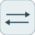

# signalConversion


<p align="center">

</p>
Pass-through that copies its input to its output unchanged (conversion point).

## 📝 Syntax

- Block type: signalConversion

## 📥 Input argument

- input ports - 1 input port(s) declared.

## 📤 Output argument

- output ports - 1 output port(s) declared.

## 📄 Description


Pass-through that copies its input to its output unchanged (conversion point). 

| Field | Value |
| --- | --- |
| Module | <code>nflow_blocks</code> | 
| Library | Utility | 
| Type | <code>signalConversion</code> | 
| Label | Signal Conversion | 

  

<b>Description</b> 

A pass-through that copies its input to its output unchanged. It marks an explicit signal-conversion point in a diagram (a contiguous-copy / signal-specification boundary); the value is identical, so it is a plain element-wise identity. Scalar or vector. 

<b>Ports</b> 

<b>Input(s)</b> 

| Port | Role | Side | Position | 
| --- | --- | --- | --- | 
| Port\_1 | Numeric signal read by the block. | left | x=0, y=25 | 

 

<b>Output(s)</b> 

| Port | Role | Side | Position | 
| --- | --- | --- | --- | 
| Port\_1 | Numeric signal produced by the block. | right | x=90, y=25 | 

 

<b>Parameters</b> 

| Parameter | Default value | 
| --- | --- | 
| *none* |  | 

 

<b>Block Characteristics</b> 

| Field | Value |
| --- | --- |
| Block type | signalConversion | 
| Family | Utility | 
| Rendered size | 90 x 50 | 
| Phases | ALGEBRAIC | 
| Internal state or history | no | 
| Signal data type | double numeric values | 

 

<b>Algorithms</b> 

- ALGEBRAIC: out = in, element-wise. 

<b>Equation or Rule</b> 
$$y = u$$
 

<b>Extended Capabilities</b> 

Code generation: supported for C and Rust. 

<b>Implementation Sources</b> 

**Manifest:** `modules/nflow_blocks/libraries/utility/library.json`
 

**Runtime:** `modules/nflow_blocks/src/cpp/routing/signalConversion.cpp`


## 💡 Example

Input 5 passes through unchanged to 5.

```matlab
d.blocks={ struct('id','c','type','constant','inputs',0,'outputs',1,'params',struct('Value',5)), struct('id','s','type','signalConversion','inputs',1,'outputs',1,'params',struct()), struct('id','w','type','toWorkspace','inputs',1,'outputs',0,'params',struct('VariableName','y','SaveFormat','Array')) };
d.connections={ struct('from','c','to','s','fromIndex',0,'toIndex',0), struct('from','s','to','w','fromIndex',0,'toIndex',0) };
d.sampleTime=0.1; d.duration=0.2; d.solver='discrete'; d.variables=struct();
r=jsondecode(__nflow_simulate__(jsonencode(d)));
```


## 🔗 See also

[convert](../../nflow_blocks/utility/convert.md), [reshape](../../nflow_blocks/utility/reshape.md).

## 🕔 History

| Version | 📄 Description     |
| ------- | --------------- |
| 1.0.0   | initial version |

<!--
## 👤 Author

Allan CORNET
-->
