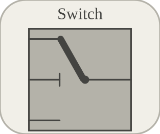

# switch

Selects between top and bottom inputs using a condition input.

## 📝 Syntax

- Block type: switch

## 📥 Input argument

- input ports - 3 input port(s) declared.

## 📤 Output argument

- output ports - 1 output port(s) declared.

## 📄 Description

Selects between top and bottom inputs using a condition input. 

| Field | Value |
| --- | --- |
| Module | <code>nflow_blocks</code> | 
| Library | Utility blocks | 
| Type | <code>switch</code> | 
| Label | Switch | 

  

<b>Description</b> 

Conditional selector block: chooses between inputs based on a threshold and comparison condition. 

<b>Ports</b> 

<b>Input(s)</b> 

| Port | Role | Side | Position | 
| --- | --- | --- | --- | 
| Port\_1 | Numeric signal read by the block. | left | x=0, y=0 | 
| Port\_2 | Numeric signal read by the block. | left | x=0, y=40 | 
| Port\_3 | Numeric signal read by the block. | left | x=0, y=80 | 

 

<b>Output(s)</b> 

| Port | Role | Side | Position | 
| --- | --- | --- | --- | 
| Port\_1 | Numeric signal produced by the block. | right | x=80, y=40 | 

 

<b>Parameters</b> 

| Parameter | Default value | 
| --- | --- | 
| <code>condition</code> | ge | 
| <code>threshold</code> | 0 | 

 

<b>Inspector Keys</b> 

These serialized keys are exposed by the block inspector. 

- <code>condition</code> 
- <code>threshold</code> 

<b>Block Characteristics</b> 

| Field | Value |
| --- | --- |
| Block type | switch | 
| Family | Utility blocks | 
| Rendered size | 80 x 80 | 
| Phases | ALGEBRAIC | 
| Direct feedthrough | yes | 
| Internal state or history | not observed in the documented runtime | 
| Signal data type | double numeric values | 

 

<b>Algorithms</b> 

- Algebraic block. 
- Input 1 is top data, input 2 is condition value, input 3 is bottom data. 
- condition supports gt, ne, and ge; unknown values fall back to ge. 
- C code generation follows condition; Rust code generation currently treats the condition input as nonzero/zero. 

<b>Equation or Rule</b> 
$$y = \begin{cases} u_1, & \operatorname{condition}(u_2, threshold) \\ u_3, & \mathrm{otherwise} \end{cases}$$
 

<b>Extended Capabilities</b> 

This page describes the native runtime behavior observed in the module C++ sources. Declared phases indicate when the simulation engine calls the block. 

Code generation: supported for C and Rust. 

<b>Implementation Sources</b> 

**Manifest:** `modules/nflow_blocks/libraries/utility/library.json`
 

**Runtime:** `modules/nflow_blocks/src/cpp/nonlinear/switch.cpp`

## 🔗 See also

[compareToConstant](../../nflow_blocks/logic/compareToConstant.md), [relationalOperator](../../nflow_blocks/logic/relationalOperator.md), [toggleSwitch](../../nflow_blocks/utility/toggleSwitch.md).

## 🕔 History

| Version | 📄 Description     |
| ------- | --------------- |
| 1.0.0   | initial version |

<!--
## 👤 Author

Allan CORNET
-->
