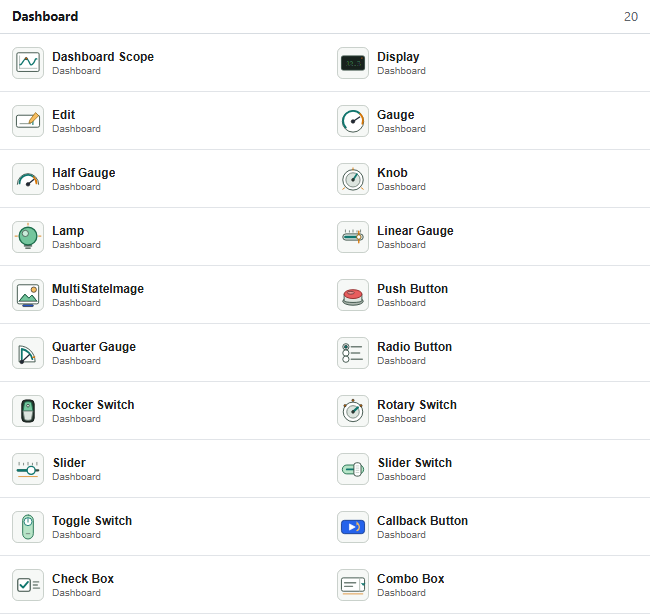
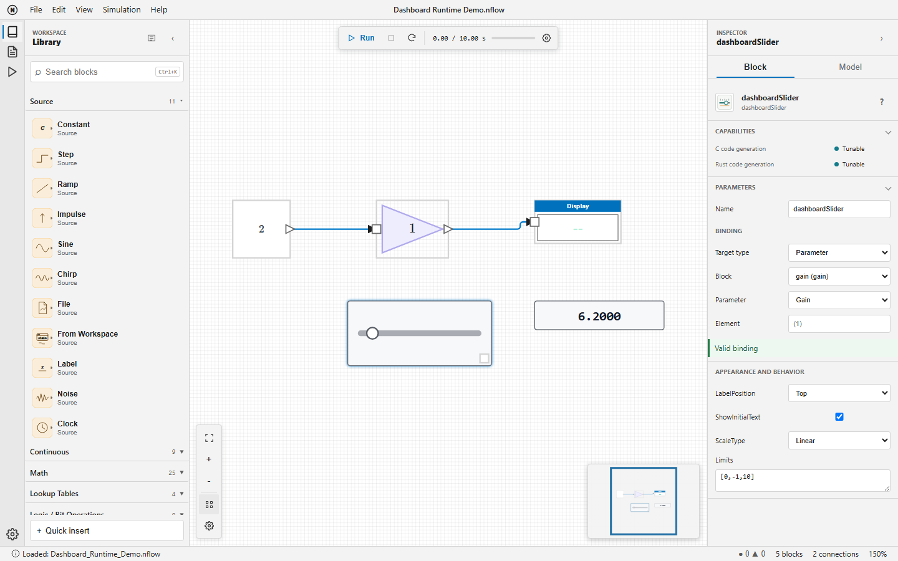

# nflow\_dashboard

Monitor and adjust NFlow simulations with interactive Dashboard blocks.

## 📝 Syntax

- Dashboard library: displays, controls, bindings, and callback actions

## 📄 Description


Dashboard blocks provide controls and displays directly on an NFlow diagram. They have no regular input or output ports: each block reads or writes a target selected in the <b>Binding</b> section of the inspector. 

<b>Available blocks</b> 

| Family | Blocks | Purpose | 
| --- | --- | --- | 
| Signal displays | Dashboard Scope, Display | Plot timestamped samples or show the latest typed value. | 
| Gauges | Gauge, Half Gauge, Quarter Gauge, Linear Gauge | Show a scalar value against limits and optional colored ranges. | 
| State displays | Lamp, MultiStateImage | Map signal values to colors or images. | 
| Continuous controls | Edit, Knob, Slider | Set a scalar parameter or variable to an entered or pointer-selected value. | 
| State controls | Push Button, Rotary Switch, Radio Button, Combo Box, Check Box, Rocker Switch, Slider Switch, Toggle Switch | Select one of the configured numeric states. | 
| Action | Callback Button | Evaluate Nelson code on click or press without a binding. | 

 



 

<b>Creating a binding</b> 

Select a Dashboard block, then choose the target in the inspector. The status below the selector reports <b>Valid binding</b>, <b>Not connected</b>, or a precise error. Bindings use stable block identifiers, so saving, reopening, renaming, copying, and nested subsystems do not depend on displayed labels. 

| Target | Used by | Configuration and timing | 
| --- | --- | --- | 
| Signal | All display blocks | Select a block output, its one-based port, and Sample or Frame processing. Values are read after each major simulation step. | 
| Parameter | All controls except Callback Button | Select a block, a numeric adjustable parameter, and optionally one scalar element. A validated change is visible at the next major step. | 
| Variable | All controls except Callback Button | Select the Diagram, Base, or Global workspace, a numeric variable, and optionally one scalar element. | 

 

Use one-based element notation such as <b>(2)</b> or <b>(2,3)</b>. Empty element text selects the complete target and is valid only when that target is scalar. Missing blocks, ports, variables, elements, nonnumeric values, and non-adjustable targets are rejected before simulation. 



 

<b>Interacting with controls</b> 

Controls remain usable while a simulation is running, paused, or stopped. A pointer gesture that starts on a control belongs to that control until release, even if the simulation finishes during the gesture. Drag the block body outside the control to move the block. Slider and Knob support pointer dragging, arrow keys for incremental changes, and Home or End for their limits. Native Edit and Combo Box controls release focus when the diagram background is selected. 

<b>Appearance and behavior</b> 

| Blocks | Main properties | 
| --- | --- | 
| All applicable blocks | **LabelPosition**, **ShowInitialText**, **Opacity**, and **Binding**. | 
| Dashboard Scope | **TimeSpan**, **UpdateMode**, **YLimits**, **NormalizeYAxis**, **ScaleAtStop**, legend, grid, ticks, markers, border, and colors. | 
| Gauges, Slider, Knob | **Limits**; gauges also support **ScaleColors** and **ScaleDirection**. Slider and Knob support a Linear or Log **ScaleType**. | 
| Display and Edit | Alignment and opacity. Display additionally supports **Format**, **FormatString**, layout, grid visibility, and grid color. | 
| State controls | **States** or **Values**, labels, optional enumerated data type, button type, text, and icon properties where applicable. | 
| Lamp and MultiStateImage | Default and state colors, or state images with **ScaleMode**. | 

 

Limits and states are validated by the inspector. Log scales require positive usable limits. Opacity is between 0 and 1. Dashboard Scope clips its plot to the block interior and to the configured Y limits. 

<b>Callback Button</b> 

A short click evaluates <b>ClickFcn</b>. Holding the pointer for <b>PressDelay</b> milliseconds evaluates <b>PressFcn</b>; a positive <b>RepeatInterval</b> repeats that action while held. The default press delay is 500 ms. Callback errors are reported in the Console and do not stop the simulation. 

<b>C and Rust code generation</b> 

| Capability | Dashboard behavior | 
| --- | --- | 
| Instrumentation | Display blocks are validated, then removed from generated code without changing numerical results. | 
| Tunable | A supported scalar control target becomes a typed field of **ModelState** with a stable setter. A change between two step calls applies to the next step. | 
| Unsupported | Callback Button code is never generated. Structural, composite, and unsupported targets are rejected before files are written. | 


## 💡 Examples

Open a runnable signal-display and Slider binding example.

```matlab
open_system([modulepath('nflow_blocks'), '/examples/Dashboard_Runtime_Demo.nflow']);
```
Open the gallery containing all 20 Dashboard blocks.

```matlab
open_system([modulepath('nflow_blocks'), '/examples/Dashboard_Gallery_Demo.nflow']);
```


## 🔗 See also

[nflow_workspace](../nflow_gui/nflow_workspace.md), [nflow_solvers](../nflow_gui/nflow_solvers.md), [open_system](../nflow_gui/open_system.md).

## 🕔 History

| Version | 📄 Description     |
| ------- | --------------- |
| 2.0.0   | initial version |

<!--
## 👤 Author

Allan CORNET
-->
