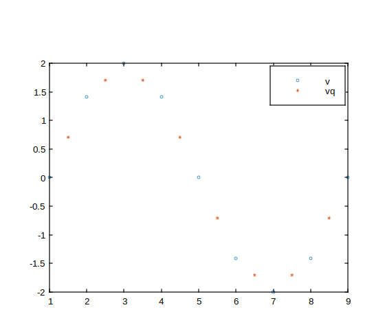

# interp1

1-D data interpolation

## 📝 Syntax

- vq = interp1(x, v, xq)
- vq = interp1(x, v, xq, method)
- vq = interp1(x, v, xq, method, extrapolation)
- vq = interp1(v, xq)
- vq = interp1(v, xq, method)
- vq = interp1(v, xq, method, extrapolation)
- pp = interp1(x, v, method, 'pp')

## 📥 Input argument

- x - Sample points: vector.
- v - Sample values: vector, matrix.
- xq - Query points: scalar, vector, matrix.
- method - Interpolation method: 'linear', 'nearest', 'next', 'previous', 'pchip', 'cubic', 'makima', or 'spline'.
- extrapolation - 'extrap' or a scalar value.

## 📤 Output argument

- vq - Interpolated values: scalar, vector, matrix.

## 📄 Description

<b>vq = interp1(x, v, xq)</b> returns interpolated values of a 1-D function at specific query points. The default method is linear interpolation.

<b>pp = interp1(x, v, method, 'pp')</b> returns a piecewise polynomial structure that can be evaluated with <b>ppval</b>.

## 📚 Bibliography

de Boor, C., A Practical Guide to Splines, Springer-Verlag, 1978.

## 💡 Example

```matlab
f = figure();
v = [0  1.41  2  1.41  0  -1.41  -2  -1.41 0];
xq = 1.5:8.5;
vq = interp1(v,xq);
plot(1:9, v, 'o', xq, vq, '*');
legend('v','vq');
```



## 🔗 See also

[interp2](../special_functions/interp2.md), [interp3](../special_functions/interp3.md), [interpn](../special_functions/interpn.md), [ppval](../polynomial_functions/ppval.md).

## 🕔 History

| Version | 📄 Description  |
| ------- | --------------- |
| 1.0.0   | initial version |

<!--
## 👤 Author

Allan CORNET
-->
