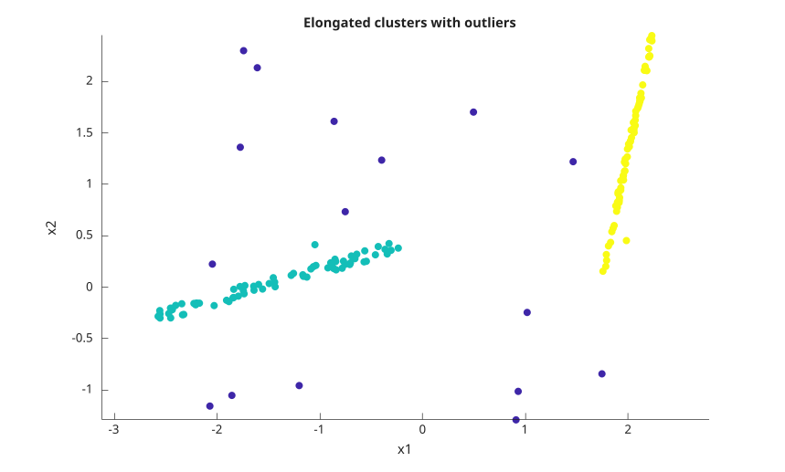
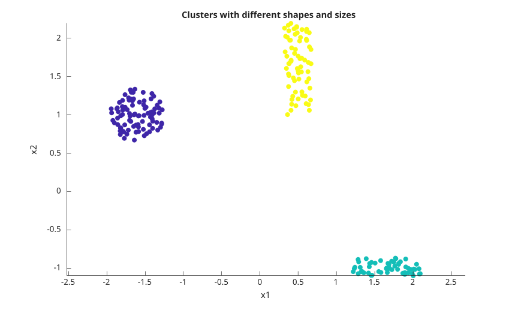
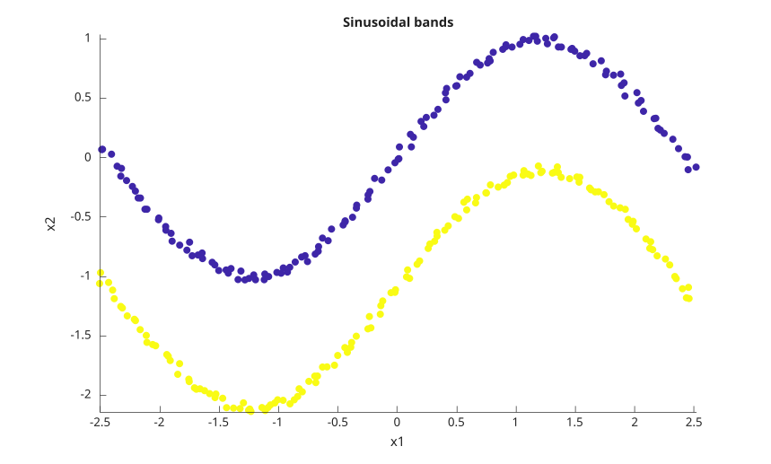
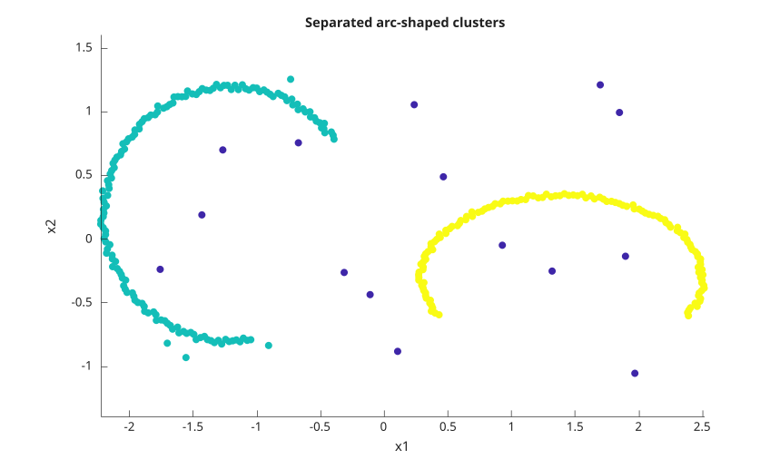
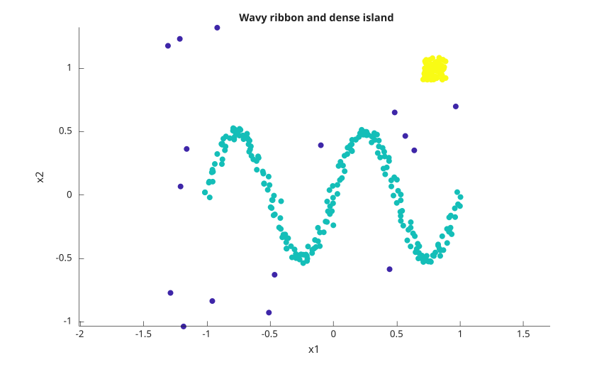
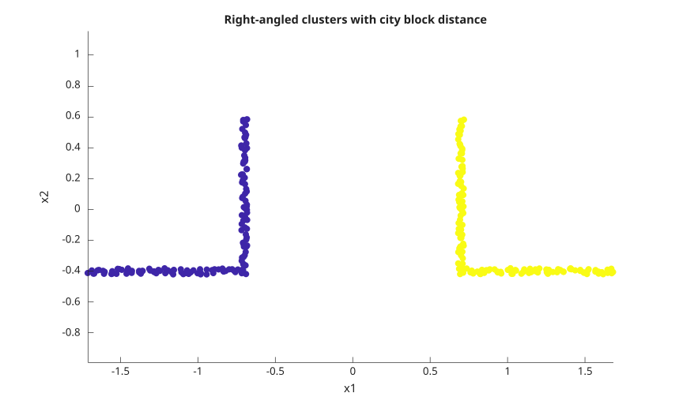

# dbscan

Density-based spatial clustering.

## 📝 Syntax

- idx = dbscan(X, epsilon, minpts)
- idx = dbscan(X, epsilon, minpts, 'Distance', distance)
- idx = dbscan(X, epsilon, minpts, 'Distance', 'minkowski', 'P', p)
- idx = dbscan(X, epsilon, minpts, 'Distance', 'seuclidean', 'Scale', scale)
- idx = dbscan(X, epsilon, minpts, 'Distance', 'mahalanobis', 'Cov', cov)
- idx = dbscan(D, epsilon, minpts, 'Distance', 'precomputed')
- idx = dbscan(B, [], minpts, 'Distance', 'precomputed')
- [idx, corepts] = dbscan(...)

## 📥 Input argument

- X - real full numeric matrix. Each row is one observation and each column is one variable. Empty input with zero rows is accepted and returns empty outputs.
- D - real full precomputed distance data. D can be a square n-by-n matrix or a vector containing the lower triangular distances in column order: d(2,1), d(3,1), ..., d(n,1), d(3,2), ..., d(n,n-1).
- B - logical full precomputed neighborhood data. True values mark observations that are neighbors. B can be a square matrix or the same compact lower triangular vector form as D. The diagonal is always treated as true because each observation is its own neighbor.
- epsilon - positive scalar neighborhood radius. A distance exactly equal to epsilon is inside the neighborhood. Use [] only when the precomputed input is logical.
- minpts - positive integer minimum number of observations in an epsilon-neighborhood for a core point. The observation itself is included in this count.
- distance - distance name or function handle. Names can be abbreviated when the abbreviation is not ambiguous.
- p - positive scalar exponent used only with 'minkowski'. The default exponent is 2.
- scale - positive finite vector used only with 'seuclidean'. Its length must match the number of columns in X. When omitted, the scale is computed from X.
- cov - symmetric positive definite matrix used only with 'mahalanobis'. Its size must match the number of columns in X. When omitted, the covariance matrix is computed from X.

## 📤 Output argument

- idx - double column vector of cluster labels. Cluster labels start at 1 in discovery order. Noise observations are labeled -1.
- corepts - logical column vector. True means that the corresponding observation has at least minpts observations in its epsilon-neighborhood.

## 📄 Description


<b>dbscan</b> groups observations by density connectivity. The algorithm first finds all observations within epsilon of a candidate observation. A candidate is a core point when this neighborhood contains at least minpts observations. Clusters are expanded from core points and include all density-reachable core and border points. 

Distances are compared with an inclusive test: distance <= epsilon. This matters for points exactly on the boundary. Points that are not density-reachable from any core point are returned as noise with label -1. 

Supported built-in distance values are 'euclidean', 'squaredeuclidean', 'seuclidean', 'cityblock', 'chebychev', 'minkowski', 'mahalanobis', 'cosine', 'correlation', 'spearman', 'hamming', 'jaccard', and 'precomputed'. Built-in distances are usually faster than a function handle. 

A distance function handle must accept two inputs: one row observation and the complete data matrix. It must return one real numeric distance for each row of X. The returned vector can be a row or column vector. 

For 'squaredeuclidean', epsilon is compared to the squared Euclidean distance. For 'precomputed' numeric input, epsilon is still required and is compared to the values stored in D. For 'precomputed' logical input, epsilon must be [] because B already encodes the neighborhood relation. 

The order of cluster labels follows the order in which clusters are discovered from the input rows. Border observations that are reachable from more than one cluster are assigned to the first discovered cluster that reaches them.

## Used function(s)


    pdist2
    kmeans
    kmedoids
    silhouette
  

## 💡 Examples

Cluster two dense groups and one noise observation.

```matlab
X = [0 0; 0 0.1; 5 5; 5 5.1; 10 10];
[idx, corepts] = dbscan(X, 0.2, 2)
```
Return only the cluster labels.

```matlab
X = [0 0; 0 0.1; 5 5; 5 5.1];
idx = dbscan(X, 0.2, 2)
```
Use a larger minpts value to mark all observations as noise.

```matlab
X = [0; 0.1];
[idx, corepts] = dbscan(X, 1, 3)
```
Points exactly at epsilon are included in the neighborhood.

```matlab
X = [0; 1; 2];
idx = dbscan(X, 1, 2)
```
Cluster duplicate rows with a very small radius.

```matlab
X = [1 1; 1 1; 1 1; 5 5];
[idx, corepts] = dbscan(X, 1e-12, 3)
```
Use squared Euclidean distance.

```matlab
X = [0 0; 0.1 0.05; 5 5; 5.05 5.05];
idx = dbscan(X, 1, 2, 'Distance', 'squaredeuclidean')
```
Use city block distance.

```matlab
X = [0 0; 0.1 0.05; 5 5; 5.05 5.05];
idx = dbscan(X, 0.2, 2, 'Distance', 'cityblock')
```
Use Chebychev distance.

```matlab
X = [0 0; 0.1 0.05; 5 5; 5.05 5.05];
idx = dbscan(X, 0.1, 2, 'Distance', 'chebychev')
```
Use Minkowski distance with exponent 1.

```matlab
X = [0 0; 0.1 0.05; 5 5; 5.05 5.05];
idx = dbscan(X, 0.2, 2, 'Distance', 'minkowski', 'P', 1)
```
Use standardized Euclidean distance with an explicit scale.

```matlab
X = [0 0; 0.1 0.05; 5 5; 5.05 5.05];
idx = dbscan(X, 0.2, 2, 'Distance', 'seuclidean', 'Scale', [1 1])
```
Use Mahalanobis distance with an explicit covariance matrix.

```matlab
X = [0 0; 0.1 0.05; 5 5; 5.05 5.05];
idx = dbscan(X, 0.2, 2, 'Distance', 'mahalanobis', 'Cov', eye(2))
```
Use cosine distance to group observations with the same direction.

```matlab
X = [1 0; 2 0; 0 1; 0 2];
idx = dbscan(X, 0.01, 2, 'Distance', 'cosine')
```
Use correlation distance.

```matlab
X = [1 2; 2 3; 10 9; 11 10];
idx = dbscan(X, 0.01, 2, 'Distance', 'correlation')
```
Use Spearman distance.

```matlab
X = [1 2; 2 3; 10 9; 11 10];
idx = dbscan(X, 0.01, 2, 'Distance', 'spearman')
```
Use Hamming distance on binary-valued rows.

```matlab
X = [1 0 0; 1 0 0; 0 1 0; 0 1 0];
idx = dbscan(X, 0.01, 2, 'Distance', 'hamming')
```
Use Jaccard distance on sparse-pattern rows.

```matlab
X = [1 0 0; 1 0 0; 0 1 0; 0 1 0];
idx = dbscan(X, 0.01, 2, 'Distance', 'jaccard')
```
Use a custom distance function handle.

```matlab
X = [0 0; 0 0.1; 5 5; 5 5.1; 10 10];
f = @(row, A) sqrt((A(:, 1) - row(1)).^2 + (A(:, 2) - row(2)).^2);
idx = dbscan(X, 0.2, 2, 'Distance', f)
```
Use a square precomputed distance matrix.

```matlab
X = [0; 0.1; 5; 5.1; 10];
D = abs(X - X');
idx = dbscan(D, 0.2, 2, 'Distance', 'precomputed')
```
Use a compact precomputed distance vector.

```matlab
Dv = [0.1 5 5.1 10 4.9 5 9.9 0.1 5 4.9];
idx = dbscan(Dv, 0.2, 2, 'Distance', 'precomputed')
```
Use a logical precomputed neighborhood matrix.

```matlab
B = [true true false; true true true; false true true];
idx = dbscan(B, [], 2, 'Distance', 'precomputed')
```
Use a compact logical precomputed neighborhood vector.

```matlab
Bv = [true false false true false true];
idx = dbscan(Bv, [], 2, 'Distance', 'precomputed')
```
Plot elongated clusters with outliers.

```matlab
f = figure();
rng(11);
n = 70;
u = 2 * rand(n, 1) - 1;
v = 2 * rand(n, 1) - 1;
X1 = [1.2 * u - 1.4, 0.35 * u + 0.12 * rand(n, 1)];
X2 = [0.25 * v + 2.0, 1.2 * v + 0.18 * rand(n, 1) + 1.2];
X3 = [4.8 * rand(18, 1) - 2.2, 3.8 * rand(18, 1) - 1.3];
X = [X1; X2; X3];
idx = dbscan(X, 0.32, 6);
c = idx;
c(c < 0) = 0;
scatter(X(:, 1), X(:, 2), 36, c, 'filled');
axis equal;
title('Elongated clusters with outliers');
xlabel('x1');
ylabel('x2');
```

Plot clusters with different shapes and sizes.

```matlab
f = figure();
rng(12);
n1 = 90;
n2 = 55;
n3 = 70;
theta = 2 * pi * rand(n1, 1);
r = 0.35 * sqrt(rand(n1, 1));
X1 = [r .* cos(theta) - 1.6, r .* sin(theta) + 1.0];
X2 = [0.9 * rand(n2, 1) + 1.2, 0.25 * rand(n2, 1) - 1.1];
X3 = [0.35 * (rand(n3, 1) - 0.5) + 0.5, 1.2 * (rand(n3, 1) - 0.5) + 1.6];
X = [X1; X2; X3];
idx = dbscan(X, 0.28, 5);
c = idx;
c(c < 0) = 0;
scatter(X(:, 1), X(:, 2), 36, c, 'filled');
axis equal;
title('Clusters with different shapes and sizes');
xlabel('x1');
ylabel('x2');
```

Plot two sinusoidal bands.

```matlab
f = figure();
rng(13);
n = 140;
t = linspace(-2.5, 2.5, n)';
X1 = [t, sin(1.3 * t)] + 0.08 * (rand(n, 2) - 0.5);
X2 = [t, sin(1.3 * t) - 1.1] + 0.08 * (rand(n, 2) - 0.5);
X = [X1; X2];
idx = dbscan(X, 0.18, 5);
c = idx;
c(c < 0) = 0;
scatter(X(:, 1), X(:, 2), 36, c, 'filled');
axis equal;
title('Sinusoidal bands');
xlabel('x1');
ylabel('x2');
```

Plot separated arc-shaped clusters.

```matlab
f = figure();
rng(14);
t1 = linspace(0.2 * pi, 1.55 * pi, 150)';
t2 = linspace(1.85 * pi, 3.15 * pi, 130)';
r1 = 1 + 0.05 * (rand(150, 1) - 0.5);
r2 = 1 + 0.05 * (rand(130, 1) - 0.5);
X1 = [r1 .* cos(t1), r1 .* sin(t1)] + [-1.2, 0.2];
X2 = [1.1 * r2 .* cos(t2), 0.65 * r2 .* sin(t2)] + [1.4, -0.3];
X3 = [4 * rand(20, 1) - 2, 2.6 * rand(20, 1) - 1.3];
X = [X1; X2; X3];
idx = dbscan(X, 0.18, 5);
c = idx;
c(c < 0) = 0;
scatter(X(:, 1), X(:, 2), 36, c, 'filled');
axis equal;
title('Separated arc-shaped clusters');
xlabel('x1');
ylabel('x2');
```

Plot a wavy ribbon and a dense island.

```matlab
f = figure();
rng(15);
n = 220;
t = linspace(0, 4 * pi, n)';
X1 = [t / (2 * pi) - 1, 0.5 * sin(t)] + 0.07 * (rand(n, 2) - 0.5);
X2 = 0.18 * (rand(80, 2) - 0.5) + [0.8, 1.0];
X3 = [2.8 * rand(20, 1) - 1.4, 2.6 * rand(20, 1) - 1.1];
X = [X1; X2; X3];
idx = dbscan(X, 0.14, 5);
c = idx;
c(c < 0) = 0;
scatter(X(:, 1), X(:, 2), 36, c, 'filled');
axis equal;
title('Wavy ribbon and dense island');
xlabel('x1');
ylabel('x2');
```

Plot right-angled clusters with the city block distance.

```matlab
f = figure();
rng(16);
n = 70;
t = linspace(0, 1, n)';
X1 = [[t, zeros(n, 1)]; [ones(n, 1), t]] + 0.04 * (rand(2 * n, 2) - 0.5) - [1.7, 0.4];
X2 = [[-t, zeros(n, 1)]; [-ones(n, 1), t]] + 0.04 * (rand(2 * n, 2) - 0.5) + [1.7, -0.4];
X = [X1; X2];
idx = dbscan(X, 0.16, 4, 'Distance', 'cityblock');
c = idx;
c(c < 0) = 0;
scatter(X(:, 1), X(:, 2), 36, c, 'filled');
axis equal;
title('Right-angled clusters with city block distance');
xlabel('x1');
ylabel('x2');
```

Cluster two rings with the default distance.

```matlab
N = 90;
theta = linspace(0, 2 * pi, N)';
X = [[0.5 * cos(theta), 0.5 * sin(theta)]; [5 * cos(theta), 5 * sin(theta)]];
idx = dbscan(X, 1, 5)
```
Handle an empty data matrix.

```matlab
idx = dbscan(zeros(0, 2), 1, 2)
```


## 🕔 History

| Version | 📄 Description     |
| ------- | --------------- |
| 2.0.0   | initial version |

<!--
## 👤 Author

Allan CORNET
-->
