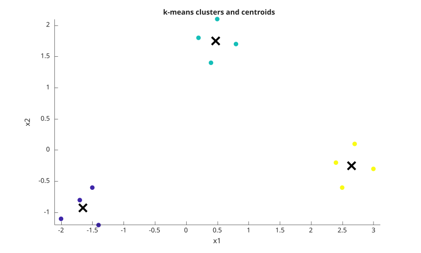
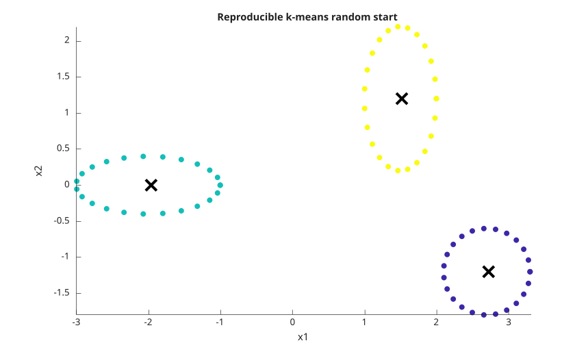
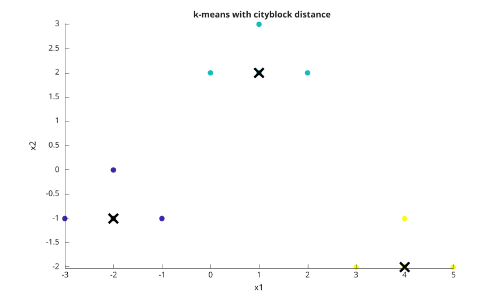

# kmeans

k-means clustering.

## 📝 Syntax

- idx = kmeans(X, k)
- idx = kmeans(X, k, 'Distance', distance)
- idx = kmeans(X, k, 'Start', start)
- [idx, C, sumd, D] = kmeans(...)

## 📥 Input argument

- X - real full numeric matrix. Rows are observations and columns are variables.
- k - positive integer number of clusters. Use [] only when Start is a numeric array.
- distance - distance name: 'sqeuclidean', 'squaredeuclidean', 'cityblock', 'cosine', 'correlation', or 'hamming'.
- start - initial centroid choice: 'plus', 'sample', 'uniform', 'cluster', a k-by-p matrix, or a k-by-p-by-r array.

## 📤 Output argument

- idx - double column vector of cluster indices.
- C - k-by-p matrix of centroid locations.
- sumd - k-by-1 vector of within-cluster sums of point-to-centroid distances.
- D - n-by-k matrix of distances from each observation to each centroid.

## 📄 Description


<b>kmeans</b> partitions observations into k clusters by iteratively assigning each observation to the nearest centroid and recomputing centroids from assigned observations. 

Random starts use Nelson's global random generator. Use <b>rng</b> before calling <b>kmeans</b>, or pass <b>Options</b> created by <b>statset</b> with a <b>RandStream</b> in <b>Streams</b>, for reproducible random initialization.

## Used function(s)


    statset
    statget
    rng
    table
  

## 💡 Examples

Cluster two groups.

```matlab
X = [0 0; 0 1; 5 5; 5 6];
[idx, C] = kmeans(X, 2, 'Start', [0 0; 5 5])
```
Plot three clusters and their centroids.

```matlab
f = figure();
X = [-2.0 -1.1;
     -1.7 -0.8;
     -1.4 -1.2;
     -1.5 -0.6;
      0.2  1.8;
      0.5  2.1;
      0.8  1.7;
      0.4  1.4;
      2.4 -0.2;
      2.7  0.1;
      3.0 -0.3;
      2.5 -0.6];
start = [-1.7 -0.8; 0.5 2.1; 2.7 0.1];
[idx, C] = kmeans(X, 3, 'Start', start);
scatter(X(:, 1), X(:, 2), 48, idx, 'filled');
hold on;
plot(C(:, 1), C(:, 2), 'kx', 'MarkerSize', 12, 'LineWidth', 3);
axis equal;
title('k-means clusters and centroids');
xlabel('x1');
ylabel('x2');
```

Plot a reproducible random initialization.

```matlab
f = figure();
rng(4);
t = linspace(0, 2 * pi, 24)';
X1 = [cos(t) - 2, 0.4 * sin(t)];
X2 = [0.5 * cos(t) + 1.5, sin(t) + 1.2];
X3 = [0.6 * cos(t) + 2.7, 0.6 * sin(t) - 1.2];
X = [X1; X2; X3];
[idx, C] = kmeans(X, 3, 'Start', 'plus', 'Replicates', 4);
scatter(X(:, 1), X(:, 2), 36, idx, 'filled');
hold on;
plot(C(:, 1), C(:, 2), 'kx', 'MarkerSize', 12, 'LineWidth', 3);
axis equal;
title('Reproducible k-means random start');
xlabel('x1');
ylabel('x2');
```

Plot clusters computed with cityblock distance.

```matlab
f = figure();
X = [-3 -1;
     -2 -1;
     -2  0;
     -1 -1;
      0  2;
      1  2;
      1  3;
      2  2;
      3 -2;
      4 -2;
      4 -1;
      5 -2];
start = [-2 -1; 1 2; 4 -2];
[idx, C, sumd] = kmeans(X, 3, 'Start', start, 'Distance', 'cityblock');
scatter(X(:, 1), X(:, 2), 48, idx, 'filled');
hold on;
plot(C(:, 1), C(:, 2), 'kx', 'MarkerSize', 12, 'LineWidth', 3);
axis equal;
title('k-means with cityblock distance');
xlabel('x1');
ylabel('x2');
```

