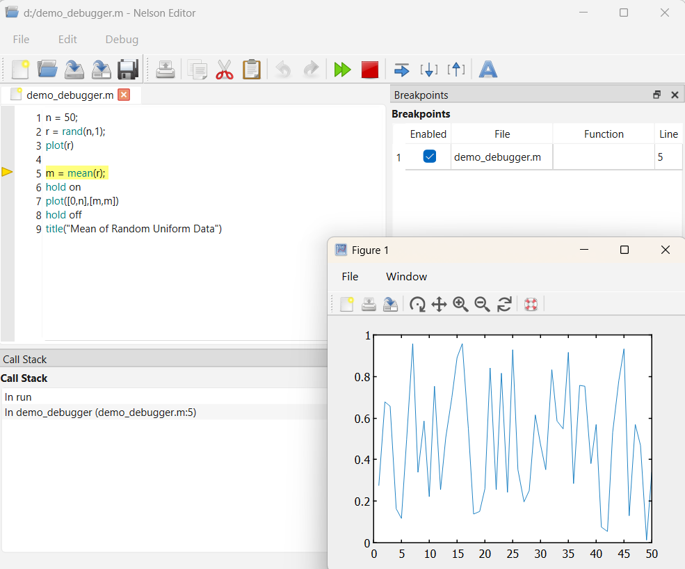

# debugging workflow

Debugging workflow for Nelson code files.

## 📄 Description

The Nelson debugger provides interactive tools to diagnose and fix problems in scripts and functions by controlling execution and inspecting program state.

A typical debugging workflow consists of preparing the code, pausing execution at specific locations, examining variable values, stepping through instructions, and resuming or stopping execution.

Before starting a debugging session, ensure that all code files are saved and accessible from the current folder or search path. Unsaved changes may not be taken into account when running code from the command line.

Execution can be paused by setting breakpoints or interrupting a running program. When execution is paused, Nelson enters debug mode and the command prompt changes to indicate that the debugger has control.

While execution is paused, the current line has not yet been executed. You can inspect variables in the current workspace, execute code line by line, step into or out of functions, or continue execution until the next breakpoint.

Each function has its own workspace. When stepping into a function, the active workspace changes to reflect the function context.

After identifying the problem, end the debugging session to return to normal execution mode. Ending the session restores the standard command prompt and clears the debugger context.

## 💡 Examples

Creates demo_debugger.m for debugging examples.

```matlab
n = 50;
r = rand(n,1);
plot(r)

m = mean(r);
hold on
plot([0,n],[m,m])
hold off
title("Mean of Random Uniform Data")
```

Set a breakpoint in the demo_debugger function. click on the left margin next to the line number to toggle a breakpoint.


Start debugging by calling the demo_debugger function from the command line or "Run file" button.



## 🔗 See also

[edit](../text_editor/edit.md), [dbstop](../debugger/dbstop.md), [dbstep](../debugger/dbstep.md), [dbcont](../debugger/dbcont.md), [dbquit](../debugger/dbquit.md), [dbstatus](../debugger/dbstatus.md).

## 🕔 History

| Version | 📄 Description  |
| ------- | --------------- |
| 1.16.0  | Initial version |

<!--
## 👤 Author

Allan CORNET
-->
