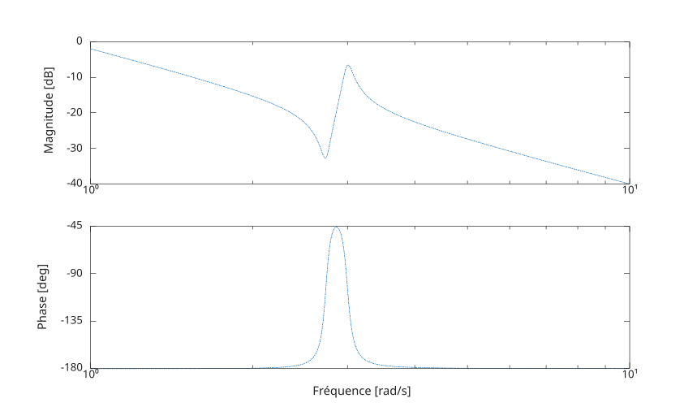

# bode

Diagramme de Bode de la réponse en fréquence, données de magnitude et de phase.

## 📝 Syntaxe

- bode()
- bode(H)
- bode(H, wIn)
- bode(H, w, lineSpec)
- [magnitude, phase, w] = bode(H)
- [magnitude, phase, w] = bode(H, wIn)

## 📥 Argument d'entrée

- H - un modèle lti.
- wIn - une cellule {wmin, wmax} ou un vecteur [wmin:wmax].
- lineSpec - Style de ligne, marqueur et couleur.

## 📤 Argument de sortie

- magnitude - Amplitude : taille 1 x 1 x k (SISO).
- phase - Phase: size 1 x 1 x k (SISO).
- w - Frequencies: a vector: 1 x k.

## 📄 Description

<b>bode(sys)</b> generates a Bode plot illustrating the frequency response of a dynamic system model, denoted as <b>sys.</b>

This plot visually represents the system's response in terms of both magnitude (measured in decibels, dB) and phase (measured in degrees) across varying frequencies.

The specific frequency points on the plot are automatically determined by <b>bode</b> based on the system's inherent dynamics.

## 💡 Exemple

```matlab
H = tf([1 0.1 7.5],[1 0.12 9 0 0]);
bode(H,{1 10}, '-.')
```



## 🔗 Voir aussi

[plot](../../graphics/plot.md).

## 🕔 Historique

| Version | 📄 Description   |
| ------- | ---------------- |
| 1.0.0   | version initiale |

<!--
## 👤 Auteur

Allan CORNET
-->
