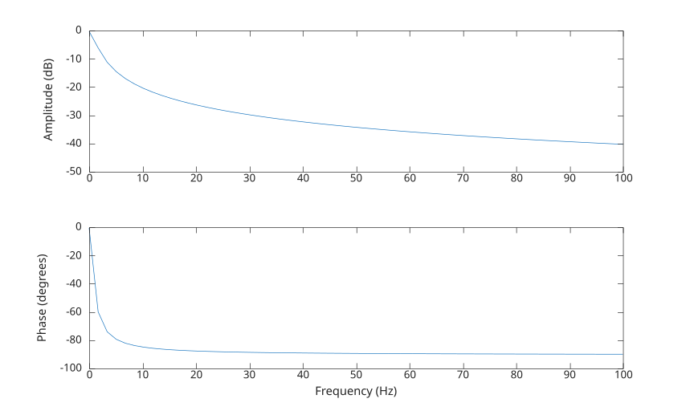

# freqresp

Réponse en fréquence du système.

## 📝 Syntaxe

- [H, wout] = freqresp(sys, w)
- H = freqresp(sys, w)

## 📥 Argument d'entrée

- sys - modèle LTI
- w - Fréquences : vecteur.

## 📤 Argument de sortie

- H - Valeurs de réponse en fréquence
- wout - Fréquences de sortie correspondant à la réponse en fréquence : vecteur.

## 📄 Description

Calcule la réponse en fréquence (réponse complexe) d'un système LTI pour une gamme de fréquences donnée.

## 💡 Exemples

```matlab
G = tf(1,[1 1]);
h1 = freqresp(G, 3)
```

```matlab
num = [1 2];
den = [1 3 2];
sys = tf(num,den);
w = linspace(0, 100, 60);
[resp,freq] = freqresp(sys, w);

f = figure();
subplot(2, 1, 1);
plot(freq, 20 * log10(abs(squeeze(resp))));
ylabel(_('Amplitude (dB)'));
subplot(2, 1, 2);
plot(freq, angle(squeeze(resp)) * 180/pi);
ylabel(_('Phase (degrees)'));
xlabel(_('Frequency (Hz)'));

```



## 🔗 Voir aussi

[bode](../../control_system/bode.md), [evalfr](../../control_system/evalfr.md).

## 🕔 Historique

| Version | 📄 Description   |
| ------- | ---------------- |
| 1.0.0   | version initiale |

<!--
## 👤 Auteur

Allan CORNET
-->
