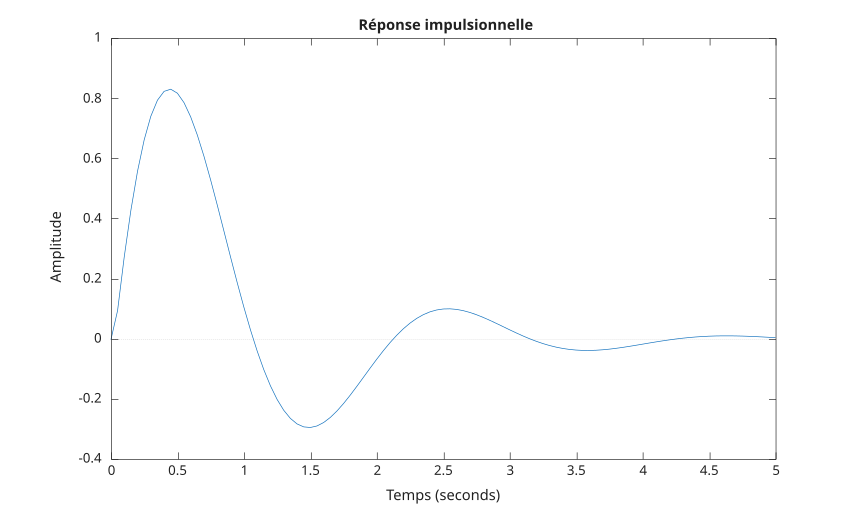

# impulse

Réponse impulsionnelle d'un système dynamique.

## 📝 Syntaxe

- [y, t, x] = impulse(sys)
- [y, t, x] = impulse(sys, tFinal)
- [y, t, x] = impulse(sys, [t0, tFinal])
- [y, t, x] = impulse(sys, t)
- impulse(...)

## 📥 Argument d'entrée

- sys - un modèle lti.
- t - Échantillons temporels : vecteur.
- tFinal - Temps de fin pour la réponse à l'échelon : scalaire.
- [t0, tFinal] - Plage temporelle pour la réponse à l'échelon : vecteur à deux éléments.

## 📤 Argument de sortie

- y - Données de réponse simulée : matrice ou vecteur.
- tOut - Vecteur temporel : vecteur.
- x - Trajectoires d'état : matrice ou vecteur.

## 📄 Description

Calcule et trace la réponse impulsionnelle du système dynamique pour un signal impulsionnel appliqué en entrée.

## 💡 Exemple

```matlab
sys = tf(4,[1 2 10]);
t = 0:0.05:5;
f = figure();
impulse(sys,t);
```



## 🔗 Voir aussi

[step](../../control_system/step.md), [lsim](../../control_system/lsim.md).

## 🕔 Historique

| Version | 📄 Description   |
| ------- | ---------------- |
| 1.0.0   | version initiale |

<!--
## 👤 Auteur

Allan CORNET
-->
