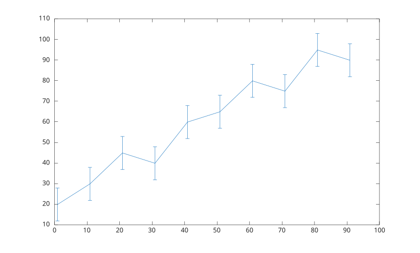
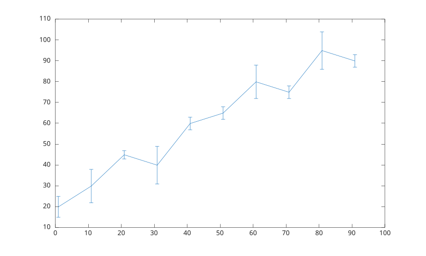
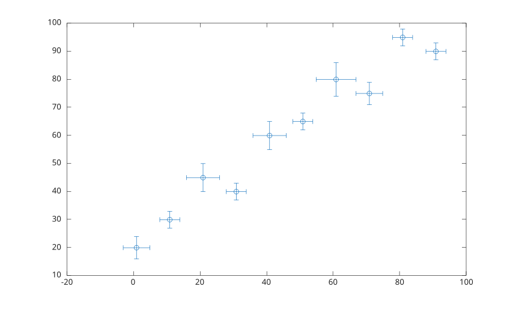

# errorbar

Trace des donnees avec barres d'erreur.

## 📝 Syntaxe

- errorbar(Y, E)
- errorbar(X, Y, E)
- errorbar(X, Y, YNEG, YPOS)
- errorbar(..., orientation)
- errorbar(X, Y, YNEG, YPOS, XNEG, XPOS)
- errorbar(..., lineSpec)
- errorbar(..., propertyName, propertyValue)
- errorbar(ax, ...)
- h = errorbar(...)

## 📥 Argument d'entrée

- X - valeurs x.
- Y - valeurs y.
- E - erreurs y symetriques.
- YNEG - erreurs y negatives.
- YPOS - erreurs y positives.
- XNEG - erreurs x negatives.
- XPOS - erreurs x positives.
- orientation - orientation des barres d'erreur : <b>'vertical'</b>, <b>'horizontal'</b> ou <b>'both'</b>.
- lineSpec - specification de style, marqueur et couleur.
- propertyName - nom d'une propriete de l'objet errorbar.
- propertyValue - valeur d'une propriete de l'objet errorbar.
- ax - objet axes cible.

## 📤 Argument de sortie

- h - objet graphique errorbar ou vecteur ligne d'objets errorbar pour des donnees matricielles.

## 📄 Description


<b>errorbar</b> trace des donnees x et y avec des barres d'erreur verticales ou combinees x/y. 

Les entrees vectorielles creent un objet errorbar. Les entrees matricielles creent un objet errorbar par colonne. 

Voir [proprietes de errorbar](../../../graphics/2_graphics_objects/4_properties/nelson.graphics.errorbar.properties.md) pour la liste complete des proprietes.

## 💡 Exemples

Tracer des barres d'erreur verticales de meme longueur.

```matlab
x = 1:10:100;
y = [20 30 45 40 60 65 80 75 95 90];
err = 8 * ones(size(y));
errorbar(x, y, err);

```

Tracer des barres d'erreur verticales de longueurs variables.

```matlab
x = 1:10:100;
y = [20 30 45 40 60 65 80 75 95 90];
err = [5 8 2 9 3 3 8 3 9 3];
errorbar(x, y, err);

```

Tracer des barres d'erreur horizontales.

```matlab
x = 1:10:100;
y = [20 30 45 40 60 65 80 75 95 90];
err = [1 3 5 3 5 3 6 4 3 3];
errorbar(x, y, err, 'horizontal');

```

Tracer des barres d'erreur verticales et horizontales avec marqueurs seuls.

```matlab
x = 1:10:100;
y = [20 30 45 40 60 65 80 75 95 90];
err = [4 3 5 3 5 3 6 4 3 3];
errorbar(x, y, err, 'both', 'o');

```

Controler les longueurs des barres dans toutes les directions.

```matlab
x = 1:10:100;
y = [20 30 45 40 60 65 80 75 95 90];
yneg = [1 3 5 3 5 3 6 4 3 3];
ypos = [2 5 3 5 2 5 2 2 5 5];
xneg = [1 3 5 3 5 3 6 4 3 3];
xpos = [2 5 3 5 2 5 2 2 5 5];
errorbar(x, y, yneg, ypos, xneg, xpos, 'o');

```


## 🔗 Voir aussi

[proprietes de errorbar](../../../graphics/2_graphics_objects/4_properties/nelson.graphics.errorbar.properties.md), [plot](../../../graphics/1_plots/1_line_plots/plot.md), [line](../../../graphics/1_plots/1_line_plots/line.md).
<!--
## 👤 Auteur

Allan CORNET
-->
