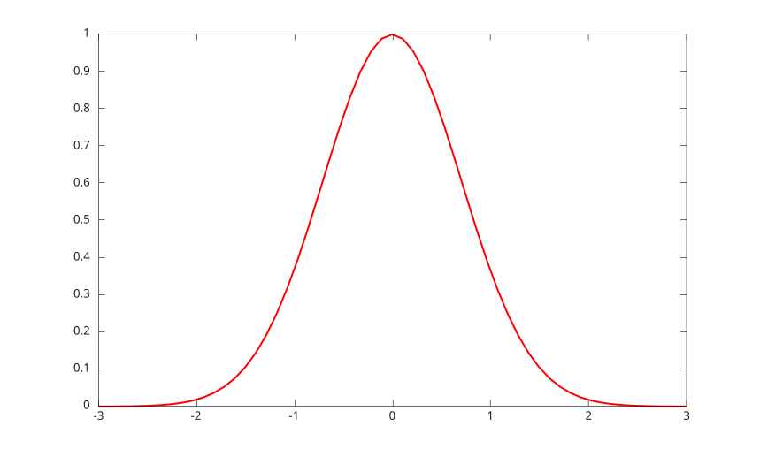
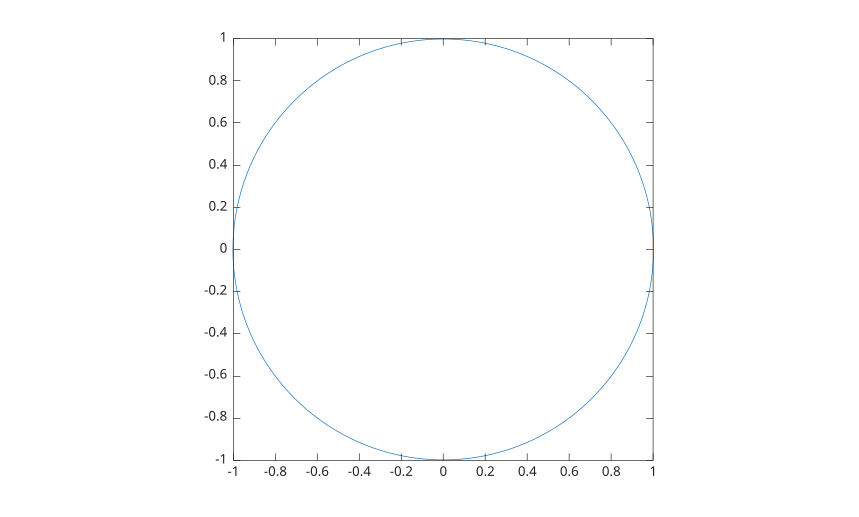

# fplot

Trace une expression ou une fonction parametrique.

## 📝 Syntaxe

- fplot(f)
- fplot(f, [xmin xmax])
- fplot(xfun, yfun)
- fplot(xfun, yfun, [tmin tmax])
- fplot(..., lineSpec)
- fplot(..., propertyName, propertyValue)
- fplot(ax, ...)
- h = fplot(...)

## 📥 Argument d'entrée

- f - fonction evaluee sur les valeurs x.
- xfun - fonction evaluee sur le parametre pour produire les donnees x.
- yfun - fonction evaluee sur le parametre pour produire les donnees y.
- lineSpec - specification de style, marqueur et couleur.
- propertyName - nom d'une [propriete de line](../../../graphics/2_graphics_objects/4_properties/nelson.graphics.line.properties.md).
- propertyValue - valeur d'une propriete de l'objet line.
- ax - objet axes cible.

## 📤 Argument de sortie

- h - objet graphique <b>functionline</b> pour y = f(x), ou objet graphique <b>parameterizedfunctionline</b> pour x = x(t), y = y(t).

## 📄 Description


<b>fplot</b> echantillonne des fonctions sur un intervalle fini et trace le resultat comme un objet graphique de fonction. L'intervalle par defaut est [-5 5]. 

Pour y = f(x), <b>fplot</b> retourne un objet <b>functionline</b>. Pour les courbes parametriques, il retourne un objet <b>parameterizedfunctionline</b>. 

Voir [proprietes de functionline](../../../graphics/2_graphics_objects/4_properties/nelson.graphics.functionline.properties.md) et [proprietes de parameterizedfunctionline](../../../graphics/2_graphics_objects/4_properties/nelson.graphics.parameterizedfunctionline.properties.md) pour les listes completes des proprietes.

## 💡 Exemples


```matlab
fplot(@(x) sin(x), [0 2*pi]);

```


```matlab
fplot(@(x) exp(-x.^2), [-3 3], '-r', 'LineWidth', 1.5);

```



```matlab
fplot(@(t) cos(t), @(t) sin(t), [0 2*pi]);
axis equal

```



## 🔗 Voir aussi

[plot](../../../graphics/1_plots/1_line_plots/plot.md), [proprietes de functionline](../../../graphics/2_graphics_objects/4_properties/nelson.graphics.functionline.properties.md), [proprietes de parameterizedfunctionline](../../../graphics/2_graphics_objects/4_properties/nelson.graphics.parameterizedfunctionline.properties.md), [fsurf](../../../graphics/1_plots/7_surfaces_volumes_polygons/fsurf.md).
<!--
## 👤 Auteur

Allan CORNET
-->
