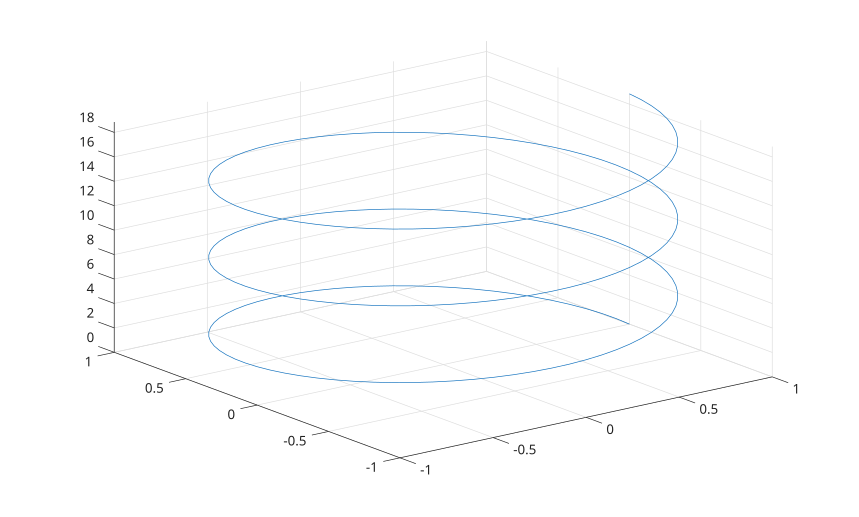

# fplot3

Tracer une courbe parametrique 3-D depuis des handles de fonctions.

## 📝 Syntaxe

- fplot3(xfun, yfun, zfun)
- fplot3(xfun, yfun, zfun, tinterval)
- fplot3(..., LineSpec)
- fplot3(parent, ...)
- h = fplot3(...)

## 📥 Argument d'entrée

- xfun, yfun, zfun - Handles de fonctions evalues sur l'intervalle du parametre.
- tinterval - Vecteur fini croissant a deux elements. La valeur par defaut est [-5 5].
- LineSpec - Specification de style de ligne, marqueur et couleur.
- Paires nom-valeur - Proprietes de ligne et de parameterizedfunctionline, dont MeshDensity.

## 📤 Argument de sortie

- h - Objet graphique de ligne de fonction parametrique.

## 📄 Description

<b>fplot3</b> echantillonne trois handles de fonctions sur un intervalle de parametre et affiche la courbe 3-D obtenue.

## 💡 Exemples

Tracer une helice.

```matlab
fplot3(@(t) cos(t), @(t) sin(t), @(t) t, [0 6*pi]);
```


Personnaliser le style de ligne.

```matlab
fplot3(@(t) t, @(t) t.^2, @(t) t.^3, [-2 2], 'r--', 'LineWidth', 2);
```


## 🔗 Voir aussi

[fplot](../../../graphics/1_plots/1_line_plots/fplot.md), [plot3](../../../graphics/1_plots/1_line_plots/plot3.md), [proprietes de parameterizedfunctionline](../../../graphics/2_graphics_objects/4_properties/nelson.graphics.parameterizedfunctionline.properties.md).
