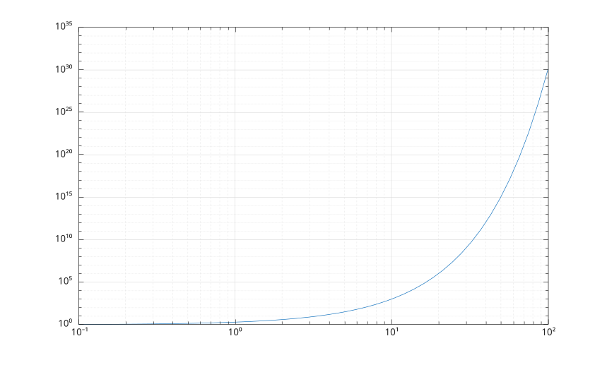
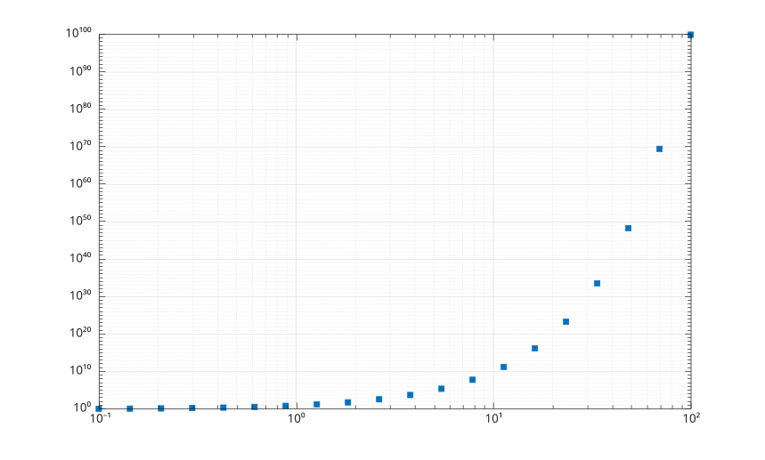

# loglog

Tracé en échelle log-log.

## 📝 Syntaxe

- loglog(X, Y)
- loglog(X, Y, LineSpec)
- loglog(Y)
- loglog(Y, LineSpec)
- loglog(ax, ...)
- loglog(..., propertyName, propertyValue)
- go = loglog(...)

## 📥 Argument d'entrée

- X - Coordonnées en échelle logarithmique : scalaire, vecteur ou matrice.
- Y - Coordonnées en échelle logarithmique : scalaire, vecteur ou matrice.
- LineSpec - Style de ligne, marqueur et/ou couleur : vecteur de caractères ou chaîne scalaire.
- ax - Un objet graphique scalaire : conteneur parent, spécifié comme axes.
- propertyName - Une chaine scalaire ou un vecteur ligne de caracteres. Voir [proprietes de line](../../../graphics/2_graphics_objects/4_properties/nelson.graphics.line.properties.md) pour la liste des proprietes.
- propertyValue - Une valeur.

## 📤 Argument de sortie

- go - Un objet graphique : type ligne.

## 📄 Description

<b>loglog(X, Y)</b> trace les données en utilisant une échelle logarithmique en base 10 pour l'axe des x et l'axe des y.

<b>loglog</b> utilise exactement la même syntaxe que la commande <b>plot</b>.

## 💡 Exemples

```matlab
f = figure();
x = logspace(-1,2);
y = 2 .^ x;
loglog(x,y)
grid on
```



```matlab
f = figure();
x = logspace(-1,2,20);
y = 10 .^ x;
loglog(x,y,'s','MarkerFaceColor',[0 0.447 0.741])
grid on
```



## 🔗 Voir aussi

[semilogx](../../../graphics/1_plots/1_line_plots/semilogx.md), [semilogy](../../../graphics/1_plots/1_line_plots/semilogy.md), [line](../../../graphics/1_plots/1_line_plots/line.md), [plot](../../../graphics/1_plots/1_line_plots/plot.md), [grid](../../../graphics/3_labels_styling/1_axes_appearance/grid.md).

## 🕔 Historique

| Version | 📄 Description   |
| ------- | ---------------- |
| 1.0.0   | version initiale |

<!--
## 👤 Auteur

Allan CORNET
-->
