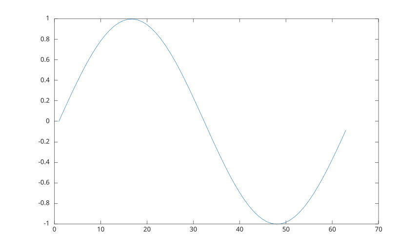
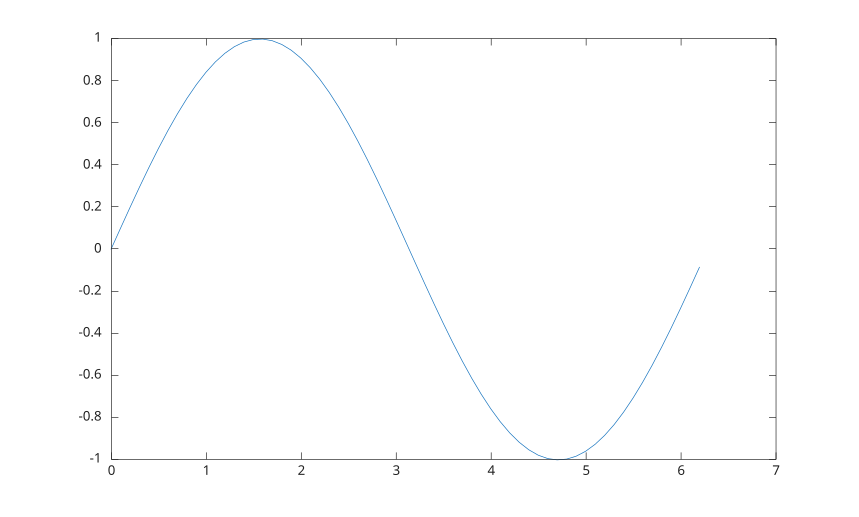
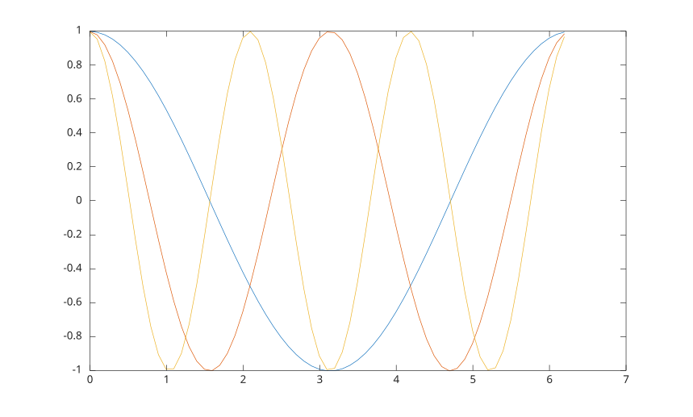
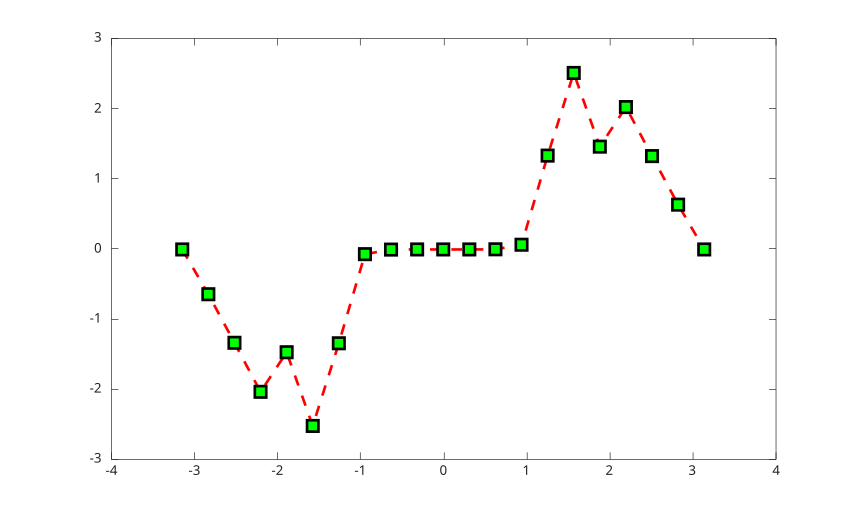
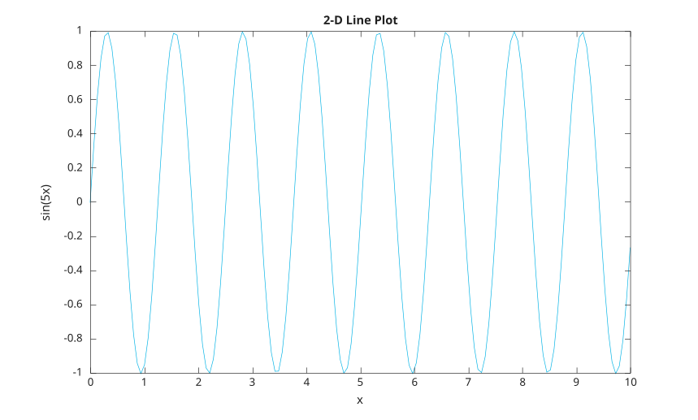

# plot

Tracé linéaire 2D.

## 📝 Syntaxe

- plot(Y)
- plot(X1, Y1, ...)
- plot(X1, Y1, LineSpec, ...)
- plot(..., propertyName, propertyValue, ...)
- plot(ax, ...)
- go = plot(...)

## 📥 Argument d'entrée

- X1 - Coordonnées x : vecteur ou matrice.
- Y1 - Coordonnées y : vecteur ou matrice.
- LineSpec - Style de ligne, marqueur et/ou couleur : vecteur de caractères ou chaîne scalaire.
- ax - Valeur scalaire d'objet graphique : conteneur parent, spécifié comme axes.
- propertyName - Chaine scalaire ou vecteur ligne de caracteres. Voir [proprietes de line](../../../graphics/2_graphics_objects/4_properties/nelson.graphics.line.properties.md) pour la liste des proprietes.
- propertyValue - Une valeur.

## 📤 Argument de sortie

- go - Objet graphique : type ligne.

## 📄 Description

<b>plot(Y)</b> trace les colonnes de <b>Y</b> en fonction de leur indice.

<b>plot(X, Y)</b> trace la courbe définie par la paire <b>X</b> et <b>Y</b>.

<b>go = plot(...)</b> retourne un vecteur colonne d'objets graphiques de type ligne.

<b>LineSpec</b> est une chaîne utilisée pour modifier les caractéristiques de la ligne et se compose de trois parties optionnelles dans n'importe quel ordre :

Le SymbolSpec spécifie le symbole à dessiner à chaque point de données :

| Symbole   | Description                    |
| --------- | ------------------------------ |
| **'o'**   | Symbole cercle                 |
| **'x'**   | Symbole croix                  |
| **'+'**   | Symbole plus                   |
| **'\*'**  | Symbole astérisque             |
| **'.'**   | Symbole point                  |
| **'s'**   | Symbole carré                  |
| **'d'**   | Symbole losange                |
| **'v'**   | Triangle pointe vers le bas    |
| **'^'**   | Triangle pointe vers le haut   |
| **' < '** | Triangle pointe vers la droite |
| **' > '** | Triangle pointe vers la gauche |

Le LineStyleSpec spécifie le style de ligne à utiliser pour chaque série de données :

| Style    | Description         |
| -------- | ------------------- |
| **'-'**  | Ligne continue      |
| **'--'** | Ligne pointillée    |
| **'-.'** | Ligne tiret-point   |
| **':'**  | Ligne en pointillés |

Le ColorSpec spécifie la couleur de ligne à utiliser pour chaque série de données :

| Couleur | Description |
| ------- | ----------- |
| **'k'** | Noir        |
| **'y'** | Jaune       |
| **'m'** | Magenta     |
| **'c'** | Cyan        |
| **'r'** | Rouge       |
| **'b'** | Bleu        |
| **'g'** | Vert        |

Voir <b>line</b> pour plus d'informations sur les propriétés.

## 💡 Exemples

Abscisses par defaut avec les indices :

```matlab
f = figure()
plot(sin(0:0.1:2*pi))
```


Utilisation d'abscisses explicites :

```matlab
f = figure()
x = [0:0.1:2*pi]';
plot(x, sin(x))
```


Plusieurs courbes avec abscisses partagees :

```matlab
f = figure()
x = [0:0.1:2*pi]';
plot(x, [cos(x), cos(2*x), cos(3*x)])
```


Couleur et taille des marqueurs :

```matlab
f = figure();
x = -pi:pi/10:pi;
y = tan(sin(x)) - sin(tan(x));
plot(x ,y, '--rs', LineWidth=2, MarkerEdgeColor='k', MarkerFaceColor='g', MarkerSize=11)
```


Ajout d'un titre et d'etiquettes d'axes :

```matlab
f = figure();
x = linspace(0, 10, 150);
y = sin(5*x);
plot(x,y,'Color',[0,0.7,0.9])
title('2-D Line Plot')
xlabel('x')
ylabel('sin(5x)')
```



## 🔗 Voir aussi

[line](../../../graphics/1_plots/1_line_plots/line.md), [plot3](../../../graphics/1_plots/1_line_plots/plot3.md), [name=value syntax](../../../interpreter/name_value_syntax.md).

## 🕔 Historique

| Version | 📄 Description   |
| ------- | ---------------- |
| 1.0.0   | version initiale |

<!--
## 👤 Auteur

Allan CORNET
-->
