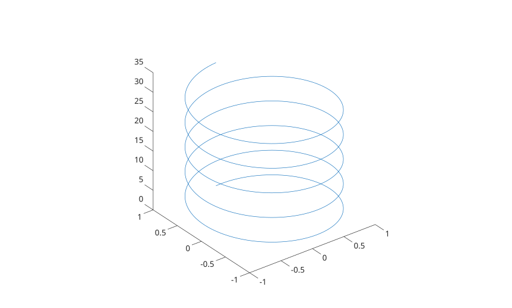
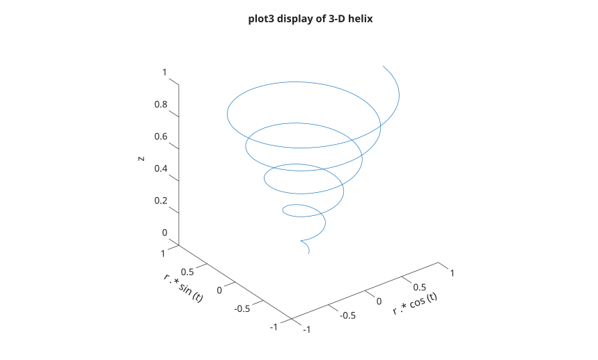

# plot3

Tracé de courbe 3D.

## 📝 Syntaxe

- plot3(X1, Y1, Z1, ...)
- plot3(X1, Y1, Z1, LineSpec, ...)
- plot3(..., propertyName, propertyValue, ...)
- plot3(ax, ...)
- go = plot3(...)

## 📥 Argument d'entrée

- X1 - Coordonnées x : vecteur ou matrice.
- Y1 - Coordonnées y : vecteur ou matrice.
- Z1 - Coordonnées z : vecteur ou matrice.
- LineSpec - Style de ligne, marqueur et/ou couleur : vecteur de caractères ou chaîne scalaire.
- ax - Valeur scalaire d'objet graphique : conteneur parent, spécifié comme axes.
- propertyName - Chaine scalaire ou vecteur ligne de caracteres. Voir [proprietes de line](../../../graphics/2_graphics_objects/4_properties/nelson.graphics.line.properties.md) pour la liste des proprietes.
- propertyValue - Une valeur.

## 📤 Argument de sortie

- go - Objet graphique : type ligne.

## 📄 Description

<b>plot3(X1, Y1, Z1, ...)</b> trace une ou plusieurs courbes dans l'espace tridimensionnel.

<b>go = plot3(...)</b> retourne un vecteur colonne d'objets graphiques de type ligne.

Voir <b>line</b> ou<b>plot</b> pour plus d'informations sur les propriétés.

## 💡 Exemples

```matlab
f  = figure();
t = 0:pi/50:10*pi;
L = plot3(sin(t), cos(t), t);
axis square
```



```matlab
f  = figure();
t = 0:0.1:10*pi;
r = linspace (0, 1, length(t));
z = linspace (0, 1, length(t));
h = plot3 (r .* cos (t), r .* sin (t), z);
ylabel ('r .* sin (t)');
xlabel ('r .* cos (t)');
zlabel ('z');
title ('plot3 display of 3-D helix');
axis square
```



## 🔗 Voir aussi

[line](../../../graphics/1_plots/1_line_plots/line.md), [plot](../../../graphics/1_plots/1_line_plots/plot.md).

## 🕔 Historique

| Version | 📄 Description   |
| ------- | ---------------- |
| 1.0.0   | version initiale |

<!--
## 👤 Auteur

Allan CORNET
-->
